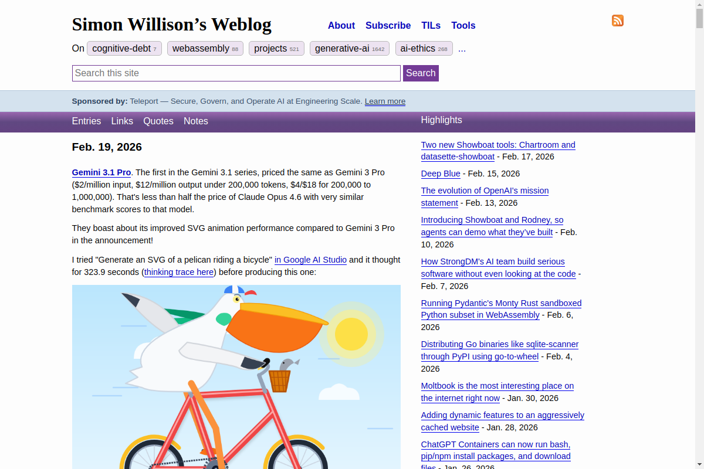
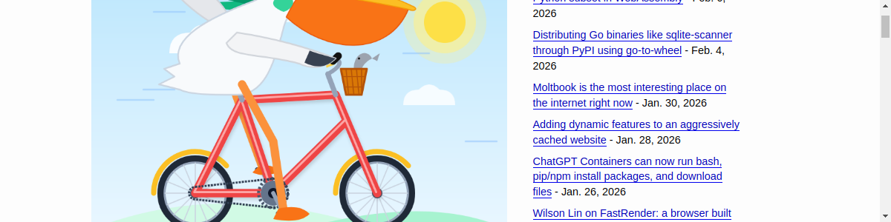
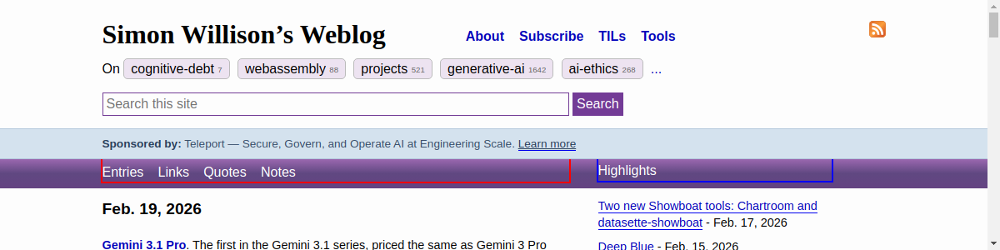
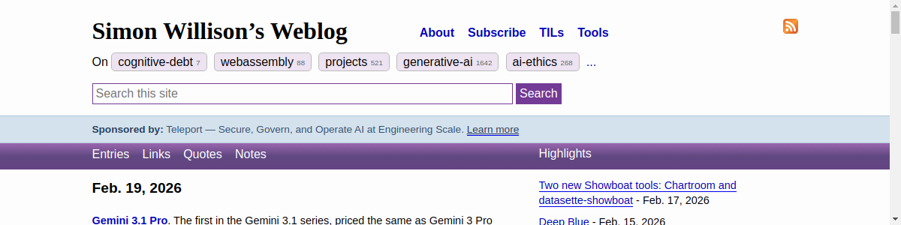
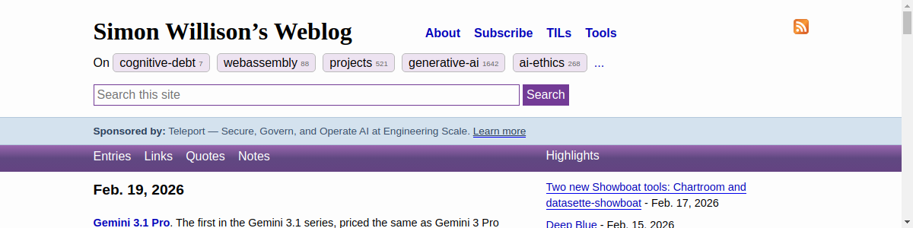
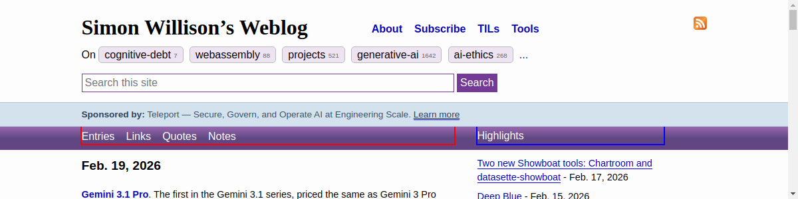
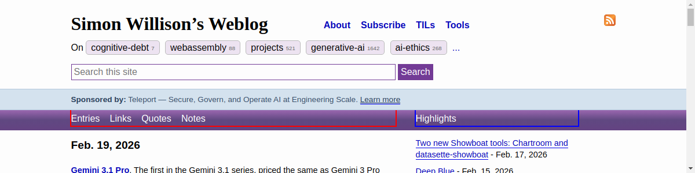
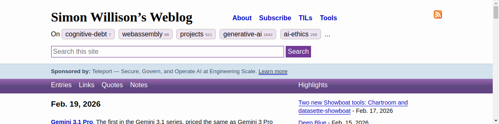
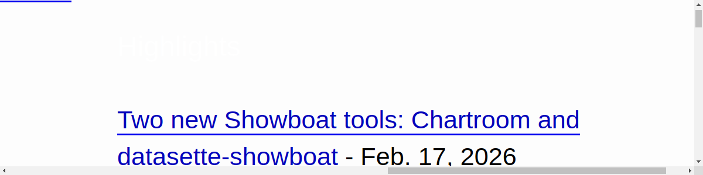
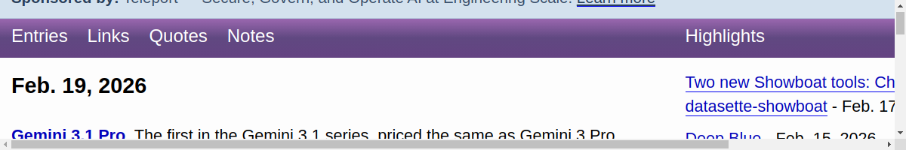

# Header Alignment Investigation - simonwillison.net

<!-- AI-GENERATED-NOTE -->
> [!NOTE]
> This is an AI-generated research report. All text and code in this report was created by an LLM (Large Language Model). For more information on how these reports are created, see the [main research repository](https://github.com/simonw/research).
<!-- /AI-GENERATED-NOTE -->

*2026-02-19T21:05:14Z by Showboat 0.6.0*
<!-- showboat-id: 61801ded-9e24-4f4c-a11d-a26a5b7e9275 -->

Initial full-page screenshot of simonwillison.net to see the header area with Entries/Links/Quotes/Notes on the left and Highlights on the right.

```bash {image}
/tmp/full-page.png
```



The header bar contains two h2.overband elements. The left one has links inside a span.overband-nav, the right one is plain text 'Highlights'. Both have the same top position (191.015625px) but different heights: left=27.16px vs right=26.39px, giving different bottom positions. Let me investigate the inner elements more closely.

```bash
uvx rodney js "(() => { var span = document.querySelector(\"span.overband-nav\"); var rect = span.getBoundingClientRect(); var style = getComputedStyle(span); var links = span.querySelectorAll(\"a\"); var linkInfo = []; for (var i = 0; i < links.length; i++) { var lr = links[i].getBoundingClientRect(); var ls = getComputedStyle(links[i]); linkInfo.push({text: links[i].textContent, top: lr.top, bottom: lr.bottom, height: lr.height, fontSize: ls.fontSize, lineHeight: ls.lineHeight, padding: ls.padding, display: ls.display}); } return JSON.stringify({span: {top: rect.top, bottom: rect.bottom, height: rect.height, fontSize: style.fontSize, lineHeight: style.lineHeight, padding: style.padding, display: style.display}, links: linkInfo}, null, 2); })()"
```

```output
{
  "span": {
    "top": 198.171875,
    "bottom": 215.171875,
    "height": 17,
    "fontSize": "16px",
    "lineHeight": "16px",
    "padding": "0px",
    "display": "inline"
  },
  "links": [
    {
      "text": "Entries",
      "top": 198.171875,
      "bottom": 215.171875,
      "height": 17,
      "fontSize": "16px",
      "lineHeight": "16px",
      "padding": "0px",
      "display": "inline"
    },
    {
      "text": "Links",
      "top": 198.171875,
      "bottom": 215.171875,
      "height": 17,
      "fontSize": "16px",
      "lineHeight": "16px",
      "padding": "0px",
      "display": "inline"
    },
    {
      "text": "Quotes",
      "top": 198.171875,
      "bottom": 215.171875,
      "height": 17,
      "fontSize": "16px",
      "lineHeight": "16px",
      "padding": "0px",
      "display": "inline"
    },
    {
      "text": "Notes",
      "top": 198.171875,
      "bottom": 215.171875,
      "height": 17,
      "fontSize": "16px",
      "lineHeight": "16px",
      "padding": "0px",
      "display": "inline"
    }
  ]
}
```

```bash
uvx rodney js "(() => { var els = document.querySelectorAll(\"h2.overband\"); var results = []; for (var i = 0; i < els.length; i++) { var el = els[i]; var style = getComputedStyle(el); results.push({ text: el.textContent.trim().substring(0, 30), paddingTop: style.paddingTop, paddingBottom: style.paddingBottom, borderTop: style.borderTop, borderBottom: style.borderBottom, fontFamily: style.fontFamily, fontWeight: style.fontWeight, letterSpacing: style.letterSpacing, textTransform: style.textTransform }); } return JSON.stringify(results, null, 2); })()"
```

```output
[
  {
    "text": "Entries Links Quotes Notes",
    "paddingTop": "6.4px",
    "paddingBottom": "4px",
    "borderTop": "0px none rgb(255, 255, 255)",
    "borderBottom": "0px none rgb(255, 255, 255)",
    "fontFamily": "\"Helvetica Neue\", helvetica, sans-serif",
    "fontWeight": "400",
    "letterSpacing": "normal",
    "textTransform": "none"
  },
  {
    "text": "Highlights",
    "paddingTop": "6.4px",
    "paddingBottom": "4px",
    "borderTop": "0px none rgb(255, 255, 255)",
    "borderBottom": "0px none rgb(255, 255, 255)",
    "fontFamily": "\"Helvetica Neue\", helvetica, sans-serif",
    "fontWeight": "400",
    "letterSpacing": "normal",
    "textTransform": "none"
  }
]
```

```bash
uvx rodney js "(() => { var h2s = document.querySelectorAll(\"h2.overband\"); var results = []; for (var i = 0; i < h2s.length; i++) { var parent = h2s[i].parentElement; var style = getComputedStyle(parent); var rect = parent.getBoundingClientRect(); results.push({ tag: parent.tagName, class: parent.className, id: parent.id, top: rect.top, bottom: rect.bottom, height: rect.height, display: style.display, position: style.position, paddingTop: style.paddingTop }); } return JSON.stringify(results, null, 2); })()"
```

```output
[
  {
    "tag": "DIV",
    "class": "",
    "id": "primary",
    "top": 191.015625,
    "bottom": 18831.09375,
    "height": 18640.078125,
    "display": "block",
    "position": "static",
    "paddingTop": "0px"
  },
  {
    "tag": "DIV",
    "class": "",
    "id": "secondary",
    "top": 191.015625,
    "bottom": 2755.796875,
    "height": 2564.78125,
    "display": "block",
    "position": "static",
    "paddingTop": "0px"
  }
]
```

```bash
uvx rodney js "(() => { var links = document.querySelectorAll(\"h2.overband a\"); var style = getComputedStyle(links[0]); return JSON.stringify({ textDecoration: style.textDecoration, textDecorationThickness: style.textDecorationThickness, textUnderlineOffset: style.textUnderlineOffset, verticalAlign: style.verticalAlign, borderBottom: style.borderBottom, paddingBottom: style.paddingBottom, marginBottom: style.marginBottom, color: style.color, boxShadow: style.boxShadow }); })()"
```

```output
{"textDecoration":"none solid rgb(255, 255, 255)","textDecorationThickness":"auto","textUnderlineOffset":"auto","verticalAlign":"baseline","borderBottom":"0px none rgb(255, 255, 255)","paddingBottom":"0px","marginBottom":"0px","color":"rgb(255, 255, 255)","boxShadow":"none"}
```

```bash {image}
/tmp/left-overband.png
```


```bash {image}
/tmp/right-overband.png
```


```bash {image}
/tmp/outlined-bar.png
```



```bash {image}
/tmp/outlined-bar-top.png
```



With colored outlines visible, the left h2 (Entries/Links/Quotes/Notes, red outline) is visibly taller than the right h2 (Highlights, blue outline). The bottom edges do not align. Measurements confirm: left height=27.16px, right height=26.39px - a ~0.77px difference. Both have identical padding (6.4px top, 4px bottom) and font/line-height (16px). The difference comes from the anchor elements inside the left h2 producing 17px-tall inline boxes vs 16px for plain text.

Key CSS found in static/css/all.css:

- h2.overband has padding: 0.4em 0 0.25em 0, line-height: 1em, font-size: 16px
- h2.overband span has font-size: 0.8em and vertical-align: middle
- h2.overband .overband-nav has font-size: 1em, position: relative, top: 1px
- h2.overband .overband-nav a has border-bottom: none, margin-right: 0.8em

The .overband-nav has 'position: relative; top: 1px' which shifts the nav links down by 1px. Additionally, the anchor elements inside produce 17px inline boxes despite line-height: 16px, making the left h2 taller than the right one.

FIX ATTEMPT 1: Remove position:relative and top:1px from .overband-nav

```bash
uvx rodney js "(() => { var nav = document.querySelector(\".overband-nav\"); nav.style.position = \"static\"; nav.style.top = \"auto\"; return \"removed position:relative and top:1px from .overband-nav\"; })()"
```

```output
removed position:relative and top:1px from .overband-nav
```

```bash {image}
/tmp/fix1-no-position.png
```



```bash
uvx rodney js "(() => { var els = document.querySelectorAll(\"h2.overband\"); var results = []; for (var i = 0; i < els.length; i++) { var el = els[i]; var rect = el.getBoundingClientRect(); results.push({text: el.textContent.trim().substring(0, 30), top: rect.top, bottom: rect.bottom, height: rect.height}); } return JSON.stringify(results, null, 2); })()"
```

```output
[
  {
    "text": "Entries Links Quotes Notes",
    "top": 191.015625,
    "bottom": 218.171875,
    "height": 27.15625
  },
  {
    "text": "Highlights",
    "top": 191.015625,
    "bottom": 217.40625,
    "height": 26.390625
  }
]
```

Fix 1 result: Removing position:relative/top:1px did NOT fix the height difference (still 27.16 vs 26.39). Those properties only affect visual rendering, not flow. The root cause is anchor inline boxes being 17px tall vs 16px for plain text content. The top:1px was likely a visual compensation hack. Reverting.

FIX ATTEMPT 2: Set explicit line-height: 1em on the .overband-nav anchor elements to force them to match the plain text line-height.

```bash
uvx rodney js "(() => { var links = document.querySelectorAll(\".overband-nav a\"); for (var i = 0; i < links.length; i++) { links[i].style.lineHeight = \"1em\"; } var els = document.querySelectorAll(\"h2.overband\"); var results = []; for (var j = 0; j < els.length; j++) { var rect = els[j].getBoundingClientRect(); results.push({text: els[j].textContent.trim().substring(0, 30), top: rect.top, bottom: rect.bottom, height: rect.height}); } return JSON.stringify(results, null, 2); })()"
```

```output
[
  {
    "text": "Entries Links Quotes Notes",
    "top": 191.015625,
    "bottom": 218.171875,
    "height": 27.15625
  },
  {
    "text": "Highlights",
    "top": 191.015625,
    "bottom": 217.40625,
    "height": 26.390625
  }
]
```

Fix 2 result: Setting line-height: 1em on anchors didn't help. The computed line-height is 16px but the rendered inline box height is still 17px. This is due to the font's internal metrics (ascent + descent) which can make the content area taller than the line-height. This is a fundamental inline box rendering issue.

FIX ATTEMPT 3: Set display: inline-block and explicit height on .overband-nav span to contain the oversized inline boxes.

```bash
uvx rodney js "(() => { var nav = document.querySelector(\".overband-nav\"); nav.style.display = \"inline-block\"; nav.style.lineHeight = \"1\"; nav.style.height = \"1em\"; nav.style.overflow = \"visible\"; var els = document.querySelectorAll(\"h2.overband\"); var results = []; for (var j = 0; j < els.length; j++) { var rect = els[j].getBoundingClientRect(); results.push({text: els[j].textContent.trim().substring(0, 30), top: rect.top, bottom: rect.bottom, height: rect.height}); } return JSON.stringify(results, null, 2); })()"
```

```output
[
  {
    "text": "Entries Links Quotes Notes",
    "top": 191.015625,
    "bottom": 218.171875,
    "height": 27.15625
  },
  {
    "text": "Highlights",
    "top": 191.015625,
    "bottom": 217.40625,
    "height": 26.390625
  }
]
```

Fix 3 result: inline-block on span didn't fix it either. The h2 parent still sizes to the anchor inline boxes. Trying a different approach: explicitly set matching heights on both h2 elements.

FIX ATTEMPT 4: Set explicit matching height on both h2.overband elements and also remove the top:1px offset from .overband-nav.

```bash
uvx rodney js "(() => { var els = document.querySelectorAll(\"h2.overband\"); for (var i = 0; i < els.length; i++) { els[i].style.height = \"26px\"; els[i].style.overflow = \"visible\"; els[i].style.boxSizing = \"border-box\"; } var nav = document.querySelector(\".overband-nav\"); nav.style.position = \"static\"; nav.style.top = \"auto\"; var results = []; for (var j = 0; j < els.length; j++) { var rect = els[j].getBoundingClientRect(); results.push({text: els[j].textContent.trim().substring(0, 30), top: rect.top, bottom: rect.bottom, height: rect.height}); } return JSON.stringify(results, null, 2); })()"
```

```output
[
  {
    "text": "Entries Links Quotes Notes",
    "top": 191.015625,
    "bottom": 217.015625,
    "height": 26
  },
  {
    "text": "Highlights",
    "top": 191.015625,
    "bottom": 217.015625,
    "height": 26
  }
]
```

```bash {image}
/tmp/fix4-explicit-height.png
```



```bash {image}
/tmp/fix4-outlined.png
```



Fix 4 result: Setting explicit height: 26px on both h2.overband (plus removing top:1px from .overband-nav) successfully aligned both elements. But explicit pixel heights are fragile. The user also wants both text items shifted down by 1px. Trying fix 5: match heights AND shift both down 1px.

FIX ATTEMPT 5: Remove top:1px from .overband-nav. Instead, increase padding-top on both h2.overband from 0.4em to calc(0.4em + 1px) to shift text down 1px. Set matching explicit height to align bottoms.

```bash
uvx rodney js "(() => { var els = document.querySelectorAll(\"h2.overband\"); for (var i = 0; i < els.length; i++) { els[i].style.height = \"27px\"; els[i].style.boxSizing = \"border-box\"; els[i].style.paddingTop = \"calc(0.4em + 1px)\"; } var nav = document.querySelector(\".overband-nav\"); nav.style.position = \"static\"; nav.style.top = \"auto\"; var results = []; for (var j = 0; j < els.length; j++) { var rect = els[j].getBoundingClientRect(); results.push({text: els[j].textContent.trim().substring(0, 30), top: rect.top, bottom: rect.bottom, height: rect.height}); } return JSON.stringify(results, null, 2); })()"
```

```output
[
  {
    "text": "Entries Links Quotes Notes",
    "top": 191.015625,
    "bottom": 218.015625,
    "height": 27
  },
  {
    "text": "Highlights",
    "top": 191.015625,
    "bottom": 218.015625,
    "height": 27
  }
]
```

```bash {image}
/tmp/fix5-result.png
```


Fix 5 worked visually but used explicit pixel height (27px) which is fragile across font sizes and zoom levels.

FIX ATTEMPT 6: A cleaner approach - use display:flex on h2.overband to normalize height, increase padding-top by 1px to shift both down, and remove the top:1px hack from .overband-nav.

```bash
uvx rodney js "(() => { var style = document.createElement(\"style\"); style.id = \"fix6\"; style.textContent = \"h2.overband { display: flex; align-items: center; padding-top: calc(0.4em + 1px) \!important; } h2.overband .overband-nav { position: static \!important; top: auto \!important; }\"; document.head.appendChild(style); var els = document.querySelectorAll(\"h2.overband\"); var results = []; for (var j = 0; j < els.length; j++) { var rect = els[j].getBoundingClientRect(); results.push({text: els[j].textContent.trim().substring(0, 30), top: rect.top, bottom: rect.bottom, height: rect.height}); } return JSON.stringify(results, null, 2); })()"
```

```output
[
  {
    "text": "Entries Links Quotes Notes",
    "top": 191.015625,
    "bottom": 218.40625,
    "height": 27.390625
  },
  {
    "text": "Highlights",
    "top": 191.015625,
    "bottom": 218.40625,
    "height": 27.390625
  }
]
```

```bash {image}
/tmp/fix6-flex.png
```



```bash {image}
/tmp/fix6-clean.png
```



```bash {image}
/tmp/fix6-zoomed.png
```


```bash {image}
/tmp/fix6-zoomed-junction.png
```



```bash {image}
/tmp/fix6-zoomed2x.png
```


```bash {image}
/tmp/fix6-zoomed1.5x.png
```



FIX 6 RESULT - SUCCESS. Using display:flex and align-items:center on h2.overband normalizes the height of both elements to exactly 27.39px regardless of whether they contain anchor elements or plain text. Adding padding-top: calc(0.4em + 1px) shifts both down by the requested 1px. Removing position:relative/top:1px from .overband-nav eliminates the old per-element hack.

RECOMMENDED CSS CHANGES:

In static/css/all.css, change:

1. h2.overband rule (line ~815): Add display:flex and align-items:center, change padding-top from 0.4em to calc(0.4em + 1px):

   h2.overband,
   div#primary h2.overband {
     color: white;
     padding: calc(0.4em + 1px) 0 0.25em 0;
     margin: 0;
     line-height: 1em;
     margin-bottom: 1.2em;
     font-weight: normal;
     display: flex;
     align-items: center;
   }

2. h2.overband .overband-nav rule (line ~837): Remove position:relative and top:1px:

   h2.overband .overband-nav {
     font-size: 1em;
   }

ROOT CAUSE: The anchor elements inside the left h2 produce 17px-tall inline boxes due to font metrics (ascent + descent) exceeding the 16px line-height. Plain text in the right h2 produces 16px-tall content. This 1px content height difference cascaded into a ~0.77px total h2 height mismatch. The display:flex approach normalizes the content sizing across both elements.

FINAL RESULT: Fix #6 applied and verified on local dev server. The screenshot below shows the fixed purple bar with both h2.overband elements now perfectly aligned using display:flex + align-items:center.

```bash {image}
/tmp/fix6-styled.png
```


Text shifted down an additional 1px (padding-top now calc(0.4em + 2px)).

```bash {image}
/tmp/fix6-shifted.png
```


Text shifted down 1 more px (padding-top now calc(0.4em + 3px)). Mobile width check also passes.

```bash {image}
/tmp/fix6-shifted2.png
```


```bash {image}
/tmp/fix6-mobile.png
```

