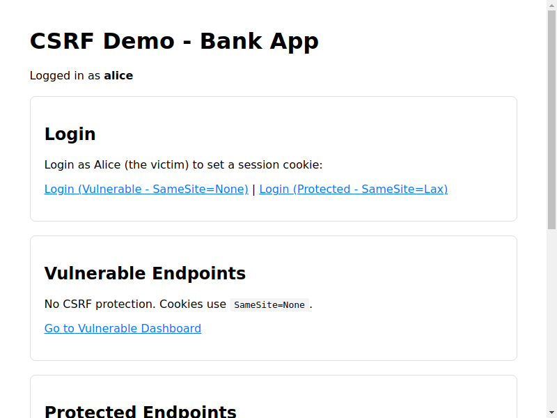
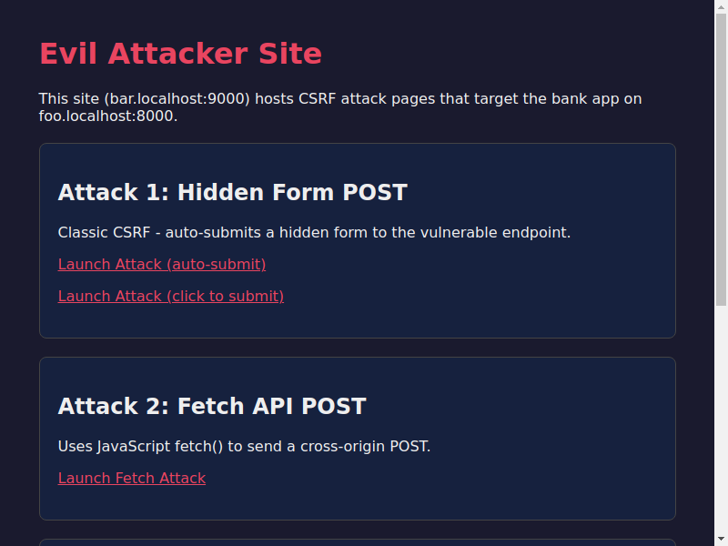
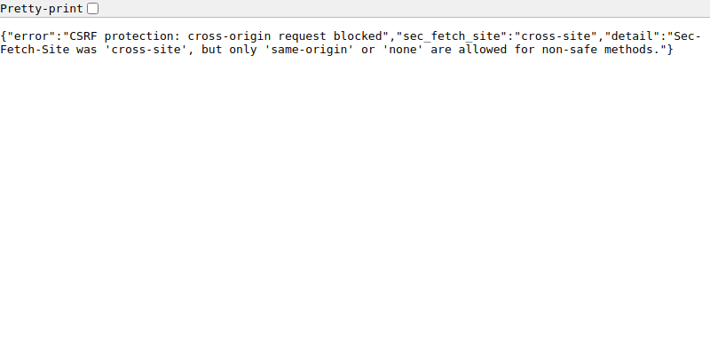

# CSRF Protection Demo: Modern Browser-Based Defenses

<!-- AI-GENERATED-NOTE -->
> [!NOTE]
> This is an AI-generated research report. All text and code in this report was created by an LLM (Large Language Model). For more information on how these reports are created, see the [main research repository](https://github.com/simonw/research).
<!-- /AI-GENERATED-NOTE -->

*2026-03-13T23:37:16Z by Showboat 0.6.1*
<!-- showboat-id: 0f5effdf-8c16-4942-b67d-703309734138 -->

## What is CSRF?

Cross-Site Request Forgery (CSRF) is a web security vulnerability where an attacker tricks a victim's browser into making unwanted requests to a site where the victim is authenticated. The browser automatically includes cookies (session tokens) with the request, so the target server thinks the request is legitimate.

**The classic attack scenario:**
1. Alice logs into her bank at `foo.localhost:8000`
2. Alice visits a malicious site at `bar.localhost:9000` (maybe via a phishing link)
3. The malicious site contains a hidden form that auto-submits a money transfer to the bank
4. Alice's browser sends her session cookie along with the forged request
5. The bank processes the transfer — Alice just lost her money!

## The New Approach: No More Tokens

Historically, CSRF was prevented using **anti-CSRF tokens** — random values embedded in forms and validated server-side. This approach works but requires instrumenting every form and POST endpoint.

Modern browsers now send metadata headers that tell the server *where a request originated*:
- **`Sec-Fetch-Site`**: Indicates whether the request is `same-origin`, `same-site`, `cross-site`, or `none` (direct navigation)
- **`Origin`**: The origin (scheme + host + port) that initiated the request

By checking these headers, servers can reject cross-origin POST requests without needing tokens at all. This is the approach implemented by Go 1.25's `http.CrossOriginProtection` middleware, based on [research by Filippo Valsorda](https://words.filippo.io/csrf/) and further explained by [Alex Edwards](https://www.alexedwards.net/blog/preventing-csrf-in-go).

## Demo Setup

We have two FastAPI servers:
- **Bank App** at `http://foo.localhost:8000` — the target, with both vulnerable and protected endpoints
- **Attacker App** at `http://bar.localhost:9000` — simulates a malicious website

Let's verify both are running:

```bash
curl -s http://foo.localhost:8000/ | grep "<title>" && curl -s http://bar.localhost:9000/ | grep "<title>"
```

```output
<head><title>CSRF Demo - Bank App</title>
<head><title>Attacker Site</title>
```

Both servers are up. Now let's see what security-relevant headers modern browsers send.

## Part 1: Understanding Browser Headers

When Chrome navigates directly to a page, it sends `Sec-Fetch-Site: none` (user-initiated):

```bash
uvx rodney open http://foo.localhost:8000/headers
uvx rodney waitload
uvx rodney js "Array.from(document.querySelectorAll('tr')).filter(r => r.querySelector('td:first-child')?.textContent?.trim().match(/^(host|origin|sec-fetch|referer)/)).map(r => {const cells = r.querySelectorAll('td'); return cells[0]?.textContent?.trim() + ': ' + cells[1]?.textContent?.trim()}).join('\n')"
```

```output
Request Headers
Page loaded
host: foo.localhost:8000
sec-fetch-dest: document
sec-fetch-mode: navigate
sec-fetch-site: none
sec-fetch-user: ?1
```

`Sec-Fetch-Site: none` means this was a direct user navigation (typed URL / bookmark). No `Origin` header is sent for GET requests. These headers are set by the browser and **cannot be spoofed by JavaScript**.

## Part 2: CSRF Attack Against an Unprotected Server

Let's login Alice and then attack:

```bash
# Login Alice to the vulnerable bank endpoint (cookie has no SameSite attribute)
uvx rodney open "http://foo.localhost:8000/vulnerable/login?user=alice"
uvx rodney waitload
uvx rodney open "http://foo.localhost:8000/vulnerable/dashboard"
uvx rodney waitload
echo "Alice is logged in. Balance:"
uvx rodney js "document.querySelector('.balance')?.textContent"
```

```output
foo.localhost:8000/vulnerable/login?user=alice
Page loaded
Bank App (Vulnerable)
Page loaded
Alice is logged in. Balance:
$10,000
```

Alice is logged in with $10,000. The attacker's page at `bar.localhost:9000` contains a hidden auto-submitting form:

```html
<form action="http://foo.localhost:8000/vulnerable/transfer" method="POST" style="display:none">
  <input type="hidden" name="to" value="mallory" />
  <input type="hidden" name="amount" value="5000" />
</form>
<script>document.forms[0].submit();</script>
```

When Alice visits the attacker's page:

```bash
# Alice visits the attacker's page — the hidden form auto-submits!
uvx rodney open "http://bar.localhost:9000/attack/form-auto"
sleep 2
uvx rodney waitload
echo "Page after attack:"
uvx rodney url
uvx rodney text "body"
echo ""
echo "=== Balances ==="
curl -s http://foo.localhost:8000/api/balances | python3 -m json.tool
echo ""
echo "=== Headers the server received ==="
curl -s http://foo.localhost:8000/api/last-headers | python3 -m json.tool
```

```output
foo.localhost:8000/vulnerable/transfer
Page loaded
Page after attack:
http://foo.localhost:8000/vulnerable/transfer
Transferred $5000 to mallory. Dashboard

=== Balances ===
{
    "alice": 5000,
    "bob": 500,
    "mallory": 5100
}

=== Headers the server received ===
{
    "host": "foo.localhost:8000",
    "origin": "http://bar.localhost:9000",
    "content-type": "application/x-www-form-urlencoded",
    "sec-fetch-site": "cross-site",
    "sec-fetch-mode": "navigate",
    "sec-fetch-dest": "document",
    "referer": "http://bar.localhost:9000/",
    "cookie": "session_id=548fd75916aad2089cca45249d138675"
}
```

**The attack succeeded!** Alice lost $5,000 to mallory. Key observations:

- `origin: http://bar.localhost:9000` — The browser reported the attacker's origin
- `sec-fetch-site: cross-site` — The browser labeled this **cross-site**
- `cookie: session_id=...` — Alice's cookie was sent (no SameSite restriction)

The browser gave the server everything needed to block this. The server just didn't check.

## Part 3: The Modern Defense

Now let's test the **protected** endpoint which implements Filippo Valsorda's algorithm. First, reset balances and login:

```bash
curl -s -X POST http://foo.localhost:8000/api/reset > /dev/null
# Login to protected endpoint (SameSite=Lax cookie)
uvx rodney open "http://foo.localhost:8000/protected/login?user=alice"
uvx rodney waitload

# Verify legitimate same-origin transfer works
uvx rodney open "http://foo.localhost:8000/protected/dashboard"
uvx rodney waitload
uvx rodney select "select[name=to]" "bob"
uvx rodney clear "input[name=amount]"
uvx rodney input "input[name=amount]" "200"
uvx rodney submit "form"
uvx rodney waitload
echo "--- Legitimate transfer result ---"
uvx rodney text "body"
echo ""
echo "=== Headers (same-origin POST) ==="
curl -s http://foo.localhost:8000/api/last-headers | python3 -m json.tool
```

```output
foo.localhost:8000/protected/login?user=alice
Page loaded
Bank App (Protected)
Page loaded
Selected: bob
Cleared
Typed: 200
Submitted
Page loaded
--- Legitimate transfer result ---
Transferred $200 to bob. Dashboard

=== Headers (same-origin POST) ===
{
    "host": "foo.localhost:8000",
    "origin": "http://foo.localhost:8000",
    "content-type": "application/x-www-form-urlencoded",
    "sec-fetch-site": "same-origin",
    "sec-fetch-mode": "navigate",
    "sec-fetch-user": "?1",
    "sec-fetch-dest": "document",
    "referer": "http://foo.localhost:8000/protected/dashboard",
    "cookie": "session_id=a6056fb28cd2f93a41d53edbc537608b"
}
```

Legitimate same-origin transfers work perfectly: `Sec-Fetch-Site: same-origin` and `Origin` matches `Host`. Now the attacker tries a cross-origin form POST:

```bash
# Attack the protected endpoint from the attacker site
uvx rodney open "http://bar.localhost:9000/attack/protected-form"
uvx rodney waitload
uvx rodney click "button[type=submit]"
sleep 1
uvx rodney waitload
echo "--- Response from server ---"
uvx rodney text "body"
echo ""
echo "=== Headers from cross-origin POST ==="
curl -s http://foo.localhost:8000/api/last-headers | python3 -m json.tool
echo ""
echo "=== Balances (unchanged!) ==="
curl -s http://foo.localhost:8000/api/balances | python3 -m json.tool
```

```output
CSRF vs Protected Endpoint
Page loaded
Clicked
Page loaded
--- Response from server ---
{"error":"CSRF protection: cross-origin request blocked","sec_fetch_site":"cross-site","detail":"Sec-Fetch-Site was 'cross-site', but only 'same-origin' or 'none' are allowed for non-safe methods."}

=== Headers from cross-origin POST ===
{
    "host": "foo.localhost:8000",
    "origin": "http://bar.localhost:9000",
    "content-type": "application/x-www-form-urlencoded",
    "sec-fetch-site": "cross-site",
    "sec-fetch-mode": "navigate",
    "sec-fetch-user": "?1",
    "sec-fetch-dest": "document",
    "referer": "http://bar.localhost:9000/"
}

=== Balances (unchanged!) ===
{
    "alice": 9800,
    "bob": 700,
    "mallory": 100
}
```

**Attack blocked!** Two layers of protection worked:

1. **`SameSite=Lax` cookie** — The browser didn't send Alice's cookie at all (notice no `cookie` field in the headers). The cross-site POST would have been unauthenticated even without the middleware.

2. **`Sec-Fetch-Site` check** — The middleware saw `cross-site` and returned 403 before reaching the transfer logic.

## Part 4: Non-Browser Requests Still Work

The algorithm correctly allows API calls (curl, scripts) that don't send browser headers:

```bash
# curl doesn't send Sec-Fetch-Site or Origin — not a browser, not a CSRF
SESSION=$(curl -s -c - "http://foo.localhost:8000/protected/login?user=alice" | grep session_id | awk '{print $NF}')
echo "curl POST to protected endpoint (no browser headers):"
curl -s -X POST "http://foo.localhost:8000/protected/transfer" \
  -d "to=bob&amount=100" -b "session_id=$SESSION"
echo ""
echo ""
echo "Headers from curl POST:"
curl -s http://foo.localhost:8000/api/last-headers | python3 -m json.tool
```

```output
curl POST to protected endpoint (no browser headers):
<p>Transferred $100 to bob. <a href='/protected/dashboard'>Dashboard</a></p>

Headers from curl POST:
{
    "host": "foo.localhost:8000",
    "cookie": "session_id=863741209ec4fc122d1777c226098e07",
    "content-type": "application/x-www-form-urlencoded"
}
```

curl has no `Sec-Fetch-Site` or `Origin` headers, so the middleware allows it through (Step 4 of the algorithm). CSRF is a browser-specific attack — non-browser clients can forge requests anyway.

## The Algorithm

Here's the protection algorithm from Filippo Valsorda's article, as implemented in this demo and in Go 1.25's `http.CrossOriginProtection`:

```python
def check_csrf(request):
    # Step 1: Allow safe methods
    if request.method in ("GET", "HEAD", "OPTIONS"):
        return ALLOW  # safe methods shouldn't change state

    # Step 2: Check trusted origins allow-list
    origin = request.headers.get("origin")
    if origin in TRUSTED_ORIGINS:
        return ALLOW  # e.g. SSO partner domains

    # Step 3: Check Sec-Fetch-Site (primary defense)
    sec_fetch_site = request.headers.get("sec-fetch-site")
    if sec_fetch_site is not None:
        if sec_fetch_site in ("same-origin", "none"):
            return ALLOW   # same-origin or direct navigation
        return BLOCK       # cross-site or cross-origin

    # Step 4: No browser headers at all → not a CSRF
    if origin is None:
        return ALLOW  # curl, API clients, etc.

    # Step 5: Fallback — compare Origin with Host
    if urlparse(origin).netloc == request.headers["host"]:
        return ALLOW
    return BLOCK
```

| Step | What it catches | When it applies |
|------|----------------|-----------------|
| 1 | Safe methods skip check | All requests |
| 2 | Trusted partner origins | Configured SSO domains |
| 3 | **Primary defense** — `Sec-Fetch-Site` | All browsers since 2023 |
| 4 | Non-browser clients | curl, API calls |
| 5 | Fallback for older browsers | Pre-2023 browsers |

## Defense in Depth with SameSite Cookies

Using `SameSite=Lax` or `SameSite=Strict` on session cookies adds another layer. As we saw, the browser didn't even send Alice's cookie on the cross-site POST. Even if the middleware had a bug, the transfer would have failed due to missing authentication.

**Combine both for comprehensive protection:**
- `Sec-Fetch-Site` middleware → blocks cross-**origin** requests (even same-site, different subdomain)
- `SameSite=Lax` cookies → blocks cross-**site** cookie transmission
- Together: protection against both cross-origin and cross-site attacks

## Key Takeaways

1. **No tokens needed** — No hidden form fields, no server-side state, no token rotation
2. **One middleware protects everything** — No per-endpoint instrumentation
3. **Browser headers can't be spoofed** — `Sec-Fetch-Site` is set by the browser, not JavaScript
4. **Use HTTPS in production** — Required for `Sec-Fetch-Site` to be sent
5. **Never change state on GET** — Safe methods must be truly safe
6. **Use HSTS** — Prevents HTTP downgrade attacks

## Further Reading

- [Filippo Valsorda: Cross-Site Request Forgery](https://words.filippo.io/csrf/) — The research behind Go 1.25's `http.CrossOriginProtection`
- [Alex Edwards: A modern approach to preventing CSRF in Go](https://www.alexedwards.net/blog/preventing-csrf-in-go) — Practical guidance on conditions and limitations
- [Go 1.25 http.CrossOriginProtection](https://pkg.go.dev/net/http@go1.25rc2#CrossOriginProtection) — The standard library implementation
- [MDN: Sec-Fetch-Site](https://developer.mozilla.org/en-US/docs/Web/HTTP/Reference/Headers/Sec-Fetch-Site) — Browser support and specification

```bash {image}
\
```



```bash {image}
\
```



```bash {image}
\
```


