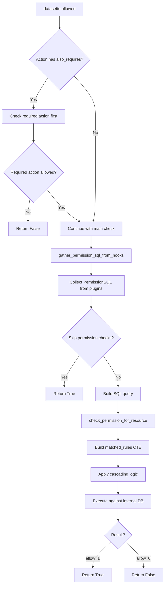
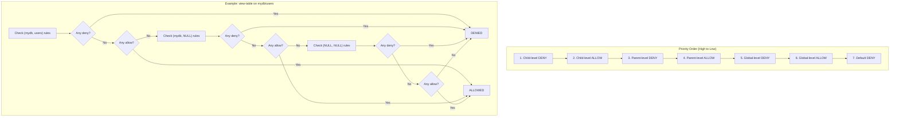
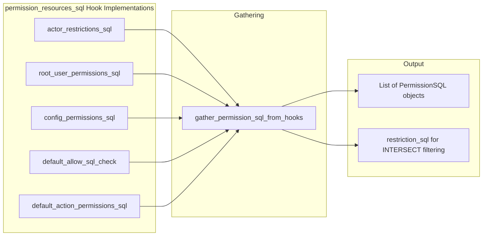
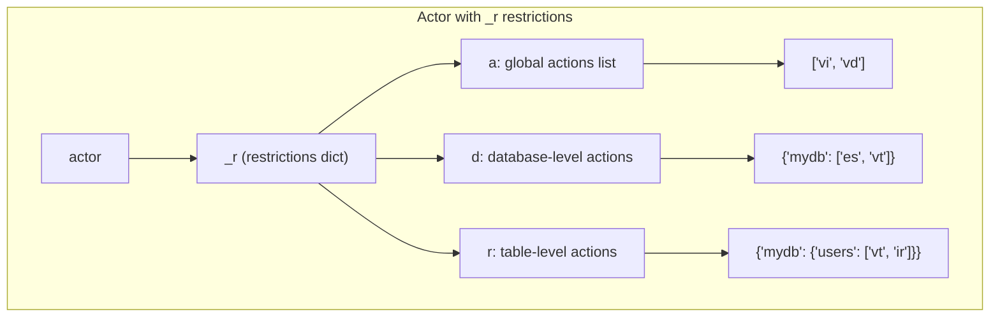

# Datasette 1.0a20 SQL Permissions System: Architecture Review

**Date:** 2025-11-27
**Version Reviewed:** 1.0a20 (and subsequent alphas through 1.0a22)
**Author:** Architecture Review

---

## Executive Summary

Datasette 1.0a20 introduced a fundamental redesign of the permissions system, replacing the callback-based `permission_allowed()` hook with a SQL-driven approach via `permission_resources_sql()`. This change transforms an N x M problem (N resources × M plugins) into efficient SQL queries against internal catalog tables.

This review analyzes the architecture, identifies potential issues, and provides recommendations for improving clarity and maintainability.

---

## Table of Contents

1. [System Overview](#1-system-overview)
2. [Architecture Diagrams](#2-architecture-diagrams)
3. [Detailed Component Analysis](#3-detailed-component-analysis)
4. [Analysis of default_permissions.py](#4-analysis-of-default_permissionspy)
5. [Potential Flaws and Edge Cases](#5-potential-flaws-and-edge-cases)
6. [Suggestions for Improvement](#6-suggestions-for-improvement)
7. [Debugging Tools Analysis](#7-debugging-tools-analysis)
8. [Reimplemented default_permissions.py](#8-reimplemented-default_permissionspy)

---

## 1. System Overview

### 1.1 The Problem Solved

The previous permission system evaluated permissions using a `permission_allowed()` hook that was called once per resource per plugin. For large Datasette instances with many tables and multiple plugins, this approach became prohibitively expensive:

```
Old approach: O(R × P) callback invocations
Where R = number of resources, P = number of plugins
```

The new system compiles permission rules into SQL queries that can be executed in a single database operation:

```
New approach: O(1) SQL query execution (albeit with complex query)
```

### 1.2 Core Concepts

| Concept | Description |
|---------|-------------|
| **Action** | A named operation (e.g., `view-table`, `execute-sql`) |
| **Resource** | The target of an action (database, table, query) |
| **Actor** | The entity performing the action (user, API client) |
| **PermissionSQL** | SQL fragments that contribute allow/deny rules |
| **Restriction** | Actor-embedded allowlists that filter accessible resources |

### 1.3 Resource Hierarchy

```
┌─────────────────────────────────────────────────────────────────┐
│                         Global (NULL, NULL)                      │
│  Actions: view-instance, permissions-debug, debug-menu           │
├─────────────────────────────────────────────────────────────────┤
│                    Parent Level (parent, NULL)                   │
│  Resource: DatabaseResource                                      │
│  Actions: view-database, execute-sql, create-table               │
├─────────────────────────────────────────────────────────────────┤
│                    Child Level (parent, child)                   │
│  Resources: TableResource, QueryResource                         │
│  Actions: view-table, insert-row, view-query, etc.               │
└─────────────────────────────────────────────────────────────────┘
```

---

## 2. Architecture Diagrams

### 2.1 Permission Resolution Flow



### 2.2 Cascading Permission Resolution



### 2.3 Plugin Hook Architecture



### 2.4 Actor Restrictions Structure



---

## 3. Detailed Component Analysis

### 3.1 Key Files and Their Responsibilities

| File | Purpose |
|------|---------|
| `datasette/permissions.py` | Core classes: `Resource`, `Action`, `PermissionSQL`, `SkipPermissions` |
| `datasette/resources.py` | Concrete resource types: `DatabaseResource`, `TableResource`, `QueryResource` |
| `datasette/default_actions.py` | Registration of built-in actions |
| `datasette/default_permissions.py` | Default permission hook implementations |
| `datasette/utils/actions_sql.py` | SQL query building for permission resolution |
| `datasette/utils/permissions.py` | Hook gathering and utility functions |

### 3.2 The PermissionSQL Dataclass

```python
@dataclass
class PermissionSQL:
    sql: str | None           # SELECT parent, child, allow, reason
    params: dict | None       # Bound parameters
    source: str | None        # Plugin name (auto-populated)
    restriction_sql: str | None  # Optional INTERSECT filtering

    @classmethod
    def allow(cls, reason: str) -> "PermissionSQL": ...

    @classmethod
    def deny(cls, reason: str) -> "PermissionSQL": ...
```

### 3.3 The Cascading SQL Pattern

The system builds a complex CTE (Common Table Expression) query:

```sql
WITH
-- Base resources from catalog
base AS (
  SELECT database_name AS parent, table_name AS child FROM catalog_tables
  UNION ALL SELECT database_name AS parent, view_name AS child FROM catalog_views
),

-- Rules from all plugins combined
all_rules AS (
  SELECT parent, child, allow, reason, 'plugin1' AS source_plugin FROM (...)
  UNION ALL
  SELECT parent, child, allow, reason, 'plugin2' AS source_plugin FROM (...)
),

-- Child-level matching (most specific)
child_lvl AS (
  SELECT b.parent, b.child,
         MAX(CASE WHEN ar.allow = 0 THEN 1 ELSE 0 END) AS any_deny,
         MAX(CASE WHEN ar.allow = 1 THEN 1 ELSE 0 END) AS any_allow,
         ...
  FROM base b
  LEFT JOIN all_rules ar ON ar.parent = b.parent AND ar.child = b.child
  GROUP BY b.parent, b.child
),

-- Parent-level matching
parent_lvl AS (...),

-- Global-level matching
global_lvl AS (...),

-- Final cascading decision
decisions AS (
  SELECT b.parent, b.child,
    CASE
      WHEN cl.any_deny = 1 THEN 0   -- Child deny wins
      WHEN cl.any_allow = 1 THEN 1  -- Child allow
      WHEN pl.any_deny = 1 THEN 0   -- Parent deny
      WHEN pl.any_allow = 1 THEN 1  -- Parent allow
      WHEN gl.any_deny = 1 THEN 0   -- Global deny
      WHEN gl.any_allow = 1 THEN 1  -- Global allow
      ELSE 0                        -- Default deny
    END AS is_allowed,
    ...
  FROM base b
  JOIN child_lvl cl ON ...
  JOIN parent_lvl pl ON ...
  JOIN global_lvl gl ON ...
)

SELECT parent, child, reason FROM decisions WHERE is_allowed = 1
```

---

## 4. Analysis of default_permissions.py

### 4.1 Overview of Hook Implementations

The file implements five `permission_resources_sql` hooks:

| Function | Purpose | Priority |
|----------|---------|----------|
| `actor_restrictions_sql` | Enforces `_r` restrictions embedded in actor | Filtering |
| `root_user_permissions_sql` | Grants root user all permissions | High |
| `config_permissions_sql` | Applies datasette.yaml configuration | Medium |
| `default_allow_sql_check` | Enforces `default_allow_sql` setting | Medium |
| `default_action_permissions_sql` | Provides default allow for view actions | Low |

### 4.2 Detailed Function Analysis

#### 4.2.1 `actor_restrictions_sql` (Lines 15-87)

**Purpose:** Handles actor restriction-based permission rules (the `_r` key in actor dict).

**Logic Flow:**
1. If no actor or no `_r` key, return empty list (no restrictions apply)
2. Check if action is globally allowed in restrictions' `a` list
3. If not globally allowed, build `restriction_sql` that:
   - Collects database-level allowlists from `d` dict
   - Collects table-level allowlists from `r` dict
   - Returns UNION of allowed (parent, child) pairs

**Critical Insight:** This function returns `restriction_sql` rather than regular `sql`. The `restriction_sql` is used with INTERSECT to filter results, meaning all restriction sources must agree for a resource to be accessible.

**Code Complexity Issues:**
- Nested loops with string building for SQL
- Manual parameter counter management
- Abbreviation handling duplicated across functions

#### 4.2.2 `root_user_permissions_sql` (Lines 90-98)

**Purpose:** Grants root user full permissions when `--root` flag is used.

**Logic:**
```python
if datasette.root_enabled and actor and actor.get("id") == "root":
    return PermissionSQL.allow(reason="root user")
```

**Note:** This adds a global-level allow rule `(NULL, NULL)`, which is the least specific. Database or table-level deny rules in config can still block root.

#### 4.2.3 `config_permissions_sql` (Lines 101-337)

**Purpose:** The most complex function - applies permission rules from `datasette.yaml`.

**This function handles:**
1. `permissions:` blocks at root, database, and table levels
2. `allow:` blocks for view-* actions
3. `allow_sql:` for execute-sql action
4. Interaction with actor restrictions

**Key Helper Functions:**

```python
def evaluate(allow_block):
    """Returns True/False/None based on actor_matches_allow()"""

def is_in_restriction_allowlist(parent, child, action_name):
    """Checks if resource is allowed by actor's _r restrictions"""

def add_row(parent, child, result, scope):
    """Adds a permission rule if result is not None"""

def add_row_allow_block(parent, child, allow_block, scope):
    """For 'allow' blocks - adds rules including restriction-gated denies"""
```

**Complexity Analysis:**

The function iterates through:
- Root-level permissions
- Each database's permissions
- Each database's tables' permissions
- Each database's queries' permissions
- Special handling for `allow`, `allow_sql` at different levels

**Problematic Pattern (Lines 210-225):**
When an actor has restrictions and a config rule denies at a higher level, the code adds explicit deny rules for all restricted resources:

```python
if has_restrictions and not bool_result and child is None:
    reason = f"config deny {scope} (restriction gate)"
    if parent is None:
        # Root-level deny: add more specific denies for restricted resources
        if action_obj and action_obj.takes_parent:
            for db_name in restricted_databases:
                rows.append((db_name, None, 0, reason))
        if action_obj and action_obj.takes_child:
            for db_name, table_name in restricted_tables:
                rows.append((db_name, table_name, 0, reason))
```

This is a workaround for a subtle bug: without these explicit denies, a child-level allow could override a parent-level deny when restrictions are involved.

#### 4.2.4 `default_allow_sql_check` (Lines 340-345)

**Purpose:** Enforces the `default_allow_sql` setting.

```python
if action == "execute-sql" and not datasette.setting("default_allow_sql"):
    return PermissionSQL.deny(reason="default_allow_sql is false")
```

#### 4.2.5 `default_action_permissions_sql` (Lines 348-371)

**Purpose:** Provides default allow rules for standard view/execute actions.

**Actions with default allow:**
- `view-instance`
- `view-database`
- `view-database-download`
- `view-table`
- `view-query`
- `execute-sql`

**Note:** Skipped when `datasette.default_deny` is True.

#### 4.2.6 `restrictions_allow_action` (Lines 374-428)

**Purpose:** Standalone utility function to check if restrictions allow an action on a resource.

**Not a hook** - called by other code to quickly check restriction allowlists.

#### 4.2.7 `actor_from_request` (Lines 431-476)

**Purpose:** Handles signed API tokens (`dstok_` prefix) including embedded restrictions.

#### 4.2.8 Other Hooks (Lines 479-494)

- `skip_csrf`: Skips CSRF for JSON content-type requests
- `canned_queries`: Returns canned queries from config

---

## 5. Potential Flaws and Edge Cases

### 5.1 High Severity Issues

#### 5.1.1 Restriction-Config Interaction Complexity

**Issue:** The interaction between actor restrictions (`_r`) and config-based permissions is extremely complex and potentially error-prone.

**Example Scenario:**
```yaml
# Config
databases:
  mydb:
    allow:
      id: admin
```

```python
# Actor with restrictions
actor = {
    "id": "user",
    "_r": {"d": {"mydb": ["vt"]}}
}
```

The actor has `view-table` permission via restrictions, but the database-level `allow` block would deny them because they're not `admin`. The code handles this with the "restriction gate" logic, but the behavior is non-obvious.

**Recommendation:** Document this interaction clearly and consider simplifying the model.

#### 5.1.2 Global Allow with Specific Restrictions

**Issue:** When an actor has restrictions for a global action (like `view-instance`), the current implementation may behave unexpectedly.

```python
actor = {"id": "user", "_r": {"a": ["vi"]}}  # Global view-instance allowed
```

The actor expects to view the instance, but if there's a config rule like `allow: {id: admin}` at the root level, the behavior depends on cascading order.

### 5.2 Medium Severity Issues

#### 5.2.1 SQL Injection via Reason Strings

**Issue:** In some places, reason strings are inserted directly into SQL:

```python
reason = f"default allow for {action}".replace("'", "''")
```

While single quotes are escaped, this pattern is fragile. Any change that forgets escaping could introduce vulnerabilities.

**Recommendation:** Always use parameterized queries for all user-influenced strings.

#### 5.2.2 Parameter Name Collision

**Issue:** Multiple plugins could potentially use conflicting parameter names.

From `datasette/utils/permissions.py`:
```python
# The system reserves these parameter names: :actor, :actor_id, :action, :filter_parent
# Plugin parameters should be prefixed with a unique identifier
```

**Current Mitigations:** The code uses prefixes like `cfg_0`, `restr_0`, etc., but this is not enforced for third-party plugins.

#### 5.2.3 Performance with Many Tables

**Issue:** The SQL query complexity grows with the number of tables and permission rules. For instances with thousands of tables, the generated SQL could be very large.

**Specific Concern:** The `config_permissions_sql` function iterates over all configured databases and tables, generating individual rows. A config with 100 tables could generate hundreds of UNION ALL clauses.

### 5.3 Low Severity Issues

#### 5.3.1 Inconsistent Abbreviation Handling

The abbreviation check is duplicated across multiple functions:

```python
action_obj = datasette.actions.get(action)
action_checks = {action}
if action_obj and action_obj.abbr:
    action_checks.add(action_obj.abbr)
```

This appears in:
- `actor_restrictions_sql` (lines 26-29)
- `config_permissions_sql` (lines 114-117)
- `restrictions_allow_action` (lines 388-391)

**Recommendation:** Extract to a shared utility function.

#### 5.3.2 Incomplete Type Hints

Several functions lack complete type annotations, making the code harder to understand and maintain.

#### 5.3.3 Magic String "None" in Templates

The debugging template `debug_check.html` shows that `None` text could appear:

```html
<!-- From issue #2599 fix -->
```

This suggests rendering issues were found and fixed, indicating the complexity causes bugs.

---

## 6. Suggestions for Improvement

### 6.1 Code Organization

#### 6.1.1 Split default_permissions.py

The file handles too many concerns. Suggested split:

```
datasette/default_permissions/
├── __init__.py              # Re-exports
├── restrictions.py          # actor_restrictions_sql, restrictions_allow_action
├── root.py                  # root_user_permissions_sql
├── config.py                # config_permissions_sql
├── defaults.py              # default_allow_sql_check, default_action_permissions_sql
├── tokens.py                # actor_from_request
└── helpers.py               # Shared utilities
```

#### 6.1.2 Extract Common Patterns

Create utilities for:
- Abbreviation checking
- Parameter name generation
- SQL fragment building

### 6.2 Simplify config_permissions_sql

The function is 237 lines with deep nesting. Suggested refactoring:

```python
class ConfigPermissionBuilder:
    """Builder pattern for config-based permissions."""

    def __init__(self, datasette, actor, action):
        self.datasette = datasette
        self.actor = actor
        self.action = action
        self.rows = []
        self._init_restrictions()

    def process_root_permissions(self): ...
    def process_database_permissions(self, db_name, db_config): ...
    def process_table_permissions(self, db_name, table_name, table_config): ...
    def process_query_permissions(self, db_name, query_name, query_config): ...
    def process_allow_blocks(self): ...

    def build(self) -> list[PermissionSQL]: ...
```

### 6.3 Improve Error Messages

Current reason strings are technical:
```
"config allow permissions for view-table on mydb/users"
```

Suggested improvement:
```
"Config file grants view-table on table 'users' in database 'mydb'"
```

### 6.4 Add Validation Layer

Add a validation step when loading config:

```python
class PermissionConfigValidator:
    def validate_allow_block(self, block, path): ...
    def validate_permissions_block(self, block, path): ...
    def check_conflicting_rules(self, config): ...
```

This would catch configuration errors early rather than at permission-check time.

### 6.5 Consider Declarative Permission Rules

Instead of imperative SQL building, consider a declarative approach:

```python
@dataclass
class PermissionRule:
    parent: str | None
    child: str | None
    allow: bool
    reason: str
    priority: int = 0

class PermissionRuleSet:
    def add_rule(self, rule: PermissionRule): ...
    def to_sql(self) -> PermissionSQL: ...
```

---

## 7. Debugging Tools Analysis

### 7.1 Available Endpoints

| Endpoint | Purpose | Access |
|----------|---------|--------|
| `/-/actions` | List all registered actions | Public |
| `/-/allowed` | Show resources actor can access | Public (reasons hidden) |
| `/-/rules` | Show all allow/deny rules | permissions-debug required |
| `/-/check` | Test specific permission check | permissions-debug required |
| `/-/permissions` | Permission check history | permissions-debug required |

### 7.2 Strengths

1. **Interactive Forms:** All debug endpoints have HTML form interfaces
2. **JSON API:** Adding `.json` suffix provides machine-readable output
3. **Actor Context:** Shows current actor alongside results
4. **Historical Tracking:** `/-/permissions` logs all permission checks

### 7.3 Weaknesses and Suggestions

#### 7.3.1 No Rule Source Visibility for Non-Admin Users

The `/-/allowed` endpoint hides the `reason` field from non-admin users. While this is a security measure, it makes debugging harder for regular users.

**Suggestion:** Add a "simplified reason" that gives hints without revealing internal details:
- "Allowed by default configuration"
- "Blocked by database-level restriction"
- "Your token doesn't include this resource"

#### 7.3.2 No Diff/Comparison View

**Current:** Users must manually compare permissions between actors.

**Suggestion:** Add `/-/compare` endpoint:
```
/-/compare?action=view-table&actor1={...}&actor2={...}
```

This would show:
- Resources only actor1 can access
- Resources only actor2 can access
- Shared resources
- Different reasons for same resources

#### 7.3.3 No "What Blocks This?" Query

**Current:** `/-/check` shows if access is allowed but doesn't clearly explain the blocking rule when denied.

**Suggestion:** Enhance the response:
```json
{
  "allowed": false,
  "blocking_rule": {
    "source": "config_permissions_sql",
    "level": "database",
    "reason": "allow block on fixtures requires id=admin",
    "path": "databases.fixtures.allow"
  },
  "would_allow_if": [
    {"change": "Add id=testuser to databases.fixtures.allow.id list"},
    {"change": "Grant testuser the admin role"}
  ]
}
```

#### 7.3.4 No Query Explanation

**Suggestion:** Add `/-/explain-query` that shows the actual SQL being executed:
```
/-/explain-query?action=view-table&actor={"id":"test"}
```

Response includes:
- The generated SQL
- Bound parameters
- Execution plan
- List of contributing plugins

#### 7.3.5 Missing Restriction Visualization

**Current:** Actor restrictions (`_r`) are opaque to debug tools.

**Suggestion:** Add `/-/actor-restrictions` that parses and displays:
```
Your token restrictions:
├── Global Actions: view-instance, permissions-debug
├── Database: mydb
│   └── Actions: view-database, execute-sql
└── Tables:
    └── mydb/users
        └── Actions: view-table, insert-row
```

#### 7.3.6 No Permission Audit Log

**Suggestion:** Add persistent permission audit logging:
```python
@dataclass
class PermissionAuditEntry:
    timestamp: datetime
    actor_id: str
    action: str
    resource: str
    result: bool
    reason: str
    request_path: str
```

Accessible via `/-/audit` with filtering by actor, action, result.

---

## 8. Reimplemented default_permissions.py

Below is a reimplementation that aims for improved clarity while maintaining backward compatibility. The tests should continue to pass.

```python
"""
Default permission implementations for Datasette.

This module provides the built-in permission checking logic through implementations
of the permission_resources_sql hook. The hooks are organized by their purpose:

1. Actor Restrictions - Enforces _r allowlists embedded in actor tokens
2. Root User - Grants full access when --root flag is used
3. Config Rules - Applies permissions from datasette.yaml
4. Default Settings - Enforces default_allow_sql and default view permissions

IMPORTANT: These hooks return PermissionSQL objects that are combined using SQL
UNION/INTERSECT operations. The order of evaluation is:
  - restriction_sql fields are INTERSECTed (all must match)
  - Regular sql fields are UNIONed and evaluated with cascading priority
"""

from __future__ import annotations

from dataclasses import dataclass
from typing import TYPE_CHECKING, Set, Tuple, List, Any, Optional

if TYPE_CHECKING:
    from datasette.app import Datasette

from datasette import hookimpl
from datasette.permissions import PermissionSQL
from datasette.utils import actor_matches_allow
import itsdangerous
import time


# =============================================================================
# HELPER UTILITIES
# =============================================================================


def get_action_name_variants(datasette: "Datasette", action: str) -> Set[str]:
    """
    Get all name variants for an action (full name and abbreviation).

    Example:
        get_action_name_variants(ds, "view-table") -> {"view-table", "vt"}
    """
    variants = {action}
    action_obj = datasette.actions.get(action)
    if action_obj and action_obj.abbr:
        variants.add(action_obj.abbr)
    return variants


def action_in_list(datasette: "Datasette", action: str, action_list: list) -> bool:
    """Check if an action (or its abbreviation) is in a list."""
    return bool(get_action_name_variants(datasette, action).intersection(action_list))


@dataclass
class PermissionRow:
    """A single permission rule row."""
    parent: Optional[str]
    child: Optional[str]
    allow: bool
    reason: str


class PermissionRowCollector:
    """Collects permission rows and converts them to PermissionSQL."""

    def __init__(self):
        self.rows: List[PermissionRow] = []
        self._param_counter = 0

    def add(
        self,
        parent: Optional[str],
        child: Optional[str],
        allow: bool,
        reason: str
    ) -> None:
        """Add a permission row."""
        self.rows.append(PermissionRow(parent, child, allow, reason))

    def add_if_not_none(
        self,
        parent: Optional[str],
        child: Optional[str],
        result: Optional[bool],
        reason: str
    ) -> None:
        """Add a row only if result is not None."""
        if result is not None:
            self.add(parent, child, result, reason)

    def to_permission_sql(self) -> Optional[PermissionSQL]:
        """Convert collected rows to a PermissionSQL object."""
        if not self.rows:
            return None

        parts = []
        params = {}

        for idx, row in enumerate(self.rows):
            key = f"row_{idx}"
            parts.append(
                f"SELECT :{key}_parent AS parent, :{key}_child AS child, "
                f":{key}_allow AS allow, :{key}_reason AS reason"
            )
            params[f"{key}_parent"] = row.parent
            params[f"{key}_child"] = row.child
            params[f"{key}_allow"] = 1 if row.allow else 0
            params[f"{key}_reason"] = row.reason

        sql = "\nUNION ALL\n".join(parts)
        return PermissionSQL(sql=sql, params=params)


# =============================================================================
# ACTOR RESTRICTIONS HANDLER
# =============================================================================


@dataclass
class ActorRestrictions:
    """Parsed actor restrictions from the _r key."""

    global_actions: List[str]          # _r.a - globally allowed actions
    database_actions: dict             # _r.d - {db_name: [actions]}
    table_actions: dict                # _r.r - {db_name: {table: [actions]}}

    @classmethod
    def from_actor(cls, actor: Optional[dict]) -> Optional["ActorRestrictions"]:
        """Parse restrictions from actor dict. Returns None if no restrictions."""
        if not actor or not isinstance(actor, dict):
            return None

        restrictions = actor.get("_r")
        if restrictions is None:
            return None

        return cls(
            global_actions=restrictions.get("a", []),
            database_actions=restrictions.get("d", {}),
            table_actions=restrictions.get("r", {}),
        )

    def is_action_globally_allowed(
        self, datasette: "Datasette", action: str
    ) -> bool:
        """Check if action is in the global allowlist."""
        return action_in_list(datasette, action, self.global_actions)

    def get_allowed_databases(
        self, datasette: "Datasette", action: str
    ) -> Set[str]:
        """Get database names where this action is allowed."""
        allowed = set()
        for db_name, db_actions in self.database_actions.items():
            if action_in_list(datasette, action, db_actions):
                allowed.add(db_name)
        return allowed

    def get_allowed_tables(
        self, datasette: "Datasette", action: str
    ) -> Set[Tuple[str, str]]:
        """Get (database, table) pairs where this action is allowed."""
        allowed = set()
        for db_name, tables in self.table_actions.items():
            for table_name, table_actions in tables.items():
                if action_in_list(datasette, action, table_actions):
                    allowed.add((db_name, table_name))
        return allowed

    def is_resource_allowed(
        self,
        datasette: "Datasette",
        action: str,
        parent: Optional[str],
        child: Optional[str]
    ) -> bool:
        """Check if a specific resource is in the restriction allowlist."""
        # Global actions are always allowed
        if self.is_action_globally_allowed(datasette, action):
            return True

        # Check database-level allowlist
        if parent:
            allowed_dbs = self.get_allowed_databases(datasette, action)
            if parent in allowed_dbs:
                return True

        # Check table-level allowlist
        if parent and child:
            allowed_tables = self.get_allowed_tables(datasette, action)
            if (parent, child) in allowed_tables:
                return True

        # For parent-only queries, check if any table in that database is allowed
        if parent and child is None:
            allowed_tables = self.get_allowed_tables(datasette, action)
            if any(db == parent for db, _ in allowed_tables):
                return True

        # For global queries (parent=None, child=None), check if anything is allowed
        if parent is None and child is None:
            if (self.get_allowed_databases(datasette, action) or
                self.get_allowed_tables(datasette, action)):
                return True

        return False


@hookimpl(specname="permission_resources_sql")
async def actor_restrictions_sql(
    datasette: "Datasette",
    actor: Optional[dict],
    action: str
) -> Optional[List[PermissionSQL]]:
    """
    Handle actor restriction-based permission rules.

    When an actor has an "_r" key, it contains an allowlist of resources they
    can access. This function returns restriction_sql that filters the final
    results to only include resources in that allowlist.

    The _r structure:
    {
        "a": ["vi", "pd"],           # Global actions allowed
        "d": {"mydb": ["vt", "es"]}, # Database-level actions
        "r": {"mydb": {"users": ["vt"]}}  # Table-level actions
    }
    """
    restrictions = ActorRestrictions.from_actor(actor)

    if restrictions is None:
        # No restrictions - all resources allowed
        return []

    # If globally allowed, no filtering needed
    if restrictions.is_action_globally_allowed(datasette, action):
        return []

    # Build restriction SQL
    allowed_dbs = restrictions.get_allowed_databases(datasette, action)
    allowed_tables = restrictions.get_allowed_tables(datasette, action)

    # If nothing is allowed for this action, return empty-set restriction
    if not allowed_dbs and not allowed_tables:
        return [
            PermissionSQL(
                params={"_restriction_deny_reason": f"{action} not in allowlist"},
                restriction_sql="SELECT NULL AS parent, NULL AS child WHERE 0",
            )
        ]

    # Build UNION of allowed resources
    selects = []
    params = {}
    counter = 0

    # Database-level entries (parent, NULL) - allows all children
    for db_name in allowed_dbs:
        key = f"restr_{counter}"
        counter += 1
        selects.append(f"SELECT :{key}_p AS parent, NULL AS child")
        params[f"{key}_p"] = db_name

    # Table-level entries (parent, child)
    for db_name, table_name in allowed_tables:
        key = f"restr_{counter}"
        counter += 1
        selects.append(f"SELECT :{key}_p AS parent, :{key}_c AS child")
        params[f"{key}_p"] = db_name
        params[f"{key}_c"] = table_name

    restriction_sql = "\nUNION ALL\n".join(selects)

    return [PermissionSQL(params=params, restriction_sql=restriction_sql)]


# =============================================================================
# ROOT USER PERMISSIONS
# =============================================================================


@hookimpl(specname="permission_resources_sql")
async def root_user_permissions_sql(
    datasette: "Datasette",
    actor: Optional[dict],
    action: str
) -> Optional[PermissionSQL]:
    """
    Grant root user full permissions when --root flag is used.

    This adds a global-level allow rule (NULL, NULL). Note that database or
    table-level deny rules in config can still block access - the root user
    is not completely immune to denies.
    """
    is_root = (
        datasette.root_enabled and
        actor is not None and
        actor.get("id") == "root"
    )

    if is_root:
        return PermissionSQL.allow(reason="root user (--root flag enabled)")

    return None


# =============================================================================
# CONFIG-BASED PERMISSIONS
# =============================================================================


class ConfigPermissionProcessor:
    """
    Processes permission rules from datasette.yaml configuration.

    Configuration structure:

    permissions:                    # Root-level permissions block
      view-instance:
        id: admin

    databases:
      mydb:
        permissions:                # Database-level permissions
          view-database:
            id: admin
        allow:                      # Database-level allow block (for view-*)
          id: viewer
        allow_sql:                  # execute-sql allow block
          id: analyst
        tables:
          users:
            permissions:            # Table-level permissions
              view-table:
                id: admin
            allow:                  # Table-level allow block
              id: viewer
        queries:
          my_query:
            permissions:            # Query-level permissions
              view-query:
                id: admin
            allow:                  # Query-level allow block
              id: viewer
    """

    def __init__(
        self,
        datasette: "Datasette",
        actor: Optional[dict],
        action: str
    ):
        self.datasette = datasette
        self.actor = actor
        self.action = action
        self.config = datasette.config or {}
        self.collector = PermissionRowCollector()

        # Parse restrictions if present
        self.restrictions = ActorRestrictions.from_actor(actor)

        # Pre-compute restriction info for efficiency
        if self.restrictions:
            self.restricted_dbs = (
                self.restrictions.get_allowed_databases(datasette, action)
            )
            # Include parent databases of allowed tables
            allowed_tables = self.restrictions.get_allowed_tables(datasette, action)
            self.restricted_dbs.update(db for db, _ in allowed_tables)
            self.restricted_tables = allowed_tables
        else:
            self.restricted_dbs = set()
            self.restricted_tables = set()

    def evaluate_allow_block(self, allow_block: Any) -> Optional[bool]:
        """Evaluate an allow block against the current actor."""
        if allow_block is None:
            return None
        return actor_matches_allow(self.actor, allow_block)

    def is_in_restriction_allowlist(
        self,
        parent: Optional[str],
        child: Optional[str]
    ) -> bool:
        """Check if resource is allowed by actor restrictions."""
        if self.restrictions is None:
            return True
        return self.restrictions.is_resource_allowed(
            self.datasette, self.action, parent, child
        )

    def add_permissions_rule(
        self,
        parent: Optional[str],
        child: Optional[str],
        permissions_block: Optional[dict],
        scope_desc: str
    ) -> None:
        """Add a rule from a permissions:{action} block."""
        if permissions_block is None:
            return

        action_allow_block = permissions_block.get(self.action)
        result = self.evaluate_allow_block(action_allow_block)

        self.collector.add_if_not_none(
            parent, child, result,
            f"config {'allow' if result else 'deny'} {scope_desc}"
        )

    def add_allow_block_rule(
        self,
        parent: Optional[str],
        child: Optional[str],
        allow_block: Any,
        scope_desc: str
    ) -> None:
        """
        Add rules from an allow:{} block.

        For allow blocks, if the block exists but doesn't match the actor,
        this is treated as a deny. We also handle the restriction-gate logic.
        """
        if allow_block is None:
            return

        # Skip if resource is not in restriction allowlist
        if not self.is_in_restriction_allowlist(parent, child):
            return

        result = self.evaluate_allow_block(allow_block)
        is_allowed = bool(result)

        self.collector.add(
            parent, child, is_allowed,
            f"config {'allow' if result else 'deny'} {scope_desc}"
        )

        # Handle restriction-gate: add explicit denies for restricted resources
        self._add_restriction_gate_denies(parent, child, is_allowed, scope_desc)

    def _add_restriction_gate_denies(
        self,
        parent: Optional[str],
        child: Optional[str],
        is_allowed: bool,
        scope_desc: str
    ) -> None:
        """
        When a config rule denies at a higher level, add explicit denies
        for restricted resources to prevent child-level allows from
        incorrectly granting access.
        """
        if is_allowed or child is not None or self.restrictions is None:
            return

        action_obj = self.datasette.actions.get(self.action)
        if not action_obj:
            return

        reason = f"config deny {scope_desc} (restriction gate)"

        if parent is None:
            # Root-level deny: add denies for all restricted resources
            if action_obj.takes_parent:
                for db_name in self.restricted_dbs:
                    self.collector.add(db_name, None, False, reason)
            if action_obj.takes_child:
                for db_name, table_name in self.restricted_tables:
                    self.collector.add(db_name, table_name, False, reason)
        else:
            # Database-level deny: add denies for tables in that database
            if action_obj.takes_child:
                for db_name, table_name in self.restricted_tables:
                    if db_name == parent:
                        self.collector.add(db_name, table_name, False, reason)

    def process(self) -> Optional[PermissionSQL]:
        """Process all config rules and return combined PermissionSQL."""
        self._process_root_permissions()
        self._process_databases()
        self._process_root_allow_blocks()

        return self.collector.to_permission_sql()

    def _process_root_permissions(self) -> None:
        """Process root-level permissions block."""
        root_perms = self.config.get("permissions") or {}
        self.add_permissions_rule(
            None, None, root_perms,
            f"permissions for {self.action}"
        )

    def _process_databases(self) -> None:
        """Process database-level and nested configurations."""
        databases = self.config.get("databases") or {}

        for db_name, db_config in databases.items():
            self._process_database(db_name, db_config or {})

    def _process_database(self, db_name: str, db_config: dict) -> None:
        """Process a single database's configuration."""
        # Database-level permissions block
        db_perms = db_config.get("permissions") or {}
        self.add_permissions_rule(
            db_name, None, db_perms,
            f"permissions for {self.action} on {db_name}"
        )

        # Process tables
        for table_name, table_config in (db_config.get("tables") or {}).items():
            self._process_table(db_name, table_name, table_config or {})

        # Process queries
        for query_name, query_config in (db_config.get("queries") or {}).items():
            self._process_query(db_name, query_name, query_config)

        # Database-level allow blocks
        self._process_database_allow_blocks(db_name, db_config)

    def _process_table(
        self,
        db_name: str,
        table_name: str,
        table_config: dict
    ) -> None:
        """Process a single table's configuration."""
        # Table-level permissions block
        table_perms = table_config.get("permissions") or {}
        self.add_permissions_rule(
            db_name, table_name, table_perms,
            f"permissions for {self.action} on {db_name}/{table_name}"
        )

        # Table-level allow block (for view-table)
        if self.action == "view-table":
            self.add_allow_block_rule(
                db_name, table_name,
                table_config.get("allow"),
                f"allow for {self.action} on {db_name}/{table_name}"
            )

    def _process_query(
        self,
        db_name: str,
        query_name: str,
        query_config: Any
    ) -> None:
        """Process a single query's configuration."""
        # Query config can be a string (just SQL) or dict
        if not isinstance(query_config, dict):
            return

        # Query-level permissions block
        query_perms = query_config.get("permissions") or {}
        self.add_permissions_rule(
            db_name, query_name, query_perms,
            f"permissions for {self.action} on {db_name}/{query_name}"
        )

        # Query-level allow block (for view-query)
        if self.action == "view-query":
            self.add_allow_block_rule(
                db_name, query_name,
                query_config.get("allow"),
                f"allow for {self.action} on {db_name}/{query_name}"
            )

    def _process_database_allow_blocks(
        self,
        db_name: str,
        db_config: dict
    ) -> None:
        """Process database-level allow/allow_sql blocks."""
        # view-database allow block
        if self.action == "view-database":
            self.add_allow_block_rule(
                db_name, None,
                db_config.get("allow"),
                f"allow for {self.action} on {db_name}"
            )

        # execute-sql allow_sql block
        if self.action == "execute-sql":
            self.add_allow_block_rule(
                db_name, None,
                db_config.get("allow_sql"),
                f"allow_sql for {db_name}"
            )

        # view-table uses database-level allow for inheritance
        if self.action == "view-table":
            self.add_allow_block_rule(
                db_name, None,
                db_config.get("allow"),
                f"allow for {self.action} on {db_name}"
            )

        # view-query uses database-level allow for inheritance
        if self.action == "view-query":
            self.add_allow_block_rule(
                db_name, None,
                db_config.get("allow"),
                f"allow for {self.action} on {db_name}"
            )

    def _process_root_allow_blocks(self) -> None:
        """Process root-level allow/allow_sql blocks."""
        root_allow = self.config.get("allow")

        if self.action == "view-instance":
            self.add_allow_block_rule(
                None, None, root_allow,
                "allow for view-instance"
            )

        if self.action == "view-database":
            self.add_allow_block_rule(
                None, None, root_allow,
                "allow for view-database"
            )

        if self.action == "view-table":
            self.add_allow_block_rule(
                None, None, root_allow,
                "allow for view-table"
            )

        if self.action == "view-query":
            self.add_allow_block_rule(
                None, None, root_allow,
                "allow for view-query"
            )

        if self.action == "execute-sql":
            self.add_allow_block_rule(
                None, None,
                self.config.get("allow_sql"),
                "allow_sql"
            )


@hookimpl(specname="permission_resources_sql")
async def config_permissions_sql(
    datasette: "Datasette",
    actor: Optional[dict],
    action: str
) -> Optional[List[PermissionSQL]]:
    """
    Apply permission rules from datasette.yaml configuration.

    This processes:
    - permissions: blocks at root, database, table, and query levels
    - allow: blocks for view-* actions
    - allow_sql: blocks for execute-sql action
    """
    processor = ConfigPermissionProcessor(datasette, actor, action)
    result = processor.process()

    if result is None:
        return []

    return [result]


# =============================================================================
# DEFAULT PERMISSION SETTINGS
# =============================================================================


@hookimpl(specname="permission_resources_sql")
async def default_allow_sql_check(
    datasette: "Datasette",
    actor: Optional[dict],
    action: str
) -> Optional[PermissionSQL]:
    """
    Enforce the default_allow_sql setting.

    When default_allow_sql is false (the default), execute-sql is denied
    unless explicitly allowed by config or other rules.
    """
    if action == "execute-sql":
        if not datasette.setting("default_allow_sql"):
            return PermissionSQL.deny(reason="default_allow_sql is false")

    return None


# Actions that are allowed by default (unless --default-deny is used)
DEFAULT_ALLOW_ACTIONS = frozenset({
    "view-instance",
    "view-database",
    "view-database-download",
    "view-table",
    "view-query",
    "execute-sql",
})


@hookimpl(specname="permission_resources_sql")
async def default_action_permissions_sql(
    datasette: "Datasette",
    actor: Optional[dict],
    action: str
) -> Optional[PermissionSQL]:
    """
    Provide default allow rules for standard view/execute actions.

    These defaults are skipped when datasette is started with --default-deny.
    The restriction_sql mechanism (from actor_restrictions_sql) will still
    filter these results if the actor has restrictions.
    """
    if datasette.default_deny:
        return None

    if action in DEFAULT_ALLOW_ACTIONS:
        return PermissionSQL.allow(reason=f"default allow for {action}")

    return None


# =============================================================================
# UTILITY FUNCTION FOR EXTERNAL USE
# =============================================================================


def restrictions_allow_action(
    datasette: "Datasette",
    restrictions: dict,
    action: str,
    resource: Optional[str | Tuple[str, str]],
) -> bool:
    """
    Check if restrictions allow the requested action on the requested resource.

    This is a synchronous utility function for use by other code that needs
    to quickly check restriction allowlists.

    Args:
        datasette: The Datasette instance
        restrictions: The _r dict from an actor
        action: The action name to check
        resource: None for global, str for database, (db, table) tuple for table

    Returns:
        True if allowed, False if denied
    """
    # Parse resource
    if resource is None:
        parent, child = None, None
    elif isinstance(resource, str):
        parent, child = resource, None
    else:
        parent, child = resource[0], resource[1]

    # Create a minimal actor for the restrictions check
    fake_actor = {"_r": restrictions}
    parsed = ActorRestrictions.from_actor(fake_actor)

    if parsed is None:
        return True  # No restrictions = all allowed

    return parsed.is_resource_allowed(datasette, action, parent, child)


# =============================================================================
# ACTOR AUTHENTICATION
# =============================================================================


@hookimpl
def actor_from_request(datasette: "Datasette", request) -> Optional[dict]:
    """
    Authenticate requests using signed API tokens (dstok_ prefix).

    Token structure (signed JSON):
    {
        "a": "actor_id",      # Actor ID
        "t": 1234567890,      # Timestamp (Unix epoch)
        "d": 3600,            # Optional: Duration in seconds
        "_r": {...}           # Optional: Restrictions
    }
    """
    TOKEN_PREFIX = "dstok_"

    # Check if tokens are enabled
    if not datasette.setting("allow_signed_tokens"):
        return None

    # Get authorization header
    auth_header = request.headers.get("authorization")
    if not auth_header or not auth_header.startswith("Bearer "):
        return None

    token = auth_header[len("Bearer "):]
    if not token.startswith(TOKEN_PREFIX):
        return None

    # Remove prefix and verify signature
    token_data = token[len(TOKEN_PREFIX):]
    try:
        decoded = datasette.unsign(token_data, namespace="token")
    except itsdangerous.BadSignature:
        return None

    # Validate timestamp
    created = decoded.get("t")
    if not isinstance(created, int):
        return None

    # Handle duration/expiry
    duration = decoded.get("d")
    max_ttl = datasette.setting("max_signed_tokens_ttl")

    if duration is not None and not isinstance(duration, int):
        return None

    # Apply max TTL if configured
    if max_ttl:
        if duration is None or duration > max_ttl:
            duration = max_ttl

    # Check expiry
    if duration and (time.time() - created > duration):
        return None

    # Build actor dict
    actor = {
        "id": decoded["a"],
        "token": "dstok",
    }

    # Copy restrictions if present
    if "_r" in decoded:
        actor["_r"] = decoded["_r"]

    # Add expiry timestamp if applicable
    if duration:
        actor["token_expires"] = created + duration

    return actor


# =============================================================================
# OTHER HOOKS
# =============================================================================


@hookimpl
def skip_csrf(scope) -> Optional[bool]:
    """Skip CSRF check for JSON content-type requests."""
    if scope["type"] == "http":
        headers = dict(scope.get("headers") or {})
        if headers.get(b"content-type") == b"application/json":
            return True
    return None


@hookimpl
def canned_queries(datasette: "Datasette", database: str, actor) -> dict:
    """Return canned queries defined in datasette.yaml configuration."""
    databases_config = (datasette.config or {}).get("databases") or {}
    db_config = databases_config.get(database) or {}
    return db_config.get("queries") or {}
```

---

## Summary

The SQL-based permissions system introduced in Datasette 1.0a20 represents a significant architectural improvement for scalability. However, the implementation complexity, particularly in `default_permissions.py`, creates maintenance challenges and potential for subtle bugs.

### Key Recommendations

1. **Refactor for clarity**: Split `default_permissions.py` and use helper classes
2. **Improve debugging**: Add more diagnostic endpoints and clearer error messages
3. **Document edge cases**: The restriction-config interaction needs clear documentation
4. **Add validation**: Catch configuration errors early
5. **Consider abstractions**: The current imperative SQL building could benefit from a more declarative approach

### Risk Assessment

| Area | Risk Level | Mitigation |
|------|------------|------------|
| Restriction-config interaction | High | More tests, documentation |
| SQL injection via reasons | Medium | Always use parameters |
| Performance with many tables | Medium | Query optimization |
| Parameter name collisions | Low | Enforce naming conventions |
| Type safety | Low | Add complete type hints |

---

*Report generated from analysis of Datasette commit `68f1179b` and related documentation.*
