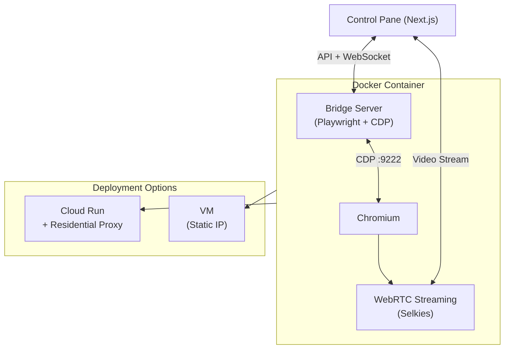

# Docker Chrome Cloud

A serverless-ready, remotely controllable Chromium instance with full network capture and automation capabilities.

## Architecture



This project replicates the `redroid` pattern but for a desktop browser:

1.  **Frontend**: Next.js Control Pane (copied and adapted from redroid)
    *   WebRTC stream viewer (low latency)
    *   Session management
    *   Network traffic inspector (planned)

2.  **Container**: `linuxserver/chromium` + Node.js
    *   **Streaming**: KasmVNC for low-latency browser streaming
    *   **Browser**: Chromium with remote debugging (CDP) enabled
    *   **Automation**: CDP-based control and script injection
    *   **Stealth**: Anti-bot-detection measures via CDP Page.addScriptToEvaluateOnNewDocument

3.  **Bridge Server**: Node.js
    *   Connects to Chrome via CDP (port 9222)
    *   Captures `Network.requestWillBeSent` and `Network.responseReceived`
    *   Exposes HTTP/WebSocket API for the frontend

## Directory Structure

```
docker-chrome/
├── Dockerfile              # Selkies + Chrome + Node.js
├── scripts/                # Supervisord config
├── server/                 # CDP Bridge Server (network capture, stealth injection)
├── docs/                   # Research documentation
└── control-pane/           # Next.js Frontend Application
    ├── src/
    │   ├── app/            # Page logic
    │   └── components/     # UI Components
    └── package.json
```

## Quick Start

### Build Container

```bash
docker build -t docker-chrome .
```

### Run Container

```bash
docker run -d \
  -p 8080:8080 \
  -p 9222:9222 \
  --shm-size=2g \
  docker-chrome
```

## Features

*   **Stealth Mode**: CDP-based script injection removes bot detection fingerprints.
*   **Network Capture**: CDP captures decrypted HTTPS traffic (headers, bodies).
*   **Remote Control**: VNC streaming allows human interaction (login, captcha).
*   **Session Reset**: Fresh browser profile on demand via API.
*   **Paste API**: Insert text into focused elements via CDP.

## Cloud Run Deployment

This container is designed for Cloud Run:
*   Single port (8080) for both WebRTC signaling and Control API.
*   Stateless (sessions are ephemeral).
*   Handles its own display server (Xvfb).

```bash
./deploy.sh
```

## VM Deployment (Alternative)

For testing in a persistent VM environment instead of Cloud Run:

```bash
./deploy-vm.sh
```

The script is **idempotent**:
*   Creates a VM if it doesn't exist
*   Updates the container if VM already exists
*   Sets up firewall rules automatically

After deployment, the script outputs:
*   External IP address
*   Direct access URL: `http://<IP>:8080`
*   Control pane connection: Add `?target=vm&ip=<IP>` to control pane URL

### VM Management Commands

```bash
# View container logs
gcloud compute ssh docker-chrome-vm --zone=us-central1-a --project=corsali-development \
  --command='sudo journalctl -u konlet-startup -f'

# SSH into VM
gcloud compute ssh docker-chrome-vm --zone=us-central1-a --project=corsali-development

# Delete VM
gcloud compute instances delete docker-chrome-vm --zone=us-central1-a --project=corsali-development
```

### Control Pane Target Switching

The control pane supports switching between deployment targets via URL parameters:

| Target | URL |
|--------|-----|
| Cloud Run (default) | `https://your-control-pane.vercel.app` |
| VM | `https://your-control-pane.vercel.app?target=vm&ip=<VM_IP>` |

