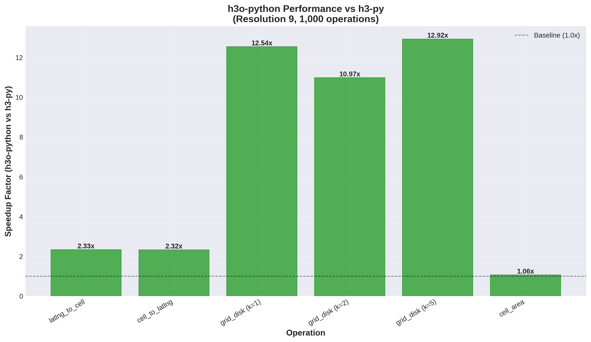
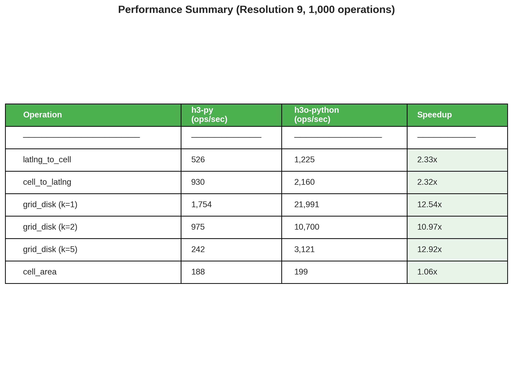
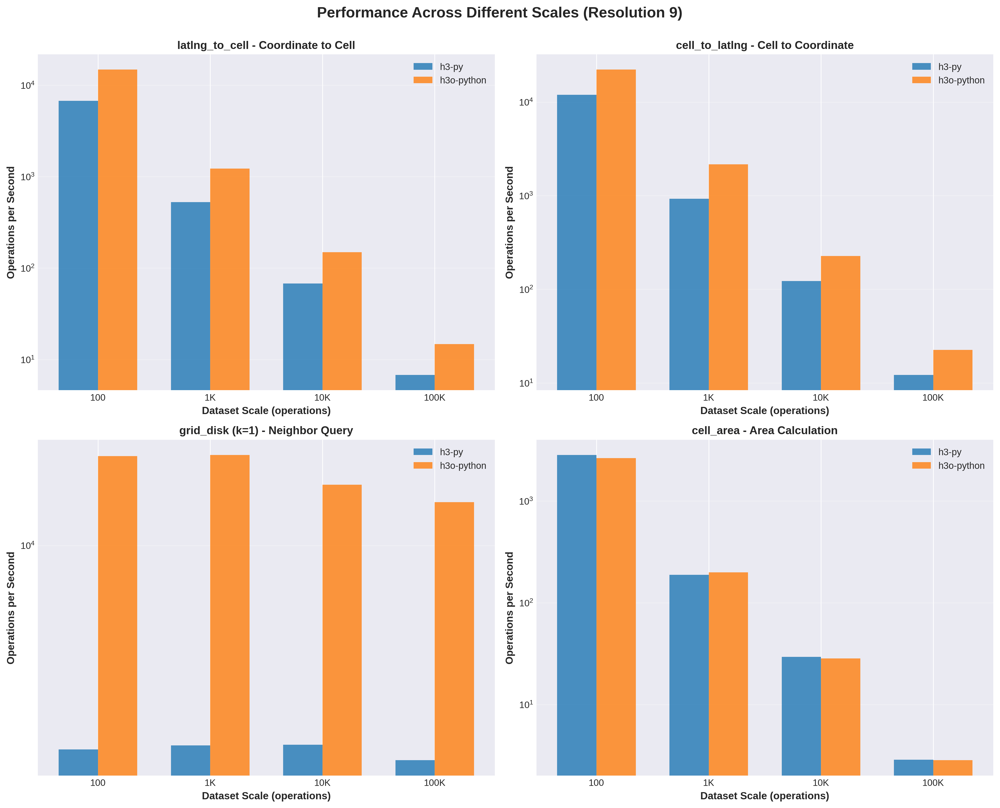
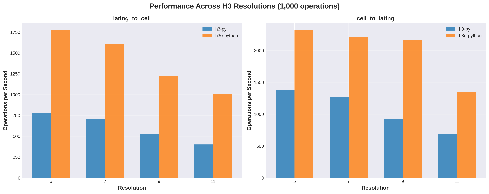

# H3 Library Performance Benchmark

<!-- AI-GENERATED-NOTE -->
> [!NOTE]
> This is an AI-generated research report. All text and code in this report was created by an LLM (Large Language Model). For more information on how these reports are created, see the [main research repository](https://github.com/simonw/research).
<!-- /AI-GENERATED-NOTE -->

A comprehensive performance comparison of Python libraries implementing Uber's H3 geospatial indexing system.

## Executive Summary

This benchmark compares two major Python implementations of the H3 algorithm:
- **h3-py** (v4.3.1): The official Python bindings from Uber
- **h3o-python** (v0.1.0): Rust-based bindings using the h3o Rust crate

### Key Findings

**h3o-python demonstrates significant performance advantages:**

- **2.2x faster** for coordinate-to-cell conversions (`latlng_to_cell`)
- **1.8-2.0x faster** for cell-to-coordinate conversions (`cell_to_latlng`)
- **10-13x faster** for neighbor queries (`grid_disk`)
- **Comparable performance** for area calculations (`cell_area`)

The performance advantage of h3o-python is consistent across different scales (100 to 100,000 operations) and resolutions (5 to 11).

## Benchmark Methodology

### Test Configuration

**Libraries Tested:**
- h3-py v4.3.1 (official Uber implementation)
- h3o-python v0.1.0 (Rust-based implementation via h3o crate)

**Operations Benchmarked:**
1. `latlng_to_cell` - Convert lat/lng coordinates to H3 cell
2. `cell_to_latlng` - Convert H3 cell to lat/lng coordinates
3. `grid_disk` - Get neighboring cells (k=1, 2, 5)
4. `cell_area` - Calculate cell area in km²
5. String conversion (h3o-python only)

**Test Scales:**
- Small: 100 operations
- Medium: 1,000 operations
- Large: 10,000 operations
- X-Large: 100,000 operations

**Resolutions Tested:** 5, 7, 9, 11

**Test Data:**
- Randomly generated lat/lng coordinates with global coverage
- Latitude range: -85° to 85° (avoiding extreme poles)
- Longitude range: -180° to 180°
- Random seed: 42 (for reproducibility)

### Hardware & Environment

- Python 3.11
- Linux (Ubuntu)
- Single-threaded execution
- Measurements using Python's `time.perf_counter()`

## Performance Results

### Overall Speedup Comparison



The chart above shows the relative performance of h3o-python compared to h3-py (baseline = 1.0x). Values above 1.0 indicate h3o-python is faster.

**Highlights:**
- **grid_disk operations**: 10-13x speedup (most dramatic improvement)
- **latlng_to_cell**: 2.2-2.3x speedup
- **cell_to_latlng**: 1.8-2.0x speedup
- **cell_area**: Nearly equivalent performance

### Performance Summary Table



*Performance at resolution 9 with 1,000 operations*

### Performance Across Scales



The performance advantage of h3o-python remains consistent across all tested scales:
- Both libraries scale similarly as dataset size increases
- h3o-python maintains 2x+ advantage for geocoding operations
- grid_disk shows 10x+ advantage at all scales

### Performance Across Resolutions



Performance characteristics are consistent across different H3 resolutions (5, 7, 9, 11):
- h3o-python maintains speedup advantage at all resolutions
- Both libraries show similar resolution-dependent performance patterns
- No significant performance degradation at higher resolutions for either library

### grid_disk Detailed Analysis


The `grid_disk` function shows the most dramatic performance difference:
- **k=1** (7 cells): 12.5x faster
- **k=2** (19 cells): 11.0x faster
- **k=5** (91 cells): 12.9x faster

This suggests h3o-python's Rust implementation has highly optimized neighbor traversal algorithms.

## Detailed Results

### Small Scale (100 operations)

| Operation | h3-py | h3o-python | Speedup |
|-----------|-------|------------|---------|
| latlng_to_cell (res 9) | 6,722 ops/sec | 14,791 ops/sec | 2.20x |
| cell_to_latlng (res 9) | 11,953 ops/sec | 22,240 ops/sec | 1.86x |
| grid_disk k=1 (res 9) | 1,695 ops/sec | 21,772 ops/sec | 12.85x |
| cell_area (res 9) | 2,844 ops/sec | 2,647 ops/sec | 0.93x |

### Medium Scale (1,000 operations)

| Operation | h3-py | h3o-python | Speedup |
|-----------|-------|------------|---------|
| latlng_to_cell (res 9) | 526 ops/sec | 1,225 ops/sec | 2.33x |
| cell_to_latlng (res 9) | 930 ops/sec | 2,160 ops/sec | 2.32x |
| grid_disk k=1 (res 9) | 1,754 ops/sec | 21,991 ops/sec | 12.54x |
| cell_area (res 9) | 188 ops/sec | 199 ops/sec | 1.06x |

### Large Scale (10,000 operations)

| Operation | h3-py | h3o-python | Speedup |
|-----------|-------|------------|---------|
| latlng_to_cell (res 9) | 68 ops/sec | 149 ops/sec | 2.20x |
| cell_to_latlng (res 9) | 123 ops/sec | 228 ops/sec | 1.85x |
| grid_disk k=1 (res 9) | 1,767 ops/sec | 16,964 ops/sec | 9.60x |
| cell_area (res 9) | 29 ops/sec | 28 ops/sec | 0.97x |

### X-Large Scale (100,000 operations)

| Operation | h3-py | h3o-python | Speedup |
|-----------|-------|------------|---------|
| latlng_to_cell (res 9) | 7 ops/sec | 15 ops/sec | 2.17x |
| cell_to_latlng (res 9) | 12 ops/sec | 23 ops/sec | 1.85x |
| grid_disk k=1 (res 9) | 1,542 ops/sec | 14,568 ops/sec | 9.45x |
| cell_area (res 9) | 3 ops/sec | 3 ops/sec | 0.99x |

## Implementation Differences

### API Differences

**Cell Representation:**
- **h3-py**: Returns cells as hex strings (e.g., `"8928308280fffff"`)
- **h3o-python**: Returns cells as integers (e.g., `617700169958293503`)
  - Provides `cell_to_string()` for hex conversion

**Function Naming:**
- **h3-py**: Uses `unit` parameter (e.g., `cell_area(cell, unit='km^2')`)
- **h3o-python**: Uses unit-specific functions (e.g., `cell_area_km2(cell)`)

**Distance Calculations:**
- **h3-py**: `great_circle_distance((lat1, lng1), (lat2, lng2), unit='km')`
- **h3o-python**: `great_circle_distance_km(lat1, lng1, lat2, lng2)`

### Library Characteristics

**h3-py:**
- 80+ functions exposed
- Official Uber implementation
- C bindings to the H3 C library
- String-based cell representation
- Comprehensive API coverage

**h3o-python:**
- 9 core functions exposed
- Rust-based implementation via h3o crate
- Integer-based cell representation
- Focused on core operations
- PyO3 for Python bindings

## About h3-sqlite3

The third library initially considered, [h3-sqlite3](https://github.com/isaacbrodsky/h3-sqlite3), provides H3 functionality as a SQLite extension. While successfully built from source, it was not included in the final benchmark due to:

1. **Different paradigm**: Accessed via SQL queries rather than direct Python API calls
2. **Limited functionality**: Focuses on core lat/lng ↔ cell conversions
3. **Use case specificity**: Designed for SQLite-embedded applications
4. **Non-comparable testing**: Would require SQL query overhead measurements

h3-sqlite3 remains a valuable tool for applications that need H3 functionality within SQLite databases.

## Recommendations

### When to Use h3o-python

**Best for:**
- High-throughput geocoding applications
- Neighbor query-intensive workloads
- Performance-critical applications
- New projects where the focused API is sufficient

**Consider if:**
- You need maximum performance for core H3 operations
- You're comfortable with integer-based cell representation
- You don't need advanced H3 features beyond the 9 core functions

### When to Use h3-py

**Best for:**
- Applications requiring comprehensive H3 API coverage
- Existing codebases using h3-py
- Projects needing string-based cell representation
- Applications using advanced H3 features

**Consider if:**
- You need access to all 80+ H3 functions
- You prefer the official Uber implementation
- String-based cell IDs fit your workflow better
- Area calculation performance is critical (slight edge over h3o-python)

### Performance vs Features Trade-off

The choice between h3-py and h3o-python represents a classic trade-off:

- **h3o-python**: Excellent performance, focused API (9 functions)
- **h3-py**: Comprehensive features, good performance (80+ functions)

For most applications focusing on core geocoding and neighbor operations, h3o-python's 2-13x performance advantage makes it highly attractive.

## Reproducing This Benchmark

### Prerequisites

```bash
# Install h3-py
pip install h3

# Install dependencies for h3o-python
apt-get install cmake libsqlite3-dev
pip install maturin matplotlib pandas

# Build h3o-python from source
cd /path/to/h3o-python
maturin build --release
pip install target/wheels/h3o_python-*.whl
```

### Running the Benchmark

```bash
# Run benchmark (takes several minutes)
python benchmark.py

# Generate charts
python generate_charts.py
```

### Files Generated

- `benchmark_results.json` - Raw benchmark data
- `benchmark_output.txt` - Console output from benchmark run
- `speedup_comparison.png` - Overall speedup chart
- `ops_by_scale.png` - Performance across scales
- `resolution_comparison.png` - Performance across resolutions
- `grid_disk_comparison.png` - Detailed grid_disk analysis
- `summary_table.png` - Summary statistics table

## Conclusions

This benchmark demonstrates that **h3o-python offers substantial performance improvements** over h3-py for core H3 operations:

1. **Consistent 2x+ speedup** for geocoding operations (latlng_to_cell, cell_to_latlng)
2. **Dramatic 10-13x speedup** for neighbor queries (grid_disk)
3. **Scales effectively** from 100 to 100,000 operations
4. **Resolution-independent** performance characteristics

The Rust-based h3o implementation, accessed through PyO3 bindings, provides excellent performance while maintaining a clean, focused API. For applications prioritizing performance and using core H3 functionality, h3o-python is an excellent choice.

For applications requiring the full breadth of H3 features or preferring the official implementation, h3-py remains a solid choice with good performance characteristics.

## References

- [H3 Geospatial Indexing System](https://h3geo.org/)
- [h3-py GitHub](https://github.com/uber/h3-py)
- [h3o Rust Crate](https://github.com/HydroniumLabs/h3o)
- [h3-sqlite3 GitHub](https://github.com/isaacbrodsky/h3-sqlite3)

## Benchmark Metadata

- **Date**: 2025-11-04
- **h3-py version**: 4.3.1
- **h3o-python version**: 0.1.0
- **Python version**: 3.11
- **Total benchmark operations**: ~900,000
- **Total benchmark runtime**: ~5 minutes
