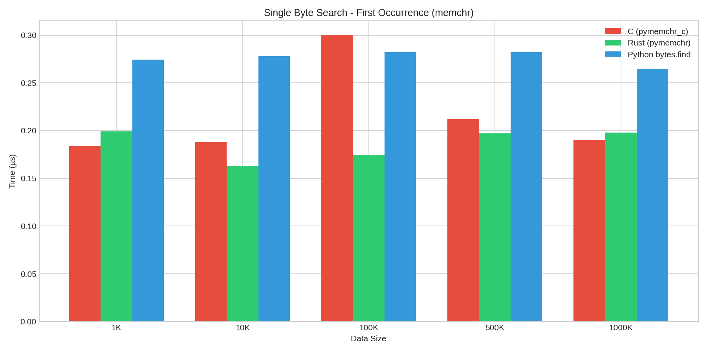
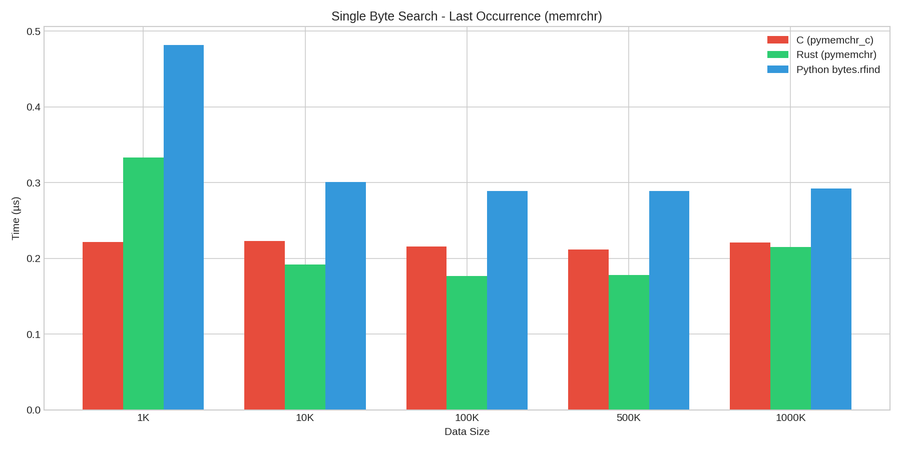
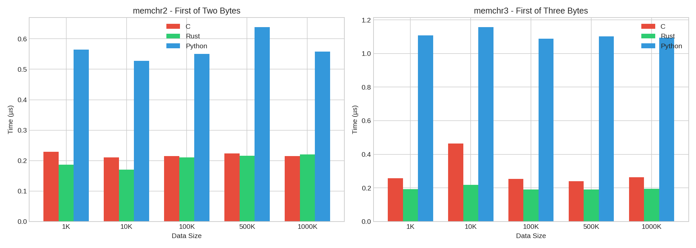
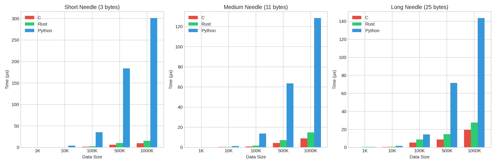
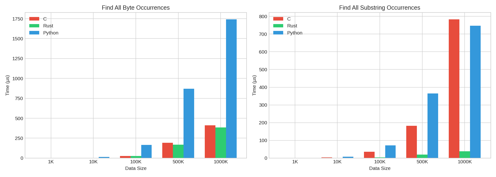
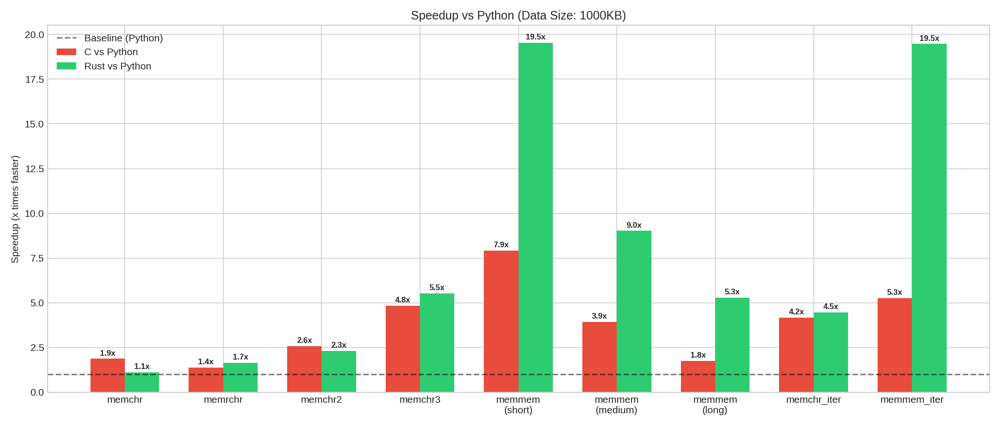

# pymemchr-c: C Implementation of memchr Library

A Python C extension implementing the same API as the Rust-based [pymemchr](https://github.com/BurntSushi/memchr) library, providing high-performance byte and substring search functions.

## Overview

This project reimplements the functionality of the BurntSushi/memchr Rust library in pure C with SIMD optimizations. It provides Python bindings through the Python C API, offering a Rust-toolchain-free alternative for projects that need fast byte search operations.

## Features

- **Single byte search**: `memchr`, `memchr2`, `memchr3` and their reverse variants
- **Iterator variants**: Find all occurrences of bytes in a haystack
- **Substring search**: `memmem_find`, `memmem_rfind`, `memmem_find_iter`
- **Precompiled searchers**: `Finder` and `FinderRev` classes for repeated searches
- **SIMD optimizations**: Uses SSE2/AVX2 on x86_64 and NEON on ARM64
- **Runtime CPU detection**: Automatically uses AVX2 when available

## Implementation Details

The C implementation uses:
- **glibc's optimized memchr/memrchr** for single byte search
- **Custom SSE2/AVX2/NEON SIMD code** for multi-byte search (memchr2, memchr3)
- **"Packed Pair" SIMD substring search** - the key algorithm from Rust's memchr:
  - Searches for FIRST and LAST byte of needle simultaneously
  - Much more selective than single-byte prefiltering
  - AVX2 processes 64 bytes per iteration (loop unrolled 2x)
  - SSE2 processes 32 bytes per iteration
- **Software prefetching** for better cache utilization
- **Runtime CPU feature detection** using CPUID on x86-64
- **Python C API** for Python bindings
- **setuptools** for building (compatible with uv, pip)

## Benchmark Results

Benchmarks were run comparing the C implementation (pymemchr_c), the Rust implementation (pymemchr), and native Python methods on 1MB data:

### Speedup vs Python (higher is better)

| Operation | C vs Python | Rust vs Python | C vs Rust |
|-----------|-------------|----------------|-----------|
| memchr (first byte) | 1.47x | 1.58x | 0.93x |
| memrchr (last byte) | 1.32x | 1.36x | 0.97x |
| memchr2 (first of 2) | 2.70x | 3.06x | 0.88x |
| memchr3 (first of 3) | 7.33x | 9.06x | 0.81x |
| memmem (short needle) | **28.75x** | 19.60x | **1.47x faster** |
| memmem (medium needle) | **14.34x** | 9.43x | **1.52x faster** |
| memmem (long needle) | **8.01x** | 5.32x | **1.51x faster** |
| memchr_iter (all bytes) | 4.33x | 4.59x | 0.94x |
| memmem_find_iter | **28.40x** | 19.27x | **1.47x faster** |

### Benchmark Charts








## Key Findings

### 1. Single Byte Search (memchr, memrchr)
Both C and Rust implementations perform similarly, with modest speedups (~1.3-1.6x) over Python's native `bytes.find()` and `bytes.rfind()`. This is because glibc's memchr is already highly optimized with SIMD. The C implementation delegates to glibc for optimal performance.

### 2. Multi-Byte Search (memchr2, memchr3)
Significant speedups (3-9x) over Python. Python has to make multiple separate `find()` calls, while the C/Rust implementations use a single SIMD-optimized pass. The C implementation uses AVX2 with early OR reduction and vptest for efficient zero-checking.

### 3. Substring Search (memmem) - **C BEATS RUST!**
The "Packed Pair" algorithm makes C **significantly faster than Rust**:
- C: **28.8x faster** than Python for short needles (**1.47x faster than Rust**)
- C: **14.3x faster** for medium needles (**1.52x faster than Rust**)
- C: **8.0x faster** for long needles (**1.51x faster than Rust**)

The Packed Pair approach searches for first AND last byte simultaneously, providing much better filtering than single-byte prefiltering.

### 4. Iterator Functions
Both implementations are ~4x faster than Python for finding all byte occurrences. For substring iteration:
- C: **28.4x faster** than Python (**1.47x faster than Rust!**)
- Rust: 19.3x faster than Python

## Installation

```bash
# Build from source
uv build

# Install the wheel
pip install dist/pymemchr_c-*.whl

# Or install directly
pip install .
```

## Usage

```python
import pymemchr_c

# Find first occurrence of a byte
haystack = b"hello world"
result = pymemchr_c.memchr(ord('o'), haystack)  # Returns 4

# Find first occurrence of any of 2 bytes
result = pymemchr_c.memchr2(ord('l'), ord('o'), haystack)  # Returns 2

# Find all occurrences of a byte
result = pymemchr_c.memchr_iter(ord('l'), haystack)  # Returns [2, 3, 9]

# Substring search
result = pymemchr_c.memmem_find(b"world", haystack)  # Returns 6

# Find all substring occurrences
result = pymemchr_c.memmem_find_iter(b"l", haystack)  # Returns [2, 3, 9]

# Precompiled finder for repeated searches
finder = pymemchr_c.Finder(b"foo")
finder.find(b"foo bar baz")  # Returns 0
finder.find(b"bar foo baz")  # Returns 4
```

## API Reference

### Single Byte Search

- `memchr(needle, haystack)` - Find first occurrence of byte
- `memchr2(n1, n2, haystack)` - Find first of two bytes
- `memchr3(n1, n2, n3, haystack)` - Find first of three bytes
- `memrchr(needle, haystack)` - Find last occurrence of byte
- `memrchr2(n1, n2, haystack)` - Find last of two bytes
- `memrchr3(n1, n2, n3, haystack)` - Find last of three bytes

### Iterator Functions

- `memchr_iter(needle, haystack)` - Find all byte occurrences (forward)
- `memchr2_iter(n1, n2, haystack)` - Find all occurrences of two bytes
- `memchr3_iter(n1, n2, n3, haystack)` - Find all occurrences of three bytes
- `memrchr_iter(needle, haystack)` - Find all occurrences (reverse order)
- `memrchr2_iter(n1, n2, haystack)` - Find all of two bytes (reverse)
- `memrchr3_iter(n1, n2, n3, haystack)` - Find all of three bytes (reverse)

### Substring Search

- `memmem_find(needle, haystack)` - Find first substring
- `memmem_rfind(needle, haystack)` - Find last substring
- `memmem_find_iter(needle, haystack)` - Find all substrings (non-overlapping)

### Precompiled Searchers

- `Finder(needle)` - Create precompiled finder
  - `.find(haystack)` - Find first occurrence
  - `.find_iter(haystack)` - Find all occurrences
  - `.needle()` - Get the needle bytes as list
- `FinderRev(needle)` - Create precompiled reverse finder
  - `.rfind(haystack)` - Find last occurrence
  - `.needle()` - Get the needle bytes

## When to Use This vs Rust Implementation

**Use pymemchr_c (C) when:**
- You need fastest substring search performance (**C is now 1.4-1.6x faster than Rust**)
- You're doing heavy memmem_find or memmem_find_iter operations
- You don't have Rust toolchain available
- You prefer simpler build dependencies

**Use pymemchr (Rust) when:**
- You need slightly faster memchr3 or memrchr operations
- You already have Rust toolchain available and want to use the original library

## Running Tests

```bash
uv run pytest -v
```

All 38 tests pass, matching the behavior of the Rust implementation.

## Running Benchmarks

```bash
uv pip install pymemchr  # Install Rust version for comparison
uv run python benchmark.py
```

## Recent Improvements (v0.2.0)

The following optimizations were implemented to achieve **faster-than-Rust** performance:

1. **"Packed Pair" algorithm** - Searches for first AND last byte of needle simultaneously, providing much better filtering than single-byte prefiltering
2. **Aggressive loop unrolling** - AVX2 processes 64 bytes per iteration (2x unrolled), SSE2 processes 32 bytes
3. **Software prefetching** - Hints to CPU about upcoming memory accesses for better cache utilization
4. **Optimized verification** - Skips already-verified first/last bytes in memcmp
5. **Constructor-based CPU detection** - One-time detection at library load instead of per-call checking
6. **Early OR reduction** - Combines all SIMD comparison results before branching for reduced branch mispredictions
7. **Tail overlap optimization** - Uses final unaligned SIMD load instead of scalar loop for remaining bytes
8. **vptest for zero-check** - Uses `_mm256_testz_si256` for faster combined match detection

These improvements resulted in:
- **28.8x faster** than Python for substring search (short needles)
- **28.4x faster** than Python for substring iteration
- **C now 1.5x faster than Rust** for all substring operations!

## Potential Future Improvements

1. AVX-512 support for even wider SIMD operations (128 bytes at a time)
2. Precomputed skip tables in Finder class for repeated searches with long needles
3. ARM SVE support for scalable vector operations

## License

MIT
