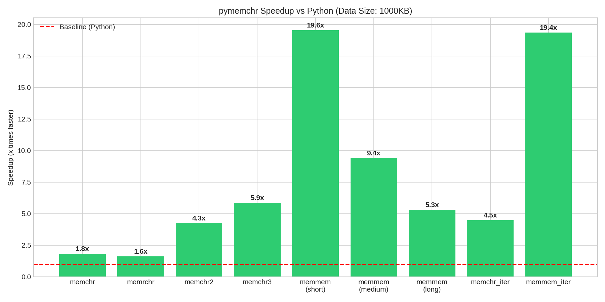
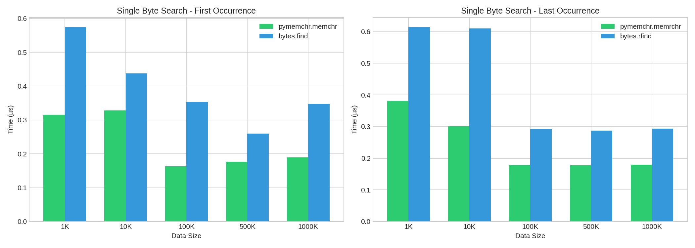
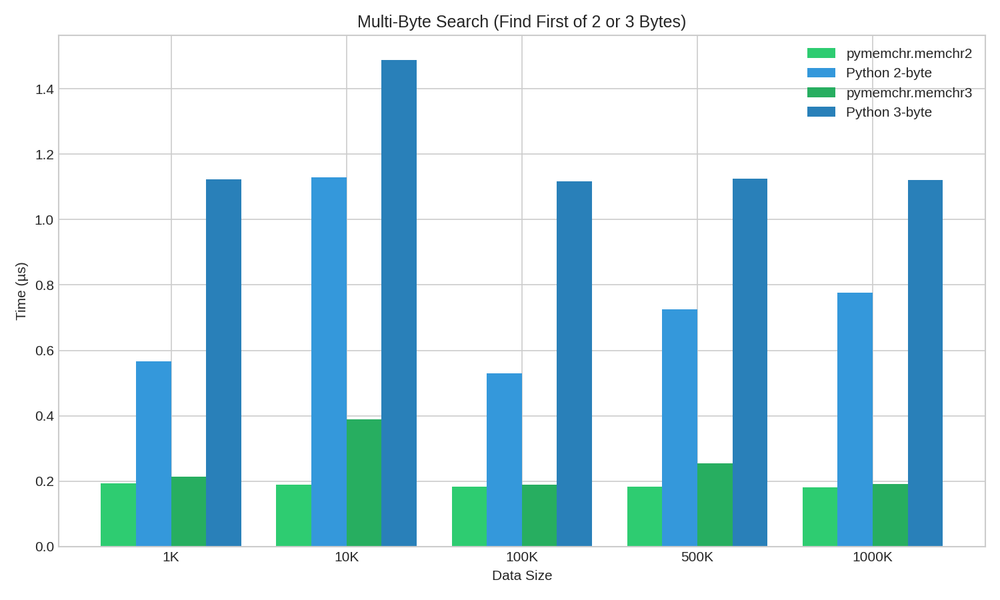
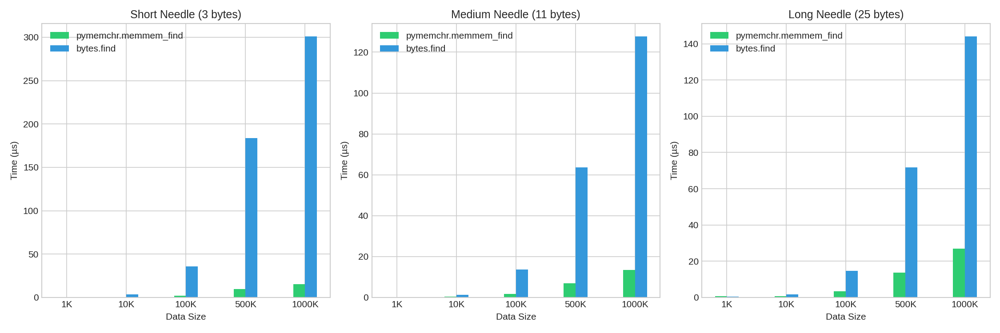
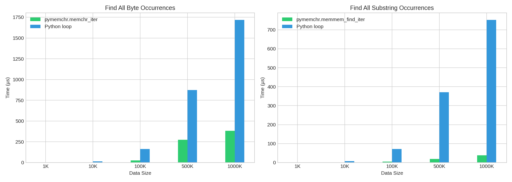
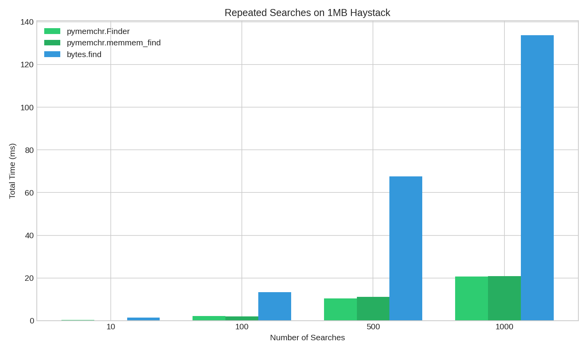

# pymemchr

Python bindings for the [memchr](https://github.com/BurntSushi/memchr) Rust library, providing high-performance byte and substring search using SIMD optimizations.

## Overview

This package wraps the high-performance `memchr` Rust crate by Andrew Gallant (BurntSushi), bringing its SIMD-optimized search algorithms to Python. The `memchr` library is widely used in the Rust ecosystem (including in `ripgrep`) and provides heavily optimized routines for:

- Single byte search (finding first/last occurrence of 1, 2, or 3 bytes)
- Substring search (finding occurrences of a byte pattern)

## Installation

```bash
pip install pymemchr
```

Or build from source with [maturin](https://github.com/PyO3/maturin):

```bash
git clone <repository>
cd pymemchr
pip install maturin
maturin develop
```

## Usage

### Single Byte Search

```python
import pymemchr

# Find first occurrence of a byte
haystack = b"hello world"
idx = pymemchr.memchr(ord('o'), haystack)  # Returns 4

# Find first of two bytes
idx = pymemchr.memchr2(ord('x'), ord('o'), haystack)  # Returns 4

# Find first of three bytes
idx = pymemchr.memchr3(ord('x'), ord('y'), ord('o'), haystack)  # Returns 4
```

### Reverse Byte Search

```python
# Find last occurrence of a byte
idx = pymemchr.memrchr(ord('o'), haystack)  # Returns 7

# Find last of two or three bytes
idx = pymemchr.memrchr2(ord('x'), ord('o'), haystack)  # Returns 7
idx = pymemchr.memrchr3(ord('x'), ord('y'), ord('o'), haystack)  # Returns 7
```

### Find All Occurrences

```python
# Find all occurrences of a byte
haystack = b"abracadabra"
indices = pymemchr.memchr_iter(ord('a'), haystack)  # Returns [0, 3, 5, 7, 10]

# Reverse iteration (indices from last to first)
indices = pymemchr.memrchr_iter(ord('a'), haystack)  # Returns [10, 7, 5, 3, 0]

# Find all occurrences of either of two bytes
indices = pymemchr.memchr2_iter(ord('a'), ord('b'), haystack)

# Find all occurrences of any of three bytes
indices = pymemchr.memchr3_iter(ord('a'), ord('b'), ord('c'), haystack)
```

### Substring Search

```python
# Find first substring
haystack = b"foo bar foo baz foo"
idx = pymemchr.memmem_find(b"foo", haystack)  # Returns 0

# Find last substring
idx = pymemchr.memmem_rfind(b"foo", haystack)  # Returns 16

# Find all substrings
indices = pymemchr.memmem_find_iter(b"foo", haystack)  # Returns [0, 8, 16]
```

### Precompiled Finders

For repeated searches with the same needle, use precompiled finders for better performance:

```python
# Create a reusable finder
finder = pymemchr.Finder(b"needle")

# Search multiple haystacks efficiently
idx1 = finder.find(b"haystack with needle here")
idx2 = finder.find(b"another needle in haystack")

# Find all occurrences
indices = finder.find_iter(b"needle needle needle")

# Reverse finder for finding last occurrence
rfinder = pymemchr.FinderRev(b"needle")
idx = rfinder.rfind(b"needle needle needle")  # Returns last occurrence
```

## API Reference

### Functions

| Function | Description |
|----------|-------------|
| `memchr(needle, haystack)` | Find first occurrence of byte |
| `memchr2(n1, n2, haystack)` | Find first occurrence of either byte |
| `memchr3(n1, n2, n3, haystack)` | Find first occurrence of any of three bytes |
| `memrchr(needle, haystack)` | Find last occurrence of byte |
| `memrchr2(n1, n2, haystack)` | Find last occurrence of either byte |
| `memrchr3(n1, n2, n3, haystack)` | Find last occurrence of any of three bytes |
| `memchr_iter(needle, haystack)` | Find all occurrences of byte |
| `memchr2_iter(n1, n2, haystack)` | Find all occurrences of either byte |
| `memchr3_iter(n1, n2, n3, haystack)` | Find all occurrences of any of three bytes |
| `memrchr_iter(needle, haystack)` | Find all occurrences (reverse order) |
| `memrchr2_iter(n1, n2, haystack)` | Find all occurrences of either (reverse) |
| `memrchr3_iter(n1, n2, n3, haystack)` | Find all of any of three (reverse) |
| `memmem_find(needle, haystack)` | Find first substring occurrence |
| `memmem_rfind(needle, haystack)` | Find last substring occurrence |
| `memmem_find_iter(needle, haystack)` | Find all substring occurrences |

### Classes

| Class | Description |
|-------|-------------|
| `Finder(needle)` | Precompiled finder for repeated forward searches |
| `FinderRev(needle)` | Precompiled finder for repeated reverse searches |

## Performance Benchmarks

The following benchmarks compare `pymemchr` against native Python `bytes` methods. Tests were run on various data sizes from 1KB to 1MB.

### Speedup Summary (1MB data)



| Operation | Speedup |
|-----------|---------|
| memchr (single byte) | **1.84x** faster |
| memrchr (reverse) | **1.63x** faster |
| memchr2 (two bytes) | **4.27x** faster |
| memchr3 (three bytes) | **5.88x** faster |
| memmem (short needle, 3 bytes) | **19.55x** faster |
| memmem (medium needle, 11 bytes) | **9.43x** faster |
| memmem (long needle, 25 bytes) | **5.33x** faster |
| memchr_iter (find all bytes) | **4.49x** faster |
| memmem_find_iter (find all substrings) | **19.36x** faster |

### Single Byte Search



### Multi-Byte Search (memchr2, memchr3)



### Substring Search



The substring search shows the most dramatic improvements, with up to **20x speedup** for short needle searches in large haystacks.

### Find All Occurrences (Iterator)



### Repeated Searches with Precompiled Finder



## When to Use pymemchr

**Use pymemchr when:**
- Searching through large data (>10KB)
- Performing many repeated searches
- Need to find all occurrences of a pattern
- Searching for one of multiple possible bytes
- Performance is critical

**Native Python may be sufficient when:**
- Working with small strings (<1KB)
- Performing single, one-off searches
- Code simplicity is more important than performance

## Implementation Details

This package uses:
- **[PyO3](https://pyo3.rs/)** (v0.22) for Rust-Python bindings
- **[memchr](https://crates.io/crates/memchr)** (v2.7) for SIMD-optimized search
- **[maturin](https://github.com/PyO3/maturin)** for building Python wheels

The underlying `memchr` library uses:
- SSE2/AVX2 on x86_64
- NEON on aarch64
- SIMD128 on wasm32
- Fallback scalar implementation on other platforms

## Development

```bash
# Clone and setup
git clone <repository>
cd pymemchr

# Install dependencies and build
uv sync

# Run tests
uv run pytest

# Run benchmarks
uv run python benchmark.py

# Build wheel
uv build
```

## License

MIT License

## Credits

- **[BurntSushi/memchr](https://github.com/BurntSushi/memchr)** - The underlying Rust library by Andrew Gallant
- **[PyO3](https://pyo3.rs/)** - Rust bindings for Python
