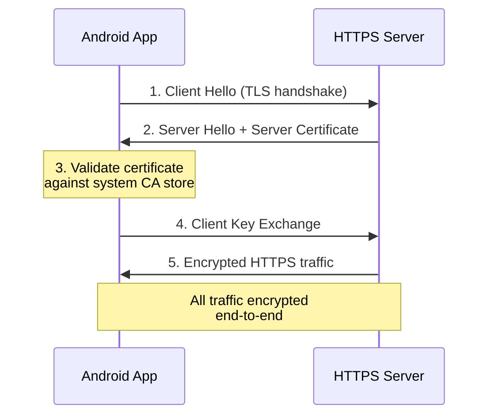
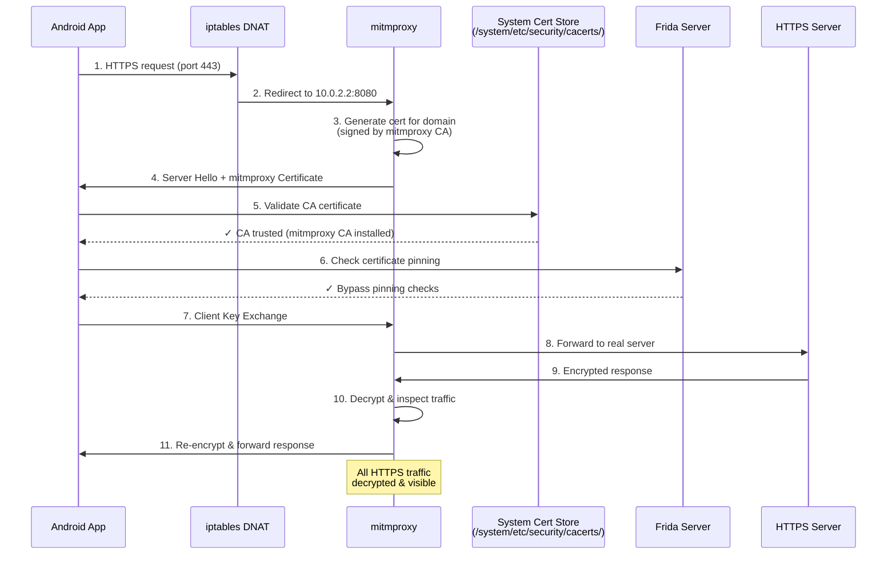

# Dockerify Android MITM Setup

Dockerized Android emulator with MITM (Man-in-the-Middle) traffic capture capabilities using mitmproxy and Frida.

## Features

- ✅ **Android 11 (API 30)** emulator via [dockerify-android](https://github.com/Shmayro/dockerify-android)
- ✅ **Web-based control** via ws-scrcpy (H.264 streaming)
- ✅ **Root access** with Magisk
- ✅ **PICO GAPPS** pre-installed
- ✅ **mitmproxy** web UI for traffic inspection
- ✅ **Frida** for certificate pinning bypass
- ✅ **System-wide traffic redirection** via iptables DNAT
- ✅ **Pre-baked APK installation** (YouTube, etc.)

## Quick Start

### Prerequisites

- Docker and Docker Compose installed
- KVM support (for hardware acceleration)
- GCP VM with KVM access (for cloud deployment)

### Local Development

```bash
# Build the image
docker compose build

# Start services
docker compose up -d

# View logs
docker compose logs -f
```

### Access Points

**Local Development:**
- **ws-scrcpy Web UI**: http://localhost:8000
- **mitmproxy Web UI**: http://localhost:8081 (password: `mitmproxy`)
- **ADB**: `adb connect localhost:5555`

**Remote Access (GCP):**
- **mitmproxy Web UI**: http://34.42.16.156:8081 (password: `mitmproxy`)
- **ADB**: `adb connect 34.42.16.156:5555`
- **ws-scrcpy**: http://34.42.16.156:8000 (may need manual start)

**Quick ADB Commands:**
```bash
# Connect to emulator
adb connect 34.42.16.156:5555  # or localhost:5555 for local

# Launch YouTube
adb -s 34.42.16.156:5555 shell am start -a android.intent.action.VIEW -d "https://www.youtube.com" com.google.android.youtube

# Take screenshot
adb -s 34.42.16.156:5555 shell screencap -p /sdcard/screen.png
adb -s 34.42.16.156:5555 pull /sdcard/screen.png

# Send input
adb -s 34.42.16.156:5555 shell input tap 500 300
adb -s 34.42.16.156:5555 shell input text "cats"
```

See [ACCESS.md](ACCESS.md) for detailed access instructions and troubleshooting.

## Pre-baking APKs

To pre-install apps (like YouTube) into the Docker image:

1. **Download APK**:
   ```bash
   # Download YouTube APK for Android 11 from APKMirror
   # Place it in apks/ directory
   ```

2. **Place APK in `apks/` directory**:
   ```bash
   cp youtube.apk apks/
   ```

3. **Rebuild image**:
   ```bash
   docker compose build
   ```

4. **APKs will auto-install** on container startup

The entrypoint script automatically installs all APKs from `/tmp/apks/` directory.

## Android Version

**Current**: Android 11 (API 30)

See [ANDROID_VERSION.md](ANDROID_VERSION.md) for details on Android version support and upgrade options.

## Manual APK Installation

If you need to install APKs manually (e.g., YouTube or other Google apps):

**Local:**
```bash
# Transfer APK to container
docker cp youtube.apk dockerify-android-mitm:/tmp/

# Install via ADB
docker exec dockerify-android-mitm adb install -r -g /tmp/youtube.apk
```

**GCP VM:**
```bash
# Transfer APK to VM
gcloud compute scp --zone=us-central1-a --project=corsali-development \
    youtube.apk android-mitm-mvp:/tmp/

# Copy to container and install
gcloud compute ssh android-mitm-mvp --zone=us-central1-a --project=corsali-development -- \
    "docker cp /tmp/youtube.apk dockerify-android-mitm:/tmp/ && \
     docker exec dockerify-android-mitm adb install -r -g /tmp/youtube.apk"
```

**Using Install Script:**
```bash
# If APKs are already in container /tmp directory
docker exec dockerify-android-mitm bash /root/scripts/install-apks.sh
```

**Notes:**
- Download APKs compatible with Android 11 (API 30) from [APKMirror](https://www.apkmirror.com/)
- Use `-g` flag to grant all permissions automatically
- Entrypoint script auto-installs APKs from `/tmp/apks/` on startup

See [INSTALL_APPS.md](INSTALL_APPS.md) for detailed instructions and troubleshooting.

## Deployment to GCP

```bash
# Deploy to GCP VM
./scripts/deploy-to-gcp.sh
```

This script:
1. Stops existing containers
2. Transfers files to VM
3. Builds Docker image
4. Starts services
5. Shows logs

## Architecture

```
┌─────────────────────────────────────────────────────────────┐
│  dockerify-android-mitm Container                           │
│  ┌────────────────────────────────────────────────────────┐ │
│  │  Android Emulator (API 30)                             │ │
│  │  ┌───────────────────────────────────────────────────┐ │ │
│  │  │  System Configuration                             │ │ │
│  │  │  - Root + Magisk                                  │ │ │
│  │  │  - PICO GAPPS                                     │ │ │
│  │  │  - iptables DNAT (ports 80/443 → 10.0.2.2:8080)   │ │ │
│  │  └───────────────────────────────────────────────────┘ │ │
│  │  ┌───────────────────────────────────────────────────┐ │ │
│  │  │  Certificate Installation                         │ │ │
│  │  │  - mitmproxy CA cert installed in:                │ │ │
│  │  │    • /system/etc/security/cacerts/ (system-wide)  │ │ │
│  │  │    • /data/misc/user/0/cacerts-added/ (fallback)  │ │ │
│  │  └───────────────────────────────────────────────────┘ │ │
│  │  ┌───────────────────────────────────────────────────┐ │ │
│  │  │  Frida Server                                     │ │ │
│  │  │  - Runtime hooking framework                      │ │ │
│  │  │  - Bypasses certificate pinning                   │ │ │
│  │  │  - Hooks TLS/SSL libraries (BoringSSL, Cronet)    │ │ │
│  │  │  - Trusts mitmproxy CA cert for all connections   │ │ │
│  │  └───────────────────────────────────────────────────┘ │ │
│  └────────────────────────────────────────────────────────┘ │
│  ┌────────────────────────────────────────────────────────┐ │
│  │  mitmproxy                                             │ │
│  │  - Port 8080 (proxy - intercepts traffic)              │ │
│  │  - Port 8081 (web UI - traffic inspection)             │ │
│  │  - Generates CA certificate                            │ │
│  └────────────────────────────────────────────────────────┘ │
└─────────────────────────────────────────────────────────────┘
         │                              │
         │                              │
    ws-scrcpy                      mitmproxy
    (port 8000)                    (port 8081)
    Android viewer                  Traffic inspection
```

### HTTPS Flow Diagrams

#### Normal HTTPS Flow (Without MITM)



#### MITM HTTPS Flow (With Custom Certificate)



**Key Points:**
- **Step 5**: Custom CA certificate must be installed in system cert store for Android to trust mitmproxy's certificates
- **Step 6**: Frida bypasses certificate pinning that would otherwise reject mitmproxy's certificates
- **Step 10**: mitmproxy can decrypt and inspect all HTTPS traffic because the connection is established with its certificate

### Traffic Flow

1. **App makes HTTPS request** → iptables DNAT redirects (ports 80/443) to mitmproxy (10.0.2.2:8080)
2. **mitmproxy intercepts** → Generates certificate signed by its CA
3. **Certificate validation** → Android checks system cert store (`/system/etc/security/cacerts/`)
4. **Certificate pinning bypass** → Frida hooks TLS libraries to trust mitmproxy CA
5. **Traffic captured** → All HTTP/HTTPS traffic visible in mitmproxy web UI

## Environment Variables

| Variable | Description | Default |
|----------|-------------|---------|
| `DNS` | DNS server | `one.one.one.one` |
| `RAM_SIZE` | Emulator RAM (MB) | `8192` |
| `SCREEN_RESOLUTION` | Screen size | `1080x1920` |
| `SCREEN_DENSITY` | Screen DPI | `420` |
| `ROOT_SETUP` | Enable root/Magisk | `1` |
| `GAPPS_SETUP` | Install PICO GAPPS | `1` |
| `ANDROID_PROXY_HOST` | Proxy host | `10.0.2.2` |
| `ANDROID_PROXY_PORT` | Proxy port | `8080` |

## Troubleshooting

### APK Installation Fails

- Ensure APK is compatible with Android 11 (API 30)
- Check APK file size (should be > 1MB)
- Verify APK is not corrupted

### Traffic Not Captured

- Check iptables rules: `adb shell su -c 'iptables -t nat -L OUTPUT -n'`
- Verify certificate installation: `adb shell ls -la /system/etc/security/cacerts/ | grep mitm`
- Check mitmproxy logs: `docker logs dockerify-android-mitm | grep mitmproxy`

### ws-scrcpy Not Working

- Verify container is running: `docker ps | grep dockerify-android`
- Check ADB connection: `adb devices`
- View container logs: `docker logs dockerify-android-mitm`

### mitmproxy Web UI Loading Slowly

If the mitmproxy web UI is slow due to too many accumulated flows, clear them by restarting mitmproxy:

**From Host Machine:**
```bash
# Local development
./scripts/clear-flows.sh

# GCP VM (via SSH)
gcloud compute ssh android-mitm-mvp --zone=us-central1-a --project=corsali-development -- \
    "cd dockerify-android-mitm && ./scripts/clear-flows.sh"
```

**From Inside Container:**
```bash
# Direct execution
docker exec dockerify-android-mitm /root/scripts/clear-flows.sh

# Or if already inside container
/root/scripts/clear-flows.sh
```

**Custom Options:**
```bash
# Custom container name
CONTAINER_NAME=my-android-mitm ./scripts/clear-flows.sh

# Custom mitmproxy password
MITMPROXY_PASSWORD=mitmproxy ./scripts/clear-flows.sh
```

**What Gets Cleared:**
- ✅ All captured traffic flows (HTTP/HTTPS requests/responses)
- ✅ Flow history in mitmproxy web UI
- ❌ mitmproxy configuration (unchanged)
- ❌ Certificate settings (unchanged)

The script restarts the mitmproxy process, which clears all flows from memory. See [scripts/clear-flows/README.md](scripts/clear-flows/README.md) for detailed troubleshooting.

## Files Structure

```
dockerify-android-mitm/
├── Dockerfile              # Custom image with mitmproxy + Frida
├── docker-compose.yml      # Service orchestration
├── apks/                   # Pre-baked APKs (YouTube, etc.)
├── scripts/
│   ├── entrypoint.sh       # Main startup script
│   ├── deploy-to-gcp.sh    # GCP deployment automation
│   ├── install-apks.sh     # Manual APK installation helper
│   ├── clear-flows.sh      # Clear mitmproxy flows
│   └── clear-flows/        # Clear flows documentation
├── frida-scripts/          # Frida hooks for cert pinning bypass
├── certs/                  # mitmproxy certificates (mounted)
└── notes/                  # Documentation and notes
```

## References

- [dockerify-android](https://github.com/Shmayro/dockerify-android)
- [mitmproxy Documentation](https://docs.mitmproxy.org/)
- [Frida Documentation](https://frida.re/docs/)
- [ws-scrcpy](https://github.com/NetrisTV/ws-scrcpy)

