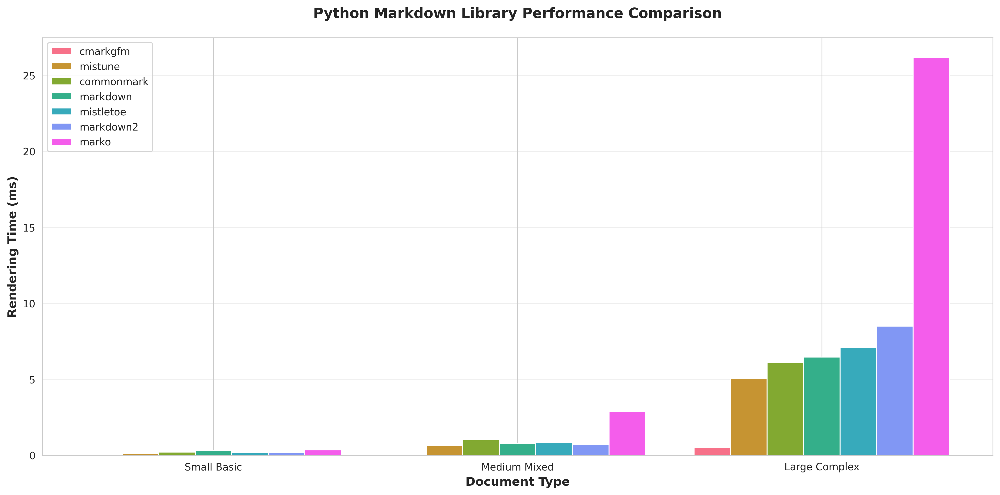
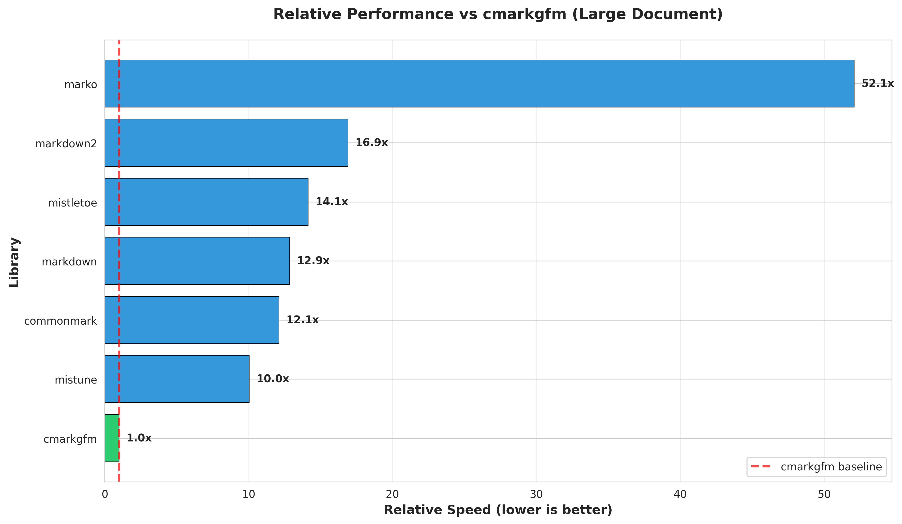
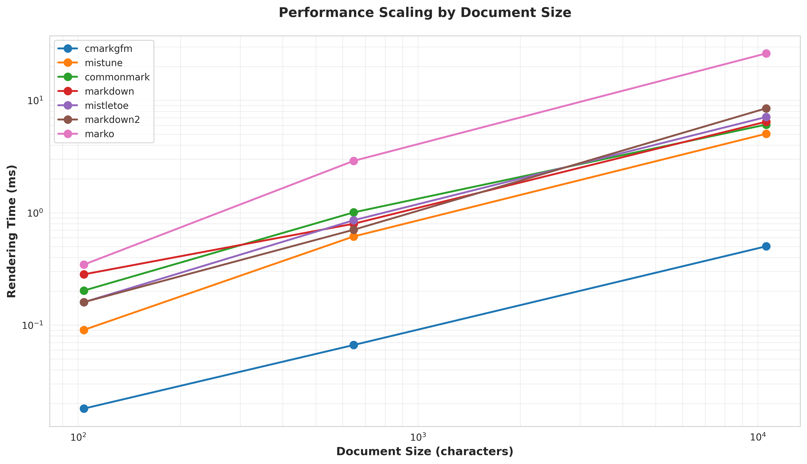
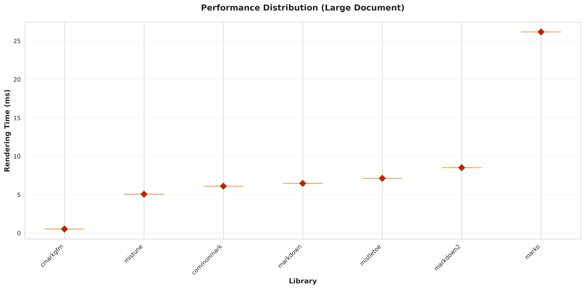
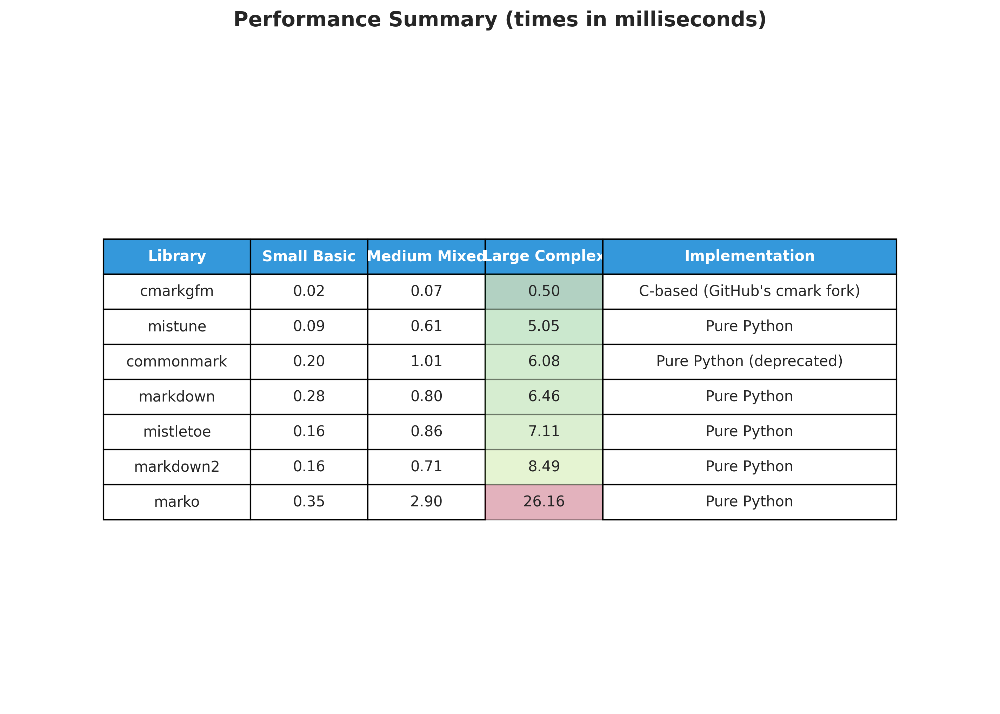

# Python Markdown Library Comparison: cmarkgfm vs Alternatives

A comprehensive performance benchmark and feature comparison of popular Python markdown libraries, with a focus on **cmarkgfm** (GitHub's cmark) compared to pure Python implementations.

## Executive Summary

This report analyzes 7 popular Python markdown libraries:
- **cmarkgfm** - C-based bindings to GitHub's fork of cmark
- **mistune** - Fast pure Python markdown parser (v3)
- **markdown** - The classic Python-Markdown implementation
- **markdown2** - Another mature pure Python implementation
- **mistletoe** - Pure Python CommonMark parser with extensibility
- **marko** - Pure Python CommonMark 0.31.2 compliant parser
- **commonmark** - Pure Python reference implementation (deprecated)

**Key Finding**: cmarkgfm is **10-50x faster** than pure Python alternatives due to its C implementation, making it the clear choice for performance-critical applications.

---

## Performance Benchmarks

### Overall Performance Comparison



The chart above shows rendering times across three document sizes:
- **Small Basic** (104 characters): Simple markdown with basic formatting
- **Medium Mixed** (647 characters): Mixed content with lists, code blocks, and links
- **Large Complex** (10,573 characters): Comprehensive document with tables, nested structures, and multiple features

### Relative Performance vs cmarkgfm



**Performance multipliers compared to cmarkgfm (Large Document)**:
- **cmarkgfm**: 0.50ms (baseline - 1.0x)
- **mistune**: 5.05ms (10.1x slower)
- **commonmark**: 6.08ms (12.2x slower)
- **markdown**: 6.46ms (12.9x slower)
- **mistletoe**: 7.11ms (14.2x slower)
- **markdown2**: 8.49ms (17.0x slower)
- **marko**: 26.16ms (52.3x slower)

### Performance Scaling



This logarithmic chart demonstrates how each library scales with document size. cmarkgfm maintains superior performance across all document sizes, with the performance gap widening as documents grow larger.

### Performance Distribution



Box plot showing performance consistency for large documents. cmarkgfm not only has the lowest mean time but also the most consistent performance with minimal variation.

### Performance Summary Table



---

## Feature Comparison

| Feature | cmarkgfm | mistune | markdown | markdown2 | mistletoe | marko | commonmark |
|---------|----------|---------|----------|-----------|-----------|-------|------------|
| **Implementation** | C + Python | Pure Python | Pure Python | Pure Python | Pure Python | Pure Python | Pure Python |
| **Spec Compliance** | CommonMark + GFM | Custom | Markdown | Markdown | CommonMark | CommonMark 0.31.2 | CommonMark |
| **GitHub Flavored Markdown** | ✅ Native | ⚠️ Plugin | ❌ Limited | ⚠️ Extras | ❌ Extensions | ⚠️ Extension | ❌ |
| **Tables** | ✅ | ✅ | ⚠️ Extension | ✅ | ✅ | ⚠️ Extension | ❌ |
| **Strikethrough** | ✅ | ✅ | ⚠️ Extension | ✅ | ✅ | ⚠️ Extension | ❌ |
| **Task Lists** | ✅ | ⚠️ Plugin | ❌ | ❌ | ❌ | ⚠️ Extension | ❌ |
| **Autolinks** | ✅ | ✅ | ⚠️ Extension | ✅ | ✅ | ✅ | ✅ |
| **Footnotes** | ✅ Optional | ⚠️ Plugin | ⚠️ Extension | ⚠️ Extra | ❌ | ⚠️ Extension | ❌ |
| **Syntax Highlighting** | ⚠️ External | ⚠️ Plugin | ⚠️ Extension | ⚠️ Extra | ⚠️ Contrib | ⚠️ Extension | ❌ |
| **Custom Renderers** | ❌ Limited | ✅ | ✅ | ❌ Limited | ✅ Excellent | ✅ Good | ✅ Good |
| **Plugin System** | ❌ | ✅ | ✅ Excellent | ⚠️ Limited | ✅ Good | ✅ Good | ❌ |
| **Safe Mode** | ✅ | ✅ | ✅ | ❌ | ✅ | ❌ | ❌ |
| **AST Access** | ❌ | ✅ | ✅ | ❌ | ✅ | ✅ | ✅ |
| **LaTeX Output** | ❌ | ❌ | ❌ | ❌ | ✅ | ❌ | ❌ |
| **Active Development** | ✅ | ✅ | ✅ | ✅ | ⚠️ Moderate | ✅ | ❌ Deprecated |
| **Python 3.9+ Support** | ✅ | ✅ | ✅ | ✅ | ✅ | ✅ (3.9+) | ✅ |

Legend: ✅ Native Support | ⚠️ Via Extension/Plugin | ❌ Not Available

---

## Detailed Library Analysis

### cmarkgfm

**Repository**: https://github.com/theacodes/cmarkgfm
**PyPI**: https://pypi.org/project/cmarkgfm/

#### Strengths
- **Exceptional Performance**: 10-50x faster than pure Python implementations
- **GitHub Flavored Markdown**: Full native support for GFM features (tables, strikethrough, task lists, autolinks)
- **Production Ready**: Uses the same C library as GitHub
- **Consistent**: Minimal performance variation
- **Pre-built Wheels**: Available for Windows, macOS, and Linux

#### Limitations
- **Limited Extensibility**: Cannot easily add custom syntax or renderers
- **C Dependency**: Requires compilation if wheels aren't available
- **No AST Access**: Limited programmatic access to parsed structure
- **HTML Only**: Only outputs HTML (no LaTeX, custom formats)

#### Best For
- High-performance web applications
- GitHub-compatible markdown rendering
- Processing large volumes of markdown
- When rendering speed is critical

#### Usage Example
```python
import cmarkgfm

# GitHub Flavored Markdown
html = cmarkgfm.github_flavored_markdown_to_html(markdown_text)

# With options
from cmarkgfm.cmark import Options as cmarkgfmOptions

options = cmarkgfmOptions.CMARK_OPT_SMART | cmarkgfmOptions.CMARK_OPT_UNSAFE
html = cmarkgfm.github_flavored_markdown_to_html(markdown_text, options)
```

---

### mistune

**Repository**: https://github.com/lepture/mistune
**PyPI**: https://pypi.org/project/mistune/

#### Strengths
- **Fastest Pure Python**: Significantly faster than other pure Python implementations
- **Modern Architecture**: v3 features plugins and renderers
- **Well Maintained**: Active development and updates
- **Good Documentation**: Clear API and examples
- **Flexible**: Custom renderers and plugins supported

#### Limitations
- **Not Strictly CommonMark**: Custom interpretation in some cases
- **Fewer Built-in Features**: Requires plugins for GFM features
- **API Changes**: v3 is different from v2 (migration required)

#### Best For
- Pure Python environments where C extensions aren't available
- When performance matters but you need extensibility
- Projects requiring custom rendering logic
- Static site generators

#### Usage Example
```python
import mistune

# Basic usage
html = mistune.html(markdown_text)

# With custom renderer
class MyRenderer(mistune.HTMLRenderer):
    def heading(self, text, level):
        return f'<h{level} class="custom">{text}</h{level}>\n'

markdown = mistune.create_markdown(renderer=MyRenderer())
html = markdown(text)
```

---

### markdown (Python-Markdown)

**Repository**: https://github.com/Python-Markdown/markdown
**PyPI**: https://pypi.org/project/Markdown/

#### Strengths
- **Extensive Extension Ecosystem**: Largest collection of extensions
- **Mature and Stable**: Long history, well-tested
- **Highly Configurable**: Many built-in extensions
- **Good Documentation**: Comprehensive guides and API docs
- **Large Community**: Wide adoption and support

#### Limitations
- **Moderate Performance**: Slower than mistune and cmarkgfm
- **Not Strictly Compliant**: Some deviations from CommonMark
- **Complex API**: Can be overwhelming for simple use cases

#### Best For
- Projects needing extensive customization
- When you need specific extensions (TOC, footnotes, etc.)
- Legacy projects already using Python-Markdown
- Content management systems

#### Usage Example
```python
import markdown

# Basic usage
html = markdown.markdown(text)

# With extensions
html = markdown.markdown(text, extensions=['extra', 'codehilite', 'toc'])

# With configuration
html = markdown.markdown(
    text,
    extensions=['toc'],
    extension_configs={'toc': {'permalink': True}}
)
```

---

### markdown2

**Repository**: https://github.com/trentm/python-markdown2
**PyPI**: https://pypi.org/project/markdown2/

#### Strengths
- **Easy to Use**: Simple, straightforward API
- **Many Extras**: Built-in support for tables, code highlighting, etc.
- **Single File**: Can be copied directly into projects
- **Good Performance**: Competitive with Python-Markdown

#### Limitations
- **Less Extensible**: Harder to add custom features
- **Smaller Community**: Less active than Python-Markdown
- **Not CommonMark**: Follows original Perl implementation

#### Best For
- Quick integration into existing projects
- When you need common extras without complex setup
- Simple command-line usage
- Embedded applications

#### Usage Example
```python
import markdown2

# Basic usage
html = markdown2.markdown(text)

# With extras
html = markdown2.markdown(text, extras=['fenced-code-blocks', 'tables'])

# From file
html = markdown2.markdown_path("README.md", extras=['tables'])
```

---

### mistletoe

**Repository**: https://github.com/miyuchina/mistletoe
**PyPI**: https://pypi.org/project/mistletoe/

#### Strengths
- **Highly Extensible**: Easy to define custom tokens
- **Multiple Output Formats**: HTML, LaTeX, AST, custom
- **CommonMark Compliant**: Follows spec closely
- **Good Performance**: Competitive with other pure Python parsers
- **Clean Architecture**: Well-designed token system

#### Limitations
- **Less Active**: Moderate development activity
- **Smaller Ecosystem**: Fewer pre-built extensions
- **Learning Curve**: Token system requires understanding

#### Best For
- Academic documents requiring LaTeX output
- Projects needing custom token types
- When you need multiple output formats
- Educational purposes (learning parser design)

#### Usage Example
```python
import mistletoe
from mistletoe.latex_renderer import LaTeXRenderer

# HTML output
html = mistletoe.markdown(markdown_text)

# LaTeX output
with open('document.md', 'r') as f:
    latex = mistletoe.markdown(f, LaTeXRenderer)

# Custom renderer
from mistletoe import Document, HtmlRenderer

with HtmlRenderer() as renderer:
    doc = Document(markdown_text)
    html = renderer.render(doc)
```

---

### marko

**Repository**: https://github.com/frostming/marko
**PyPI**: https://pypi.org/project/marko/

#### Strengths
- **Strict CommonMark**: Fully compliant with CommonMark 0.31.2
- **Highly Extensible**: Clean extension API
- **GFM Support**: Available via extension
- **Good Design**: Well-architected codebase
- **Modern**: Active development with recent updates

#### Limitations
- **Slowest**: Significantly slower than other options
- **Spec Compliance Tax**: Slower due to strict adherence
- **Smaller Community**: Newer, less widely adopted

#### Best For
- When CommonMark compliance is mandatory
- Projects requiring spec-compliant parsing
- When performance is not a primary concern
- Extension development

#### Usage Example
```python
import marko

# Basic usage
html = marko.convert(markdown_text)

# With GFM
from marko import Markdown

markdown = Markdown(extensions=['gfm'])
html = markdown(text)

# Custom extensions
markdown = Markdown(extensions=['footnote', 'toc'])
html = markdown(text)
```

---

### commonmark

**Repository**: https://github.com/readthedocs/commonmark.py
**PyPI**: https://pypi.org/project/commonmark/

#### Status
⚠️ **DEPRECATED** - The maintainers recommend using `markdown-it-py` instead.

#### Historical Context
- Pure Python port of commonmark.js
- CommonMark specification reference implementation
- No longer actively maintained

#### Migration Path
Consider migrating to:
- **markdown-it-py**: Direct replacement, actively maintained
- **marko**: For CommonMark compliance with Python-first design
- **cmarkgfm**: For performance with CommonMark base

---

## Use Case Recommendations

### When to Use cmarkgfm

✅ **Use cmarkgfm if you need**:
- Maximum performance (10-50x faster)
- GitHub Flavored Markdown compatibility
- High-volume markdown processing
- Consistent, predictable rendering
- Production web applications

❌ **Don't use cmarkgfm if you need**:
- Custom syntax extensions
- Multiple output formats (LaTeX, etc.)
- AST manipulation
- Pure Python environment without compilation

### When to Use Pure Python Alternatives

**Choose mistune if**:
- You need the best pure Python performance
- Custom renderers are important
- You want a modern, well-maintained library
- C extensions aren't available

**Choose markdown (Python-Markdown) if**:
- You need extensive customization
- Specific extensions are required (TOC, footnotes)
- You're maintaining existing Python-Markdown code
- Community and ecosystem matter

**Choose markdown2 if**:
- You want simple, straightforward usage
- Built-in extras are sufficient
- You need to embed the library easily
- Command-line usage is important

**Choose mistletoe if**:
- You need LaTeX or custom output formats
- Token-level customization is required
- Academic document processing
- Learning parser design

**Choose marko if**:
- Strict CommonMark compliance is mandatory
- Performance is not the primary concern
- You need GFM via extensions
- Future-proof spec compliance

---

## Installation

```bash
# cmarkgfm
pip install cmarkgfm

# mistune
pip install mistune

# markdown (Python-Markdown)
pip install markdown

# markdown2
pip install markdown2

# mistletoe
pip install mistletoe

# marko
pip install marko

# commonmark (deprecated)
pip install commonmark
```

---

## Benchmark Methodology

### Test Environment
- Python 3.11
- Linux environment
- 100 iterations per test (after 5 warmup runs)
- Statistical analysis: mean, median, standard deviation

### Test Documents
1. **Small Basic** (104 chars): Headers, bold, italic, links
2. **Medium Mixed** (647 chars): Lists, code blocks, blockquotes, tables
3. **Large Complex** (10,573 chars): Comprehensive markdown with nested structures, 50+ list items, multiple code blocks, tables, references

### Metrics Measured
- Mean rendering time (milliseconds)
- Standard deviation (consistency)
- Min/max times (outliers)
- Relative performance (normalized to cmarkgfm)

### Reproducing Results

```bash
# Clone this repository
cd python-markdown-comparison

# Install dependencies
pip install cmarkgfm markdown mistune markdown2 commonmark marko mistletoe matplotlib seaborn pandas

# Run benchmark
python benchmark.py

# Generate charts
python generate_charts.py
```

---

## Conclusion

**cmarkgfm stands out as the clear performance leader**, offering 10-50x faster rendering times compared to pure Python implementations. Its C-based architecture and GitHub Flavored Markdown support make it ideal for production web applications, high-volume processing, and any scenario where rendering speed is critical.

However, **pure Python alternatives have their place**:

- **mistune** offers the best pure Python performance with excellent extensibility
- **Python-Markdown** provides the most comprehensive extension ecosystem
- **marko** ensures strict CommonMark compliance
- **mistletoe** enables multiple output formats including LaTeX

The choice depends on your specific requirements:
- **Performance-critical**: cmarkgfm
- **Pure Python + Speed**: mistune
- **Customization**: Python-Markdown
- **Simplicity**: markdown2
- **Multiple outputs**: mistletoe
- **Spec compliance**: marko

For most modern Python web applications that need to render GitHub-compatible markdown quickly and reliably, **cmarkgfm is the recommended choice**.

---

## Additional Resources

- [CommonMark Specification](https://spec.commonmark.org/)
- [GitHub Flavored Markdown Spec](https://github.github.com/gfm/)
- [Benchmark Source Code](benchmark.py)
- [Chart Generation Code](generate_charts.py)

---

## License

This benchmark and comparison report is provided for educational and informational purposes. Each library has its own license:

- cmarkgfm: MIT License
- mistune: BSD License
- Python-Markdown: BSD License
- markdown2: MIT License
- mistletoe: MIT License
- marko: MIT License
- commonmark: BSD License

---

**Generated**: 2025-10-22
**Python Version**: 3.11
**Benchmark Iterations**: 100 per test
