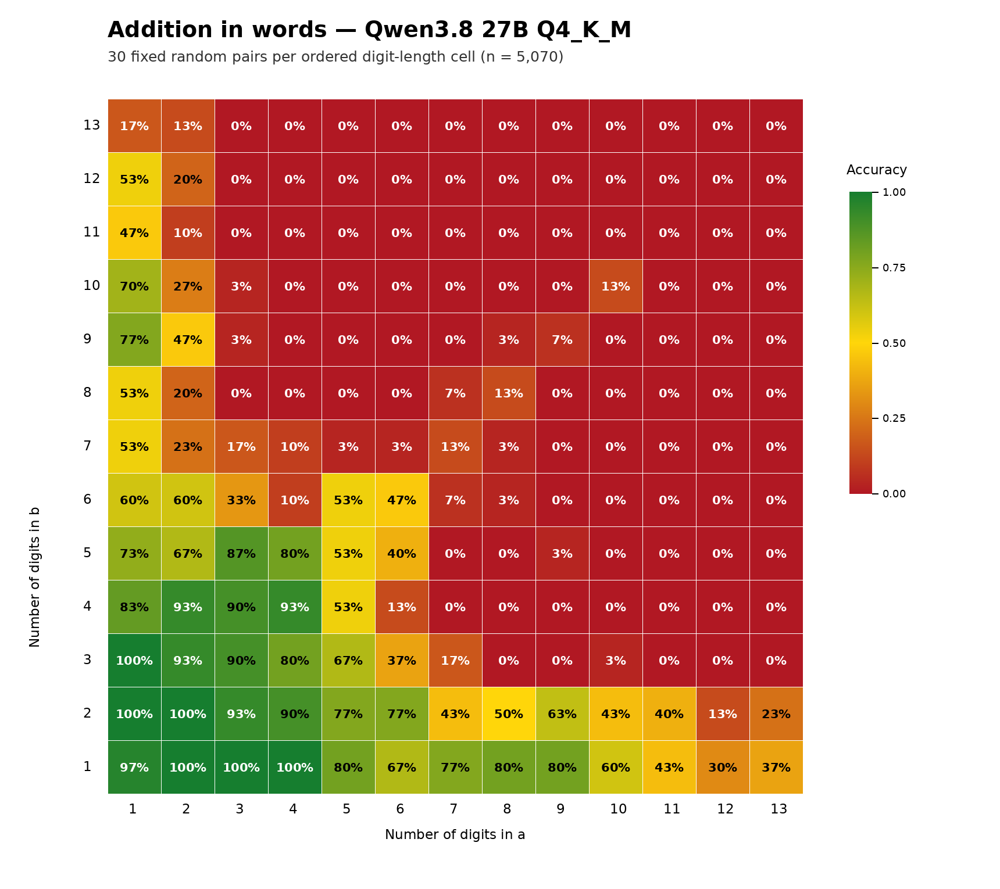

# Qwen3.8 27B addition-in-words experiment

## Executive summary

We evaluated the local `Qwen3.8-27B-Q4_K_M.gguf` model on exact integer
addition across every ordered combination of one- through thirteen-digit
operands. For each of the 169 digit-length combinations, we generated 30 fixed
operand pairs, producing 5,070 prompts in total. The model had to return only
the sum written in English words.

The official run used greedy decoding with reasoning disabled. All 5,070
requests succeeded on their first attempt, all ended normally, and none
returned content in the reasoning channel or exposed visible thinking tags.

The primary result was:

> **1,195 correct answers out of 5,070 prompts: 23.5700% numeric accuracy.**
>
> The 95% Wilson interval is **22.4220% to 24.7581%**.

The model followed the requested answer format much more reliably than it
produced the correct numeric value:

| Metric | Count | Rate |
| --- | ---: | ---: |
| Numerically correct complete response | 1,195 / 5,070 | 23.5700% |
| Valid English-number response | 4,876 / 5,070 | 96.1736% |
| Correct canonical wording | 1,140 / 5,070 | 22.4852% |

Of the 3,875 incorrect answers, 3,681 were still well-formed English numbers
that represented the wrong value. Only 194 responses failed the number-word
grammar. The dominant observed failure mode was therefore a parsable
number-word response with the wrong value, not a parser-detectable formatting
failure. This benchmark cannot determine whether such an error arose during
addition or during conversion of an internally correct sum into words.

Performance fell rapidly as operands became longer. Accuracy was 97.04% when
the longer operand had one to three digits, 65.31% for four to six digits,
17.33% for seven to nine digits, and 6.44% for ten to thirteen digits. Carry
burden was also strongly associated with failure: accuracy fell from 59.34% on
cases with no carries to 1.09% on cases with five or more carries.

## Research question

The experiment asked a deliberately narrow question:

> How accurately can this exact local Qwen3.8 27B model artifact add two
> positive integers and express the result as English number words when the
> operand lengths range from one to thirteen digits?

This setup tests several capabilities at once:

1. reading long ungrouped decimal operands;
2. performing exact addition, including carry propagation;
3. rendering the result in grammatical English number words; and
4. following the instruction to return no explanation, digits, or extra text.

The primary metric required success on all four. A response containing the
right sum as digits, the right words surrounded by an explanation, or a
well-formed but numerically wrong English number was not counted as correct.

## Model and serving configuration

The experiment applies to the precise quantized artifact and runtime below.
It should not be treated as a claim about every checkpoint or quantization of
the model family.

| Item | Official-run value |
| --- | --- |
| Model file | `/home/spark/Qwen3.8-27B-Q4_K_M.gguf` |
| Quantization | GGUF Q4_K_M (`Q4_K - Medium`) |
| Model parameters reported by the server | 27,320,697,856 |
| Model file size | 16,810,714,336 bytes, approximately 15.66 GiB |
| Model SHA-256 | `e00082f779fa385cee8c68a3ec8833a75778cc87272240b942f74e0b8243e520` |
| API | OpenAI-compatible `/v1/chat/completions` |
| Endpoint | `http://127.0.0.1:8082` |
| Server | CUDA-enabled `llama-server` |
| Server build fingerprint | `b1-c398c6e` |
| Served context | 32,768 tokens |
| Parallel slots | 1 |
| GPU offload | 99 layers requested with `-ngl 99` |
| Flash attention | Enabled |
| Chat template | Jinja template enabled |
| Speculative decoding | Disabled with `--spec-type none` |
| Draft/MTP model | Not used |

The server ran locally on an NVIDIA DGX Spark with an NVIDIA GB10 GPU, driver
580.82.09, Ubuntu 24.04.3 LTS, and an `aarch64` userspace. The host exposes
approximately 119 GiB of usable unified memory and had no swap configured.

During model loading, the server logged that several `blk.64.*` tensors were
ignored. This is retained as an observed runtime detail rather than interpreted
as corruption or assigned a specific architectural meaning. The server loaded
successfully, and the official run had no request failures.

The essential server launch shape was:

```bash
llama-server \
  -m /home/spark/Qwen3.8-27B-Q4_K_M.gguf \
  --host 127.0.0.1 \
  --port 8082 \
  -ngl 99 \
  -fa on \
  -c 32768 \
  --parallel 1 \
  --jinja \
  --reasoning off \
  --reasoning-format deepseek \
  --spec-type none
```

The server was used only as a single sequential inference slot for the
benchmark. The temporary endpoint was stopped after post-run snapshots and
artifact validation were complete.

### Official-run boundary

Before the official run, 67 Qwen requests were made as a pilot with an older
server build. Once that difference was identified, the pilot was stopped and
archived. The official run began from a fresh directory with the designated
server build and an empty attempts log. None of the pilot requests are included
in the 5,070-case result reported here.

## Test-set construction

### The 13 × 13 digit-length grid

The number of digits in operand `a` and operand `b` each ranged independently
from 1 through 13. Because operand position was retained, a three-digit `a`
plus a seven-digit `b` was a different cell from a seven-digit `a` plus a
three-digit `b`.

This produced:

```text
13 possible lengths for a
× 13 possible lengths for b
× 30 pairs per ordered cell
= 5,070 prompts
```

Every one of the 169 cells contains exactly 30 cases.

### Operand sampling

For a requested length `d`, operands were sampled uniformly as integers from:

```text
d = 1: 1 through 9
d > 1: 10^(d-1) through 10^d - 1
```

Zero was excluded, so every operand had exactly the requested positive digit
length. Integers were sampled directly; there was no floating-point sampling or
rounding.

Sampling used a dedicated pseudorandom generator with seed `20260929`.
Sampling was **with replacement**, meaning every row was an independent draw
and duplicate operand pairs were possible. The final set contains 5,061 unique
ordered operand pairs among 5,070 rows. The nine excess duplicates all occurred
in the two smallest cells: eight in the one-digit-by-one-digit cell and one in
the one-digit-by-two-digit cell.

The complete generated set was frozen before inference in `pairs.csv`. Its
SHA-256 is:

```text
a1bbd56ef958aa30c2d76c52d57bac43b4e0e96d43e75ae18f1110c82b4053aa
```

The preparation command refuses to overwrite an existing `pairs.csv` if newly
generated content differs, making the saved input file the authoritative test
manifest.

### Case identifiers, features, and request order

Each row received a stable identifier such as `a03_b08_r11`, encoding the two
operand lengths and the replicate number. Before inference, the runner also
stored:

- both operands and their exact sum;
- a canonical US-English rendering of the sum;
- the result's digit count;
- the total number of carry-producing columns; and
- the longest consecutive carry chain.

The 5,070 frozen cases were shuffled once with an independent request-order
seed, `20260930`. The shuffled order was saved as `request_order` and used for
the official sequential run. This prevented the server from seeing all easy or
all difficult cells in a block.

Each request also received a deterministic decode seed derived from the first
four bytes of `SHA-256(case_id)`, interpreted as a big-endian integer. The
all-ones sentinel value was explicitly avoided. Although greedy decoding should
not depend materially on this seed, saving it removes ambiguity and permits an
exact request replay. All 5,070 derived request seeds were distinct.

## Prompt and request format

Every benchmark case used one user message, no system message, and the same
prompt template:

> What is `{a}` + `{b}`? Please write your answer in words. Do not include any
> other text or information, just the answer in words.

Operands were inserted as ungrouped ASCII decimal strings. No commas,
underscores, or other digit separators were added to the input numbers.

The full request configuration was:

| Setting | Value |
| --- | ---: |
| `temperature` | 0 |
| `top_k` | 0 |
| `top_p` | 1 |
| `min_p` | 0 |
| `repeat_penalty` | 1 |
| `max_tokens` | 128 |
| `stream` | `false` |
| samples per request | 1 |
| custom stop strings | none |
| JSON grammar or constrained decoding | none |
| `chat_template_kwargs.enable_thinking` | `false` |

The absence of output grammar constraints is important. The model had to obey
the prose instruction on its own; the server was not forced to emit valid
number words.

## How reasoning was disabled

Reasoning was disabled redundantly at two levels:

1. the server was launched with `--reasoning off`; and
2. every request contained
   `"chat_template_kwargs": {"enable_thinking": false}`.

The effective rendered prompt was captured before the full run. It ended with
an empty, already-closed reasoning block followed by the answer position:

```text
<|im_start|>assistant
<think>

</think>

```

This demonstrated that the reasoning-disabled branch of the template was
actually selected rather than merely hiding a populated reasoning field after
generation.

A separate reasoning-disabled smoke request was sent before the official run.
It returned HTTP 200 with a normal `stop` finish and an empty reasoning field.
The diagnostic used `677 + 93847019`. It expected “ninety-three million eight
hundred forty-seven thousand six hundred ninety-six,” while the model returned
the valid but incorrect phrase “ninety-three million eight hundred forty-seven
thousand one hundred ninety-six.” The smoke step was a transport and
configuration check, not an arithmetic gate, so the full run proceeded. It was
excluded from all reported accuracy and timing totals.

The full run provided three additional checks:

- 0 of 5,070 responses had nonempty `reasoning_content`;
- 0 of 5,070 visible responses contained `<think>` tags; and
- all 5,070 saved requests explicitly set `enable_thinking=false`.

## Execution and raw-data preservation

The benchmark was executed sequentially against the single server slot. The
runner was capable of retrying a failed case up to three times with exponential
backoff after one and then two seconds. It used a 180-second request timeout and
could reconnect once for a connection-level failure. No recovery path was
needed: every official request succeeded on attempt one.

For each attempt, the append-only `attempts.jsonl` log retained:

- stable case ID and attempt number;
- exact request JSON, including the per-case seed;
- UTC start and finish timestamps;
- elapsed wall time;
- HTTP status and response headers;
- the exact UTF-8 response body; and
- the parsed response JSON.

The file was flushed and synchronized after every appended record. Grading was
performed from the saved API response, and the final `results.csv` was later
regenerated from the immutable raw log as a consistency check.

The official inference phase ran from approximately 00:35:50 through 02:46:07
UTC on 2026-09-30. The sum of recorded per-request latency was 7,725.51 seconds
(2 hours, 8 minutes, 45.5 seconds). The modest difference from total wall time
reflects checkpointing, file synchronization, progress reporting, and other
runner overhead.

## Grading methodology

### Primary metric: numeric correctness

A response was counted as numerically correct only when its **entire visible
content** parsed as a valid English number and the parsed integer equaled
`a + b`.

This means all of the following were wrong under the primary metric:

- a correct sum written with decimal digits;
- a correct number phrase with an explanation before or after it;
- a correct phrase wrapped in Markdown, quotation marks, or thinking tags;
- a malformed number phrase; and
- a valid number phrase representing the wrong integer.

### Secondary metrics

Two secondary flags were retained:

1. **Instruction compliance:** the whole visible response was a valid
   English-number expression, regardless of whether its value was correct.
2. **Canonical-text correctness:** after case and permitted punctuation
   normalization, the response exactly matched the benchmark's canonical
   US-English wording for the true sum.

Canonical wording omits the optional grammatical connector `and`. Therefore, a
response such as `one hundred and one` could be instruction-compliant and
numerically correct without being canonical.

### English-number grammar

The finite parser was case-insensitive and supported the usual small numbers,
tens, `hundred`, and descending short-scale groups through `quadrillion`. It
accepted:

- whitespace variation;
- standard or typographic hyphens;
- commas between number groups;
- optional terminal `.`, `!`, or `?`; and
- grammatical `and` immediately after `hundred` or a large scale.

It rejected digits, mixed alphanumeric tokens, unknown words, extra prose,
ascending or repeated large scales, invalid small-number sequences, dangling
`and`, inappropriate zero placement, and parsed values above
20,000,000,000,000. The design's theoretical maximum sum was
19,999,999,999,998, and the largest sum in the frozen sample was
18,703,821,761,514, so that bound covered the full test domain.

The archived parser and canonical renderer currently pass fixed boundary
examples, known-invalid constructions, and 10,000 seeded render-then-parse
round trips. After inference, all 5,070 raw responses were regraded with the
archived final parser. The regrade changed zero numeric-correctness flags, zero
compliance flags, and zero parsed answers.

## Results

### Overall metrics

| Measure | Result |
| --- | ---: |
| Completed official cases | 5,070 / 5,070 |
| Numerically correct | 1,195 |
| Numeric accuracy | **23.5700%** |
| Numeric-accuracy 95% Wilson interval | **22.4220%–24.7581%** |
| Instruction-compliant | 4,876 |
| Instruction-compliance rate | **96.1736%** |
| Canonical-text correct | 1,140 |
| Canonical-text accuracy | **22.4852%** |
| Correct but noncanonical | 55 |
| Nonempty reasoning responses | 0 |
| Normal `stop` finishes | 5,070 |
| Length-capped finishes | 0 |

Among the 1,195 correct answers, 1,140 used canonical wording and 55 used an
accepted noncanonical `and` variant. Thus 95.40% of numerically correct answers
were also canonical.

### Failure decomposition

The results separate cleanly into three mutually exclusive groups:

| Outcome | Count | Share of all prompts |
| --- | ---: | ---: |
| Correct valid English number | 1,195 | 23.57% |
| Valid English number, wrong value | 3,681 | 72.60% |
| Invalid or extra-text response | 194 | 3.83% |

This is the most important diagnostic result. The model usually produced an
answer in the requested form, but the represented integer was usually wrong.
Improving format compliance alone would have limited effect on the primary
score because nearly three quarters of all prompts already received a valid but
numerically incorrect number phrase. Put another way, 3,681 of the 3,875
incorrect answers, or 94.99%, were syntactically valid number phrases.

### Accuracy by the longer operand

For maximum operand length `m`, there are `2m - 1` ordered cells whose longer
operand has exactly `m` digits, so the group sizes grow with `m`.

| Maximum operand digits | Correct | Cases | Accuracy |
| ---: | ---: | ---: | ---: |
| 1 | 29 | 30 | 96.67% |
| 2 | 90 | 90 | 100.00% |
| 3 | 143 | 150 | 95.33% |
| 4 | 189 | 210 | 90.00% |
| 5 | 191 | 270 | 70.74% |
| 6 | 149 | 330 | 45.15% |
| 7 | 80 | 390 | 20.51% |
| 8 | 69 | 450 | 15.33% |
| 9 | 85 | 510 | 16.67% |
| 10 | 66 | 570 | 11.58% |
| 11 | 42 | 630 | 6.67% |
| 12 | 35 | 690 | 5.07% |
| 13 | 27 | 750 | 3.60% |

The small rise from eight to nine digits should not be interpreted as a real
reversal of the broader trend. The exact operands differ across groups, and
each individual cell contains only 30 observations.

The broader tiers make the size cliff easier to see:

| Maximum operand digits | Correct | Cases | Accuracy |
| --- | ---: | ---: | ---: |
| 1–3 | 262 | 270 | 97.04% |
| 4–6 | 529 | 810 | 65.31% |
| 7–9 | 234 | 1,350 | 17.33% |
| 10–13 | 170 | 2,640 | 6.44% |

All 22 cases whose correct sum expanded to fourteen digits were wrong.

### Cell-level accuracy

Six of the 169 ordered digit-length cells were perfect at 30/30:

- 1-digit `a` + 2-digit `b`;
- 1-digit `a` + 3-digit `b`;
- 2-digit `a` + 1-digit `b`;
- 2-digit `a` + 2-digit `b`;
- 3-digit `a` + 1-digit `b`; and
- 4-digit `a` + 1-digit `b`.

At the other end, 87 cells had zero correct answers. The complete matrix is
preserved in `cell_accuracy.csv`, including the count and 95% Wilson interval
for every cell.



### Accuracy by carry count

| Carry-producing columns | Correct | Cases | Accuracy |
| ---: | ---: | ---: | ---: |
| 0 | 448 | 755 | 59.34% |
| 1 | 469 | 1,139 | 41.18% |
| 2 | 173 | 1,004 | 17.23% |
| 3 | 75 | 788 | 9.52% |
| 4 | 21 | 561 | 3.74% |
| 5 or more | 9 | 823 | 1.09% |

Long carry chains showed the same general pattern: accuracy was 59.34% when
there was no carry chain, 30.80% when the longest chain was one column, 13.64%
for two columns, and 6.38% for three columns.

Carry statistics are descriptive, not causal. Longer numbers create more
opportunities for carries, so operand length, result length, total carry count,
and carry-chain length are correlated in this dataset.

### Operand-position pattern

| Relative operand lengths | Correct | Cases | Accuracy |
| --- | ---: | ---: | ---: |
| `a` longer than `b` | 538 | 2,340 | 22.99% |
| Equal length | 158 | 390 | 40.51% |
| `b` longer than `a` | 499 | 2,340 | 21.32% |

Equal-length cases are easier in aggregate largely because that group includes
many short-number cells. The 1.67-point difference between the two unequal
orientations is only descriptive: mirrored cells contain independently sampled
operands rather than exact swapped pairs, so operand position and item mix are
not cleanly separated.

### Noncompliant outputs

There were 194 responses that could not be parsed as a complete English number.
Their principal error classes were:

| Parser rejection | Count |
| --- | ---: |
| Repeated or non-descending large scales | 106 |
| Extra word `plus` | 25 |
| Parsed value above the supported maximum | 15 |
| Mixed word-and-digit tokens | 15 |
| Invalid use of `hundred` | 12 |
| Invalid use of `zero` inside a nonzero number | 10 |
| Other structural grammar errors | 11 |
| **Total** | **194** |

The largest class reflects responses that repeated or reordered words such as
`million`, `billion`, or `trillion`. None of these responses was salvaged by
extracting a number-like substring; whole-response validity was required.

### Runtime and token statistics

| Measurement | Value |
| --- | ---: |
| Official-run wall time | 7,817.37 s |
| Total recorded request time | 7,725.51 s |
| Mean request latency | 1.524 s |
| Median request latency | 1.575 s |
| 95th-percentile request latency | 2.105 s |
| 99th-percentile request latency | 2.274 s |
| Maximum request latency | 3.261 s |
| Total prompt tokens | 273,780 |
| Mean prompt tokens | 54.00 |
| Total completion tokens | 72,480 |
| Mean completion tokens | 14.30 |
| Median completion tokens | 15 |
| Maximum completion tokens | 34 |
| Mean generation rate | 11.37 tokens/s |
| Median generation rate | 11.41 tokens/s |

The 128-token response cap never bound: the longest completion contained only
34 tokens, and every request ended with `finish_reason=stop`.

Accuracy was also stable across execution order. The four consecutive request
quartiles scored 23.03%, 24.31%, 23.36%, and 23.58%, respectively. This does
not prove the absence of every runtime effect, but it provides no obvious sign
of a large warm-up, degradation, or drift trend during the official run.

## Interpretation

The model was highly reliable on short additions. It remained at or above 90%
accuracy through the four-digit maximum-length group and achieved 100% in the
two-digit maximum-length group. The decline then became steep: 70.74% at five
digits, 45.15% at six, and roughly one in five at seven.

The heatmap shows that an especially short second operand often made a cell
easier, even when the first operand was substantially longer. This is
consistent with the carry analysis: a short addend changes fewer aligned
columns and generally creates fewer opportunities for long carry propagation.
That explanation is plausible, but the experiment was not designed to identify
a causal mechanism.

For long inputs, the model often generated fluent and structurally valid number
words that were close in form to an answer but numerically wrong. This matters
operationally: a grammar check or instruction-following filter would accept
most of these failures. Independent verification against the exact sum would
still be required for any use where correctness matters.

## Limitations

1. **This is a replication design, not an exact reproduction of the pictured
   study.** Its original pair manifest, random seeds, serving stack, and decode
   configuration were unavailable.
2. **The result is artifact-specific.** It applies to the recorded Q4_K_M GGUF
   file, chat template, server build, and inference settings.
3. **Only greedy, reasoning-disabled decoding was tested.** Different reasoning
   settings, prompts, temperatures, constrained decoding, or tool use could
   produce different results.
4. **There are only 30 cases per cell.** Cell estimates move in 3.33-point
   increments and have wide uncertainty, particularly near 50% accuracy.
5. **Sampling was with replacement.** Nine excess duplicate draws slightly
   reduce the unique coverage of the two smallest cells.
6. **Mirrored cells were not exact swapped pairs.** Apparent operand-order
   differences can be confounded by independently sampled item difficulty.
7. **Carry and length features co-vary.** Their accuracy gradients are useful
   descriptions, not isolated causal effects.
8. **The primary metric combines arithmetic and language rendering.** A model
   could compute the correct integer but fail to express it under the required
   grammar, or produce fluent wording for an incorrect integer.
9. **Latency is an observed sequential-run measure.** It is not a controlled
   throughput benchmark and should not be generalized to batched service.
10. **The parser encodes a declared English-number policy.** Other defensible
    policies might accept additional colloquialisms, but the policy was fixed
    before the final readout and all raw responses remain available for
    alternative analyses.

## Integrity and validation checks

The final audit established all of the following:

- exactly 5,070 frozen cases, 5,070 raw attempts, and 5,070 graded results;
- 5,070 unique case IDs and 5,070 unique API response IDs;
- all cases present exactly once in the saved shuffled request order;
- 169 ordered cells with exactly 30 cases each;
- all attempts were attempt 1, HTTP 200, and `finish_reason=stop`;
- every saved request matched its frozen prompt, model ID, decode settings, and
  deterministic case seed;
- every raw response body parsed to the same JSON saved in `response_json`;
- zero reasoning-channel outputs and zero visible thinking tags;
- zero raw-to-results grading mismatches under the archived final parser;
- all cell summaries, the accuracy matrix, summary totals, and heatmap agreed
  with `results.csv`;
- the server build, model identity, context, and template stayed stable across
  the before/after snapshots; and
- post-run regrading was idempotent.

Key immutable checksums are:

| Artifact | SHA-256 |
| --- | --- |
| Model GGUF | `e00082f779fa385cee8c68a3ec8833a75778cc87272240b942f74e0b8243e520` |
| Frozen `pairs.csv` | `a1bbd56ef958aa30c2d76c52d57bac43b4e0e96d43e75ae18f1110c82b4053aa` |
| Append-only `attempts.jsonl` | `98a929fe389f4565212e4b8ee268d749656de417d9b760f01db808a37ea78f2a` |
| Final `results.csv` | `be4c720fc9b1ec2d21621ed740d2fe9bd7720b83f04f4b46b47cb489870fb213` |
| Official benchmark script | `907e2b312b283b88624938c94c1ba7066f67cf5fb11951ef0262ffed24199e7a` |
| Chat template | `c3cf9e34abf4f9e36c2d72165aa9c132d3e2a725b6c2586aaa3a8af9d7a81041` |

## Saved artifacts

The official run is in:

```text
runs/qwen3.8-27b-q4_k_m-seed-20260929/
```

Important files include:

| File | Purpose |
| --- | --- |
| `manifest.json` | Frozen experiment definition, hashes, seeds, and decode settings |
| `environment.json` | Host, GPU, runtime, model, and process snapshot |
| `server_props.json` | Pre-run server configuration and chat template |
| `server_models.json` | Pre-run API model identity |
| `server_props_after.json` | Post-run server configuration snapshot |
| `server_models_after.json` | Post-run API model identity snapshot |
| `rendered_prompt_no_thinking.json` | Effective reasoning-disabled rendered prompt |
| `pairs.csv` | Immutable 5,070-case input manifest |
| `smoke_tests.jsonl` | Excluded pre-run diagnostic request and response |
| `attempts.jsonl` | Append-only raw HTTP request/response record |
| `results.csv` | One graded row per official case |
| `progress.json` | Final resumable-run status |
| `cell_accuracy.csv` | All 169 cell estimates with Wilson intervals |
| `accuracy_matrix.csv` | 13 × 13 primary-accuracy matrix |
| `summary.json` | Machine-readable headline metrics and timing totals |
| `postprocess_manifest.json` | Regrade lineage and raw/result hashes |
| `heatmap.png` | Static cell-accuracy heatmap |
| `run.log` | Timestamped preparation, progress, regrade, and summary log |
| `server.log` | Full local inference-server log, including shutdown cleanup |
| `benchmark_inference.py` | Archived official inference implementation |
| `benchmark_postprocess.py` | Archived final post-processing implementation |

## Reproducing the workflow

With the model server running at the configured loopback endpoint, the saved
runner exposes these stages:

```bash
python3 benchmark_qwen38.py self-test
python3 benchmark_qwen38.py prepare
python3 benchmark_qwen38.py smoke
python3 benchmark_qwen38.py run
python3 benchmark_qwen38.py regrade
python3 benchmark_qwen38.py summarize
```

Their roles are:

1. `self-test` validates number rendering, strict parsing, boundary cases,
   invalid constructions, and 10,000 random round trips.
2. `prepare` freezes the case manifest and saves model/server/environment
   provenance. It refuses to overwrite mismatched existing inputs.
3. `smoke` verifies the reasoning-disabled request and response path. Its row is
   excluded from the benchmark.
4. `run` executes the shuffled cases sequentially, appends complete raw records,
   and checkpoints resumable progress. Rerunning it skips cases that already
   have a successful saved response.
5. `regrade` reconstructs results from the append-only raw log using the final
   archived parser and records whether any fields changed.
6. `summarize` writes the overall summary, 169-cell table, matrix, post-run
   server snapshots, and heatmap.

For a genuinely independent repeat rather than a resume, use a new run
directory and preserve the original directory unchanged. The pair seed,
request-order seed, exact model hash, template hash, decode settings, and parser
version should all be recorded again so that any changed condition is explicit.
