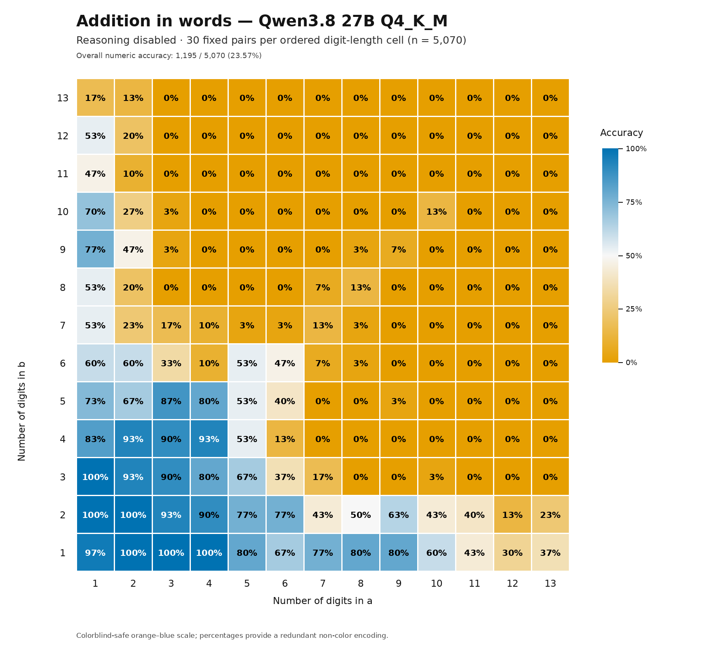
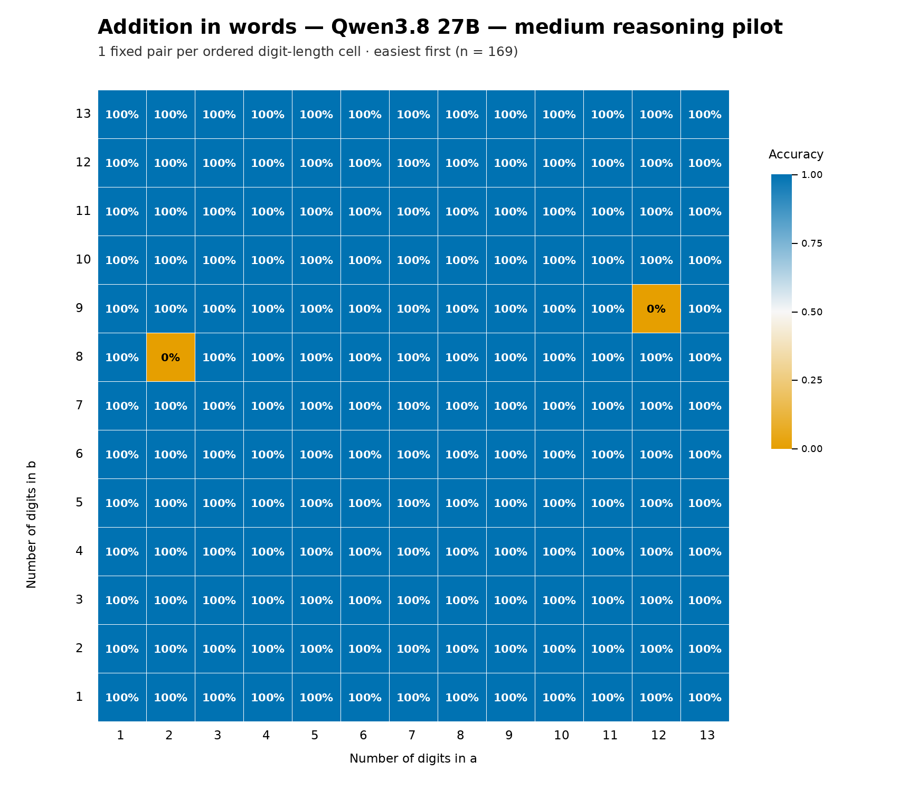

# Qwen3.8 27B addition in words

<!-- AI-GENERATED-NOTE -->
> [!NOTE]
> This is an AI-generated research report. All text and code in this report was created by an LLM (Large Language Model). For more information on how these reports are created, see the [main research repository](https://github.com/simonw/research).
<!-- /AI-GENERATED-NOTE -->

This experiment was inspired by [Colin Fraser's original Bluesky
post](https://bsky.app/profile/colin-fraser.net/post/3mwopbyznhs2k). It tests
whether the local `Qwen3.8-27B-Q4_K_M.gguf` model can add two positive integers
and return the result entirely in English words.

Every prompt used this template:

> What is `{a}` + `{b}`? Please write your answer in words. Do not include any
> other text or information, just the answer in words.

Two configurations were evaluated:

1. A complete reasoning-disabled benchmark with 30 sampled additions in every
   ordered combination of one- through thirteen-digit operands: 169 cells and
   5,070 prompts.
2. A paired medium-reasoning benchmark using the same `r01` case from every
   cell: 169 prompts total, ordered from easiest to hardest.

The folder includes the frozen inputs, raw API requests and responses, visible
answers, reasoning transcripts, grades, reports, charts, runner code, and
runtime provenance for both finalized runs. The 15.66 GiB model itself is not
included.

## Results

The full reasoning-disabled benchmark scored **1,195/5,070 (23.57%)**. Its
responses were usually formatted correctly—**96.17%** were valid English
numbers—but most represented the wrong integer. Accuracy fell sharply as the
operands grew: from 97.04% when the longer operand had one to three digits to
6.44% when it had ten to thirteen digits.

For the paired comparison below, both configurations were evaluated on the
exact same 169 additions:

| Measure | No thinking | Medium reasoning | Change |
| --- | ---: | ---: | ---: |
| Numeric correctness | 45/169 (26.63%) | 167/169 (98.82%) | +72.19 percentage points |
| Instruction compliance | 164/169 (97.04%) | 168/169 (99.41%) | +2.37 percentage points |
| Canonical wording | 43/169 (25.44%) | 166/169 (98.22%) | +72.78 percentage points |
| Median latency | 1.50 seconds | 27.62 seconds | — |
| Mean latency | 1.50 seconds | 56.60 seconds | — |
| Median completion tokens | 14 | 313 | — |
| Total completion tokens | 2,376 | 112,887 | — |

Of those 169 cases, both configurations answered 44 correctly, medium
reasoning alone answered 123 correctly, no thinking alone answered one
correctly, and both missed one.

The two medium-reasoning failures were:

- `73 + 42,439,903`: the model returned words for `42,440,076` instead of
  `42,439,976`.
- `866,210,161,193 + 296,827,965`: its reasoning reached the correct digits,
  `866,506,989,158`, but the visible answer called the leading group
  “trillion” rather than “billion.”

The [paired report](QWEN38_27B_REASONING_ON_VS_OFF_SHORT_REPORT.md) includes
the full saved reasoning and visible response for both failures, the easiest
case, a case approximately one-third through the run, and the hardest
correctly answered case. The
[full report](QWEN38_27B_EXPERIMENT_REPORT.md) documents the 5,070-case
reasoning-disabled benchmark in detail.

## Accuracy grids

These figures use an orange–neutral–blue colorblind-safe palette and print the
accuracy in every cell.

### Reasoning disabled: 30 cases per cell



### Medium reasoning: one case per cell



Because the medium-reasoning run has one case per cell, each cell in its grid
is necessarily either 0% or 100%.

## Method

Operand lengths ranged independently from one through thirteen digits. The
full benchmark sampled 30 pairs with replacement in each ordered digit-length
cell using seed `20260929`; zero was excluded. The cases were frozen before
inference and shuffled with seed `20260930`. The medium-reasoning run selected
replicate `r01` from each frozen cell, making all 169 cases exactly joinable to
the earlier run by `case_id`.

Both configurations used greedy decoding:

- `temperature=0`
- `top_k=0`
- `top_p=1`
- `min_p=0`
- `repeat_penalty=1`

The reasoning-disabled requests set `enable_thinking=false` and allowed up to
128 completion tokens. The medium-reasoning requests set
`enable_thinking=true`, `reasoning_effort=medium`, and `max_tokens=-1`. The
server used a 32,768-token context, so “unlimited” means no separate prediction
cap rather than literally unbounded generation.

A response counted as numerically correct only if its complete visible content
parsed as valid English number words and represented exactly `a + b`. Digits,
explanations, markup, extra prose, malformed number phrases, and valid phrases
for the wrong number all failed the primary metric. Reasoning content was saved
for analysis but never used to rescue or alter a visible-answer grade.

All 5,070 reasoning-disabled requests and all 169 medium-reasoning requests
completed on their first HTTP attempt. The medium-reasoning run had no token
caps, empty answers, retries, or visible thinking-tag leakage.

## Model and machine

The results apply to this exact local artifact and runtime:

| Item | Value |
| --- | --- |
| Model | `Qwen3.8-27B-Q4_K_M.gguf` |
| Quantization | GGUF Q4_K_M |
| Model SHA-256 | `e00082f779fa385cee8c68a3ec8833a75778cc87272240b942f74e0b8243e520` |
| Parameters reported by server | 27,320,697,856 |
| Server | CUDA-enabled `llama-server` |
| Server fingerprint | `b1-c398c6e` |
| Hardware | NVIDIA DGX Spark with NVIDIA GB10 |
| API | OpenAI-compatible `/v1/chat/completions` |
| Context | 32,768 tokens |
| Parallel slots | 1 |

## Important caveat

The paired result compares two complete configurations; it is not a clean
causal estimate of reasoning alone. Reasoning status and the completion limit
both changed: the earlier requests had a 128-token cap, while the medium run
used `max_tokens=-1`. Execution order also changed from a seeded shuffle to
easiest-first.

The medium-reasoning condition contains only one case per cell, so it is much
smaller than the 30-per-cell reasoning-disabled benchmark. The test also
combines arithmetic, number-to-words conversion, and instruction following in
one metric. Results are specific to the recorded model file, quantization,
chat template, server build, prompt, and decoding settings.

## Files

- `QWEN38_27B_EXPERIMENT_REPORT.md` — detailed report for the 5,070-case
  reasoning-disabled benchmark.
- `QWEN38_27B_REASONING_ON_VS_OFF_SHORT_REPORT.md` — paired comparison with
  full transcripts for the selected examples and every medium-reasoning error.
- `QWEN38_27B_REASONING_ON_VS_OFF_SHORT_REPORT.manifest.json` — source hashes
  and provenance for the paired report.
- `benchmark_qwen38.py` — reasoning-disabled runner and grader.
- `benchmark_qwen38_reasoning.py` — one-per-cell medium-reasoning runner.
- `build_reasoning_comparison_short_report.py` — validates the paired inputs
  and regenerates the comparison report.
- `render_qwen38_no_thinking_accessible_heatmap.py` — regenerates the
  colorblind-safe full-run chart.
- `runs/qwen3.8-27b-q4_k_m-seed-20260929/` — frozen inputs, raw attempts,
  grades, summaries, charts, logs, and provenance for the 5,070-case run.
- `runs/qwen3.8-27b-q4_k_m-reasoning-medium-unlimited-one-per-cell-easiest-first-seed-20260929/`
  — the equivalent archive for the 169-case medium-reasoning run.
- `references/` — the two images that motivated the experiment.
- `notes.md` — chronological packaging notes.

Within each run directory, the core artifacts are:

| File | Purpose |
| --- | --- |
| `manifest.json` | Frozen experiment definition and hashes |
| `pairs.csv` | Input cases and arithmetic features |
| `attempts.jsonl` | Complete request and response records |
| `results.csv` | One graded row per case |
| `summary.json` | Machine-readable headline results |
| `cell_accuracy.csv`, `accuracy_matrix.csv` | Grid-level results |
| `heatmap.png` | Rendered result grid |
| `environment.json`, `server_props*.json`, `server_models*.json` | Runtime provenance |
| `benchmark_inference.py`, `benchmark_postprocess.py` | Exact archived code revisions |

Environment and server snapshots intentionally preserve historical absolute
paths, process identifiers, and host details from the original machine.

## Reproduction

The scripts use only the Python standard library for inference and grading;
chart rendering additionally uses Pillow. They expect a compatible local
`llama-server` at `http://127.0.0.1:8082` and currently contain the original
model path. Update the `MODEL`, `ENDPOINT`, and `RUN_DIR` constants before
running on another machine. Run the scripts from this directory so their
relative `runs/` paths resolve correctly.

For the reasoning-disabled condition, launch the server with equivalent flags:

```bash
/path/to/llama-server \
  -m /path/to/Qwen3.8-27B-Q4_K_M.gguf \
  --host 127.0.0.1 --port 8082 \
  -ngl 99 -fa on -c 32768 --parallel 1 --jinja \
  --reasoning off --reasoning-format deepseek --spec-type none
```

Then run:

```bash
python3 benchmark_qwen38.py self-test
python3 benchmark_qwen38.py prepare
python3 benchmark_qwen38.py smoke
python3 benchmark_qwen38.py run
python3 benchmark_qwen38.py regrade
python3 benchmark_qwen38.py summarize
```

For the medium-reasoning condition, restart the server with equivalent flags:

```bash
/path/to/llama-server \
  -m /path/to/Qwen3.8-27B-Q4_K_M.gguf \
  --host 127.0.0.1 --port 8082 \
  -ngl 99 -fa on -c 32768 --parallel 1 --jinja \
  --reasoning on --reasoning-format deepseek --reasoning-effort medium \
  --reasoning-budget -1 --spec-type none --n-predict -1 \
  --no-context-shift --timeout 14400
```

Then run:

```bash
python3 benchmark_qwen38_reasoning.py self-test
python3 benchmark_qwen38_reasoning.py prepare
python3 benchmark_qwen38_reasoning.py smoke
python3 benchmark_qwen38_reasoning.py run
python3 benchmark_qwen38_reasoning.py regrade
python3 benchmark_qwen38_reasoning.py summarize
```

Regenerate the paired report and accessible full-run chart with:

```bash
python3 build_reasoning_comparison_short_report.py
python3 render_qwen38_no_thinking_accessible_heatmap.py
```

The runners are resumable and skip cases with an already saved successful
response. Use fresh run directories for an independent repeat instead of
overwriting these archived results.
