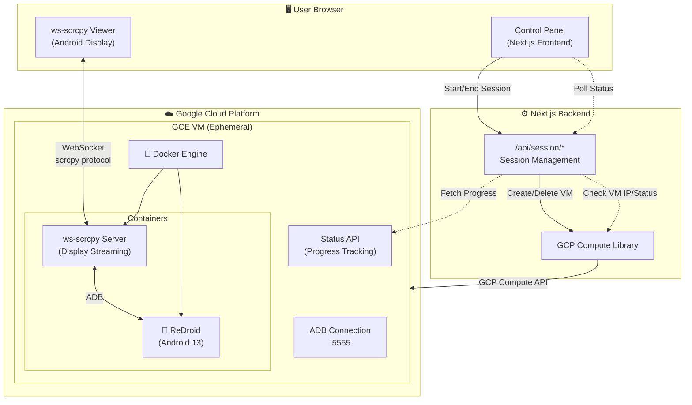

# ReDroid Cloud

Serverless-managed ephemeral Android emulators in the cloud.

## Quick Start

### 1. Prerequisites

- Node.js 18+
- GCP project with Compute Engine API enabled
- Service account with permissions (see below)

### 2. GCP Setup (One-Time)

```bash
# Set your project
export PROJECT_ID=corsali-development

# Create service account
gcloud iam service-accounts create redroid-vm-manager \
  --project=$PROJECT_ID \
  --display-name="ReDroid VM Manager"

# Grant permissions
gcloud projects add-iam-policy-binding $PROJECT_ID \
  --member="serviceAccount:redroid-vm-manager@$PROJECT_ID.iam.gserviceaccount.com" \
  --role="roles/compute.instanceAdmin.v1"

gcloud projects add-iam-policy-binding $PROJECT_ID \
  --member="serviceAccount:redroid-vm-manager@$PROJECT_ID.iam.gserviceaccount.com" \
  --role="roles/compute.networkAdmin"

gcloud projects add-iam-policy-binding $PROJECT_ID \
  --member="serviceAccount:redroid-vm-manager@$PROJECT_ID.iam.gserviceaccount.com" \
  --role="roles/iam.serviceAccountUser"

# Create credentials JSON
gcloud iam service-accounts keys create redroid-credentials.json \
  --project=$PROJECT_ID \
  --iam-account=redroid-vm-manager@$PROJECT_ID.iam.gserviceaccount.com

# Create firewall rules (required for VM access)
gcloud compute firewall-rules create allow-kasm \
  --project=$PROJECT_ID \
  --network=default \
  --allow=tcp:443 \
  --target-tags=allow-kasm \
  --description="Allow HTTPS access for noVNC"

gcloud compute firewall-rules create allow-adb \
  --project=$PROJECT_ID \
  --network=default \
  --allow=tcp:5555 \
  --target-tags=allow-adb \
  --description="Allow ADB access for ReDroid"
```

### 3. Configure Environment

```bash
# Copy example env
cp .env.example .env

# Edit .env with your credentials (single-line JSON)
cat redroid-credentials.json | tr -d '\n' | tr -s ' ' | pbcopy
# Paste as GCP_CREDENTIALS value in .env
```

### 4. Run

```bash
npm install
npm run dev
# Open http://localhost:3000
```

## Usage

1. Click **Start Session** - creates ephemeral GCE VM with ReDroid
2. Wait ~3 minutes for VM to boot and configure
3. Click **Open Android in Browser** - access Android via noVNC
4. Click **End Session** - destroys VM and all data

## Architecture



### Component Details

| Component | Description |
|-----------|-------------|
| **Control Panel** | Next.js frontend for session management (start/stop) |
| **ws-scrcpy Viewer** | Browser-based Android display via WebSocket streaming |
| **Next.js API** | REST endpoints for VM lifecycle management |
| **GCP Compute Library** | SDK wrapper for GCE instance operations |
| **GCE VM** | Ephemeral n1-standard-4 instance with nested virtualization |
| **ReDroid** | Android 13 container with GPU acceleration |
| **ws-scrcpy Server** | Converts ADB screen capture to WebSocket stream |

## Cost

- ~$0.02 per 15-minute session
- $0 when idle (all resources destroyed)

## API Endpoints

| Method | Endpoint | Description |
|--------|----------|-------------|
| POST | `/api/session/start` | Create new session/VM |
| GET | `/api/session/:id` | Get session status |
| POST | `/api/session/end` | End session, delete VM |
