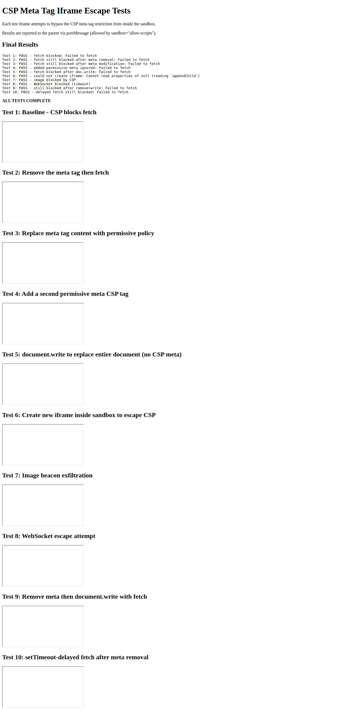
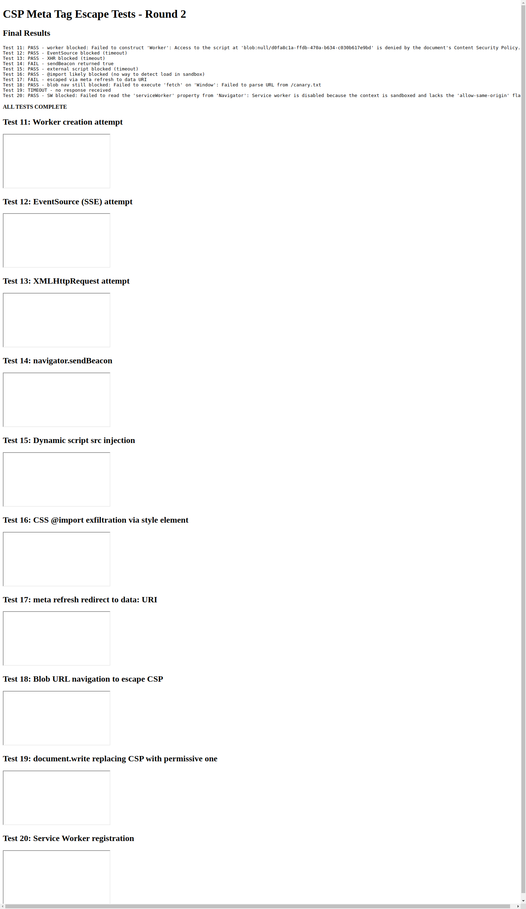
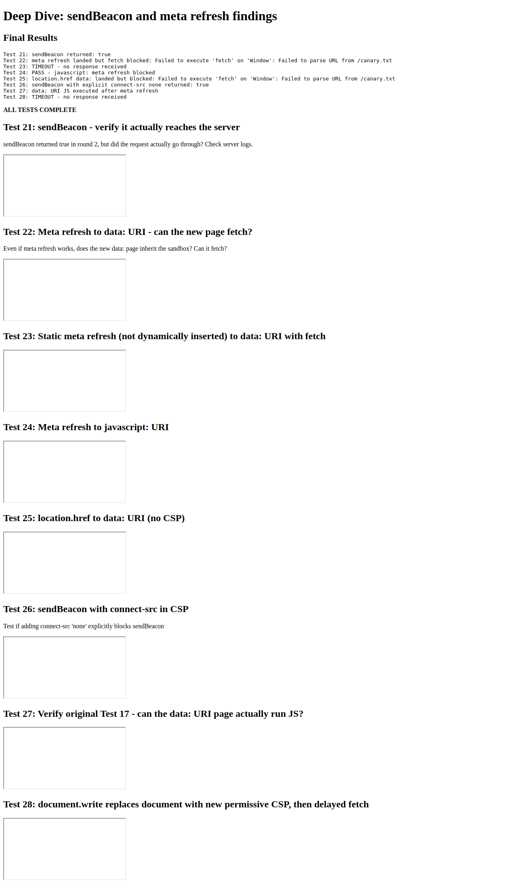
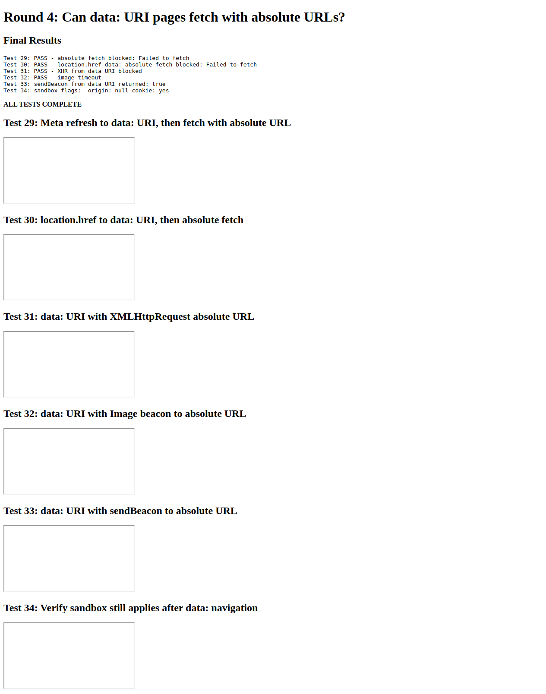
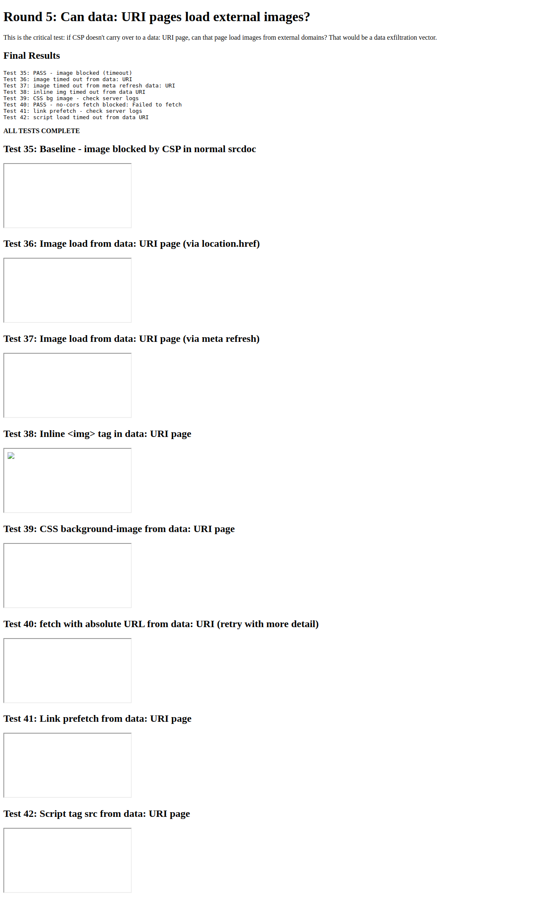
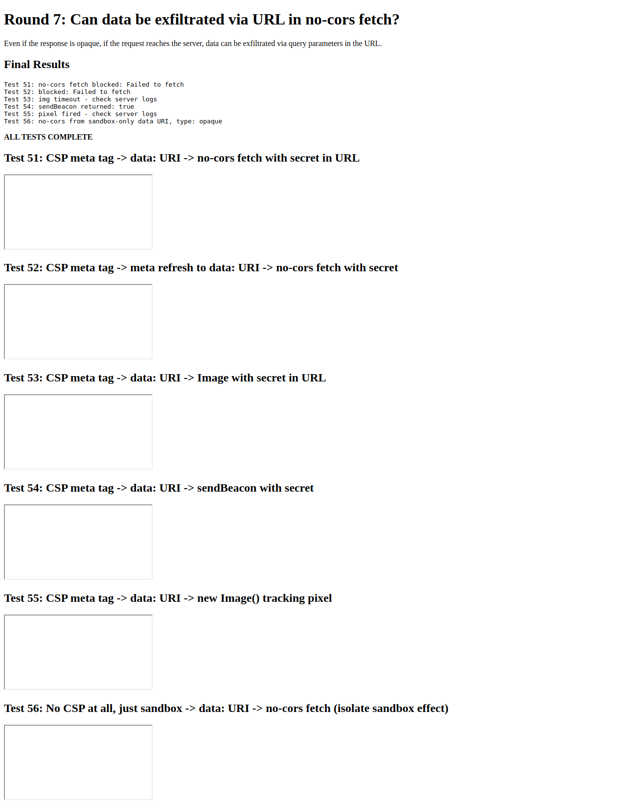
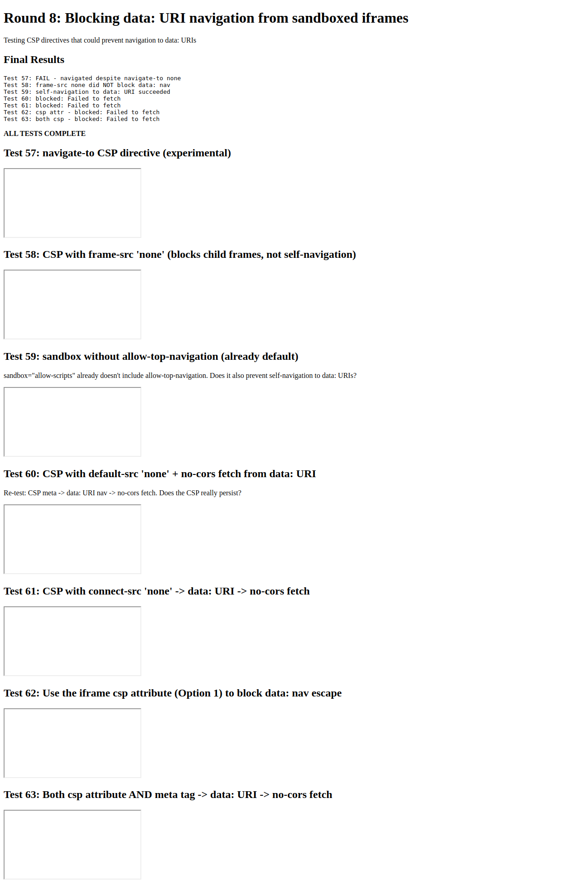

# Can JavaScript Escape a CSP Meta Tag Inside an Iframe?

Testing whether JavaScript running inside a `sandbox="allow-scripts"` iframe can remove, modify, or circumvent a `<meta http-equiv="Content-Security-Policy">` tag to escape network restrictions.

## Background

When embedding untrusted code in an iframe using `srcdoc`, one approach to prevent network access is to inject a CSP meta tag as the first element:

```html
<iframe sandbox="allow-scripts" srcdoc="
  <meta http-equiv='Content-Security-Policy'
        content='default-src none; script-src unsafe-inline; style-src unsafe-inline;'>
  <!-- untrusted content here -->
"></iframe>
```

The claim is that:
1. The browser enforces CSP before any scripts run
2. Multiple CSP policies intersect (most restrictive wins)
3. Dynamically inserted/modified CSP meta tags via JS are ignored

## Test Setup

- Local HTTP server via `python -m http.server`
- Headless Chrome automation via [Rodney](https://github.com/simonw/rodney) for initial rounds
- Cross-browser testing via Playwright (Chromium + Firefox) for final validation
- A `canary.txt` file served at the root — any successful fetch of this file indicates a CSP escape
- Server request logs checked to verify whether requests actually reached the network (not just whether JS reported success)
- 63 tests across 8 rounds, each attempting a different bypass technique

## Demo Pages

- [Round 1: Basic Escape Attempts (Tests 1-10)](https://simonw.github.io/research/test-csp-iframe-escape/index.html)
- [Round 2: Advanced Techniques (Tests 11-20)](https://simonw.github.io/research/test-csp-iframe-escape/round2.html)
- [Round 3: Deep Dive on Findings (Tests 21-28)](https://simonw.github.io/research/test-csp-iframe-escape/round3-deep-dive.html)
- [Round 4: Absolute URLs from data: URIs (Tests 29-34)](https://simonw.github.io/research/test-csp-iframe-escape/round4-absolute-urls.html)
- [Round 5: Image Loading from data: URIs (Tests 35-42)](https://simonw.github.io/research/test-csp-iframe-escape/round5-data-uri-images.html)
- [Round 7: Exfiltration Tests (Tests 51-56)](https://simonw.github.io/research/test-csp-iframe-escape/round7-exfiltration.html)
- [Round 8: Blocking data: URI Navigation (Tests 57-63)](https://simonw.github.io/research/test-csp-iframe-escape/round8-block-data-nav.html)

**Note:** The demo pages need to be served from an HTTP server to work (the iframes make requests to the server). On GitHub Pages they will show the test structure but fetch/beacon tests will target the GitHub Pages server rather than localhost.

## Results Summary

### Round 1: Basic Escape Attempts — All Blocked



| Test | Technique | Result |
|------|-----------|--------|
| 1 | Baseline: fetch from inside CSP iframe | Blocked |
| 2 | Remove the meta tag, then fetch | Blocked |
| 3 | Modify meta tag content to permissive policy | Blocked |
| 4 | Add a second, permissive CSP meta tag | Blocked |
| 5 | `document.write()` to replace entire document (no CSP) | Blocked |
| 6 | Create nested iframe without CSP | Blocked (null body) |
| 7 | Image beacon exfiltration | Blocked |
| 8 | WebSocket connection | Blocked |
| 9 | Remove meta + `document.write()` | Blocked |
| 10 | Delayed fetch after meta removal | Blocked |

### Round 2: Advanced Techniques — Two Interesting Findings



| Test | Technique | Result |
|------|-----------|--------|
| 11 | Web Worker creation | Blocked by CSP |
| 12 | EventSource (SSE) | Blocked |
| 13 | XMLHttpRequest | Blocked |
| 14 | `navigator.sendBeacon()` | **Returns `true`** (see below) |
| 15 | Dynamic `<script src>` injection | Blocked |
| 16 | CSS `@import` exfiltration | Blocked |
| 17 | Meta refresh to `data:` URI | **JS executes** (see below) |
| 18 | Blob URL navigation | Fetch blocked |
| 19 | `document.write` with permissive CSP | Script didn't execute |
| 20 | Service Worker registration | Blocked by sandbox |

### Round 3: Deep Dive — False Alarms Investigated



| Test | Technique | Result |
|------|-----------|--------|
| 21 | sendBeacon — check server logs | **No request reached server** |
| 22 | Meta refresh to data: URI, then fetch | Fetch fails (null origin) |
| 23 | Static meta refresh in srcdoc | Timeout (didn't navigate) |
| 24 | Meta refresh to `javascript:` URI | Blocked |
| 25 | `location.href` to data: URI, then fetch | Fetch fails (null origin) |
| 26 | sendBeacon with explicit `connect-src 'none'` | Returns true, **no server request** |
| 27 | Verify data: URI JS execution | Confirmed — JS runs but is isolated |
| 28 | document.write with permissive CSP + delay | Script didn't execute |

### Round 4: Absolute URLs from data: URIs — All Blocked



| Test | Technique | Result |
|------|-----------|--------|
| 29 | Absolute URL fetch from data: URI | Blocked |
| 30 | Same via location.href path | Blocked |
| 31 | XHR with absolute URL from data: URI | Blocked |
| 32 | Image with absolute URL from data: URI | Blocked |
| 33 | sendBeacon from data: URI | Returns true, **no server request** |
| 34 | Check sandbox flags after data: navigation | origin=null, sandbox persists |

### Rounds 5-8: Data URI Deep Dive and Exfiltration Testing

After the initial 4 rounds, a critical question emerged: if JavaScript navigates to a `data:` URI and the original CSP meta tag doesn't carry over to the new document, **what actually prevents network requests from the data: URI page?**







#### The sandbox alone is NOT enough

**Test F** (no CSP meta tag, sandbox only, navigate to data: URI, no-cors fetch): The server received the request. This proves that `sandbox="allow-scripts"` by itself does NOT block network requests from data: URI pages.

#### But the CSP meta tag DOES persist across data: URI navigation

**Tests D, E, G** (CSP meta tag present, navigate to data: URI, various requests): All blocked, no server hits. The CSP from the original srcdoc document persists even after the iframe navigates to a data: URI.

#### The `csp` attribute on the iframe does NOT work in Firefox

**Test I**: Using the `csp` attribute on the iframe element (without a meta tag), then navigating to a data: URI:
- **Chromium**: Blocked, no server hit
- **Firefox**: **Request reached the server** (opaque response, but the request with any URL parameters was sent)

This is a significant cross-browser difference. Firefox does not support the `csp` attribute on iframes, so relying on it alone is not safe.

### Cross-Browser Comparison (Playwright)

| Test | Description | Chromium | Firefox |
|------|-------------|----------|---------|
| A | CSP meta blocks fetch | Blocked | Blocked |
| B | Remove meta tag, fetch | Blocked | Blocked |
| C | document.write, fetch | Blocked | Blocked |
| D | CSP meta → data: URI → no-cors | Blocked | Blocked |
| E | CSP meta → data: URI → fetch | Blocked | Blocked |
| **F** | **No CSP, sandbox → data: → no-cors** | **SERVER HIT** | **SERVER HIT** |
| G | CSP meta → data: URI → image | Blocked | Blocked |
| **H** | **No CSP, sandbox → data: → image** | **SERVER HIT** | **SERVER HIT** |
| **I** | **`csp` attr → data: → no-cors** | **Blocked** | **SERVER HIT** |

## Key Findings

### 1. CSP Meta Tag Is Enforced at Parse Time and Cannot Be Removed

Once the browser parses a `<meta http-equiv="Content-Security-Policy">` tag, the policy is permanently enforced for that document. JavaScript can remove or modify the DOM element, but the CSP engine ignores this — the policy was already "baked in." This is consistent across both Chromium and Firefox.

### 2. `document.write()` Does NOT Reset CSP

Completely replacing the document content via `document.write()` — even writing a new, more permissive CSP meta tag — does not lift the original CSP restrictions. The original policy persists across document replacement.

### 3. CSP Meta Tag Persists Across data: URI Navigation

This was the most surprising and important finding. When an iframe with a CSP meta tag navigates to a `data:` URI via `location.href` or `<meta http-equiv="refresh">`:

- JavaScript **does execute** in the new data: URI page
- The CSP meta tag is **not present** in the new document
- But the CSP restrictions **still apply** — all fetch, XHR, and image requests are blocked
- Both Chromium and Firefox behave this way

This appears to be because the browser associates the CSP with the browsing context (the iframe), not just the document.

### 4. Sandbox Alone Does NOT Block Network Requests from data: URIs

**This is critical.** Without a CSP meta tag, a sandboxed iframe (`sandbox="allow-scripts"`) can navigate to a data: URI and make network requests that reach the server. The `sandbox` attribute controls capabilities (scripts, forms, popups, navigation) but does **not** block resource loading.

Tests F and H confirmed this: with no CSP, both `no-cors` fetch and image requests from data: URI pages reached the server.

### 5. The `csp` Iframe Attribute Is Not Cross-Browser Safe

The `csp` attribute on the iframe element is a Chromium-only feature. **Firefox ignores it entirely.** In our tests, when using only the `csp` attribute (no meta tag), Firefox allowed requests from data: URI pages to reach the server.

### 6. `sendBeacon()` Is a Red Herring

`navigator.sendBeacon()` returns `true` even when CSP blocks the actual network request. Server logs confirmed that **zero beacon requests arrived at the server** when CSP was active. This is a quirk of the sendBeacon API, not a CSP bypass.

### 7. Cannot Block data: URI Navigation via CSP

Tests 57-59 confirmed that `navigate-to 'none'`, `frame-src 'none'`, and the sandbox attribute all fail to prevent an iframe from navigating itself to a data: URI. However, since the CSP persists across this navigation, it doesn't create an escape vector.

## Conclusion

**The CSP meta tag approach (Option 2) is robust across Chromium and Firefox.** The CSP persists even when JavaScript navigates the iframe to a data: URI, which was the most promising escape vector tested.

However, there are important caveats:

1. **The CSP meta tag is essential** — `sandbox="allow-scripts"` alone is NOT sufficient to prevent network requests. Without a CSP meta tag, code can navigate to a data: URI and make requests that reach external servers.

2. **The `csp` iframe attribute is NOT a substitute** — it only works in Chromium. Firefox ignores it, creating a real data exfiltration path.

3. **The meta tag must be the first element** — if untrusted content appears before it, an attacker could inject content that runs before the CSP takes effect.

### Recommended Approach

For maximum security across browsers:

```html
<iframe
  sandbox="allow-scripts"
  csp="default-src 'none'; script-src 'unsafe-inline'; style-src 'unsafe-inline';"
  srcdoc="
    <meta http-equiv='Content-Security-Policy'
          content='default-src none; script-src unsafe-inline; style-src unsafe-inline;'>
    <!-- untrusted content here -->
  "
></iframe>
```

Use **both** the `csp` attribute (for Chromium defense-in-depth) **and** the meta tag (for cross-browser coverage). The meta tag is the one that actually matters for Firefox.
