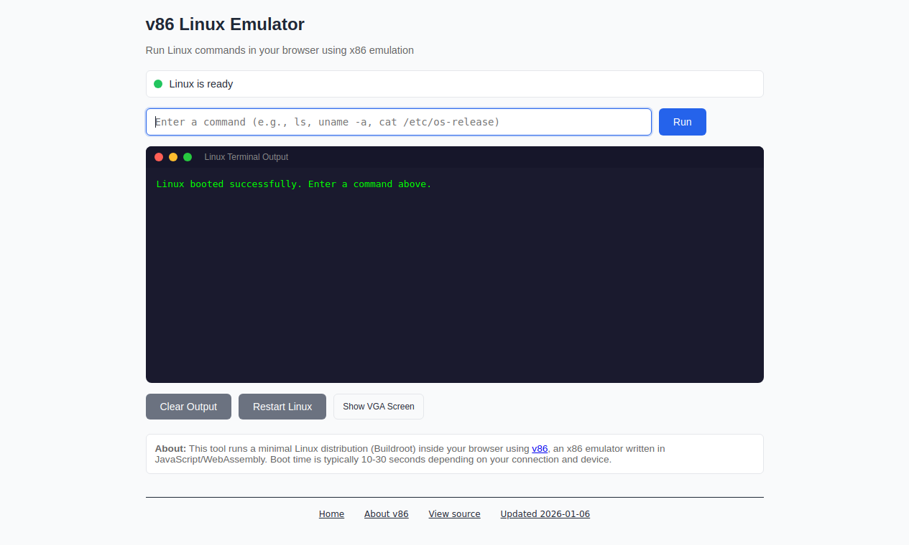

# v86 exploration

*2026-03-10T15:16:49Z by Showboat 0.6.1*
<!-- showboat-id: f5f01b71-0095-452d-b2ba-9ad5edd73e2a -->

This document explores the capabilities of the v86 Linux Emulator at https://tools.simonwillison.net/v86 - a tool that runs a minimal Linux distribution (Buildroot) inside the browser using v86, an x86 emulator written in JavaScript/WebAssembly.

```bash {image}
\
```



## System Overview

The v86 Linux Emulator runs a **Buildroot 2024.05.2** distribution on an emulated **i686** (32-bit x86) CPU modeled as a Pentium III (Katmai). It uses Linux kernel **6.8.12** compiled with PREEMPT_DYNAMIC support.

```bash
uvx rodney clear '#command-input' 2>/dev/null && uvx rodney input '#command-input' 'uname -a' 2>/dev/null && uvx rodney click '#run-btn' 2>/dev/null && sleep 5 && uvx rodney text '#output' 2>&1 | grep -A1 '^$ uname' | tail -1
```

```output
Cleared
Typed: uname -a
Clicked
Linux (none) 6.8.12 #5 PREEMPT_DYNAMIC Sat Aug 31 22:58:35 UTC 2024 i686 GNU/Linux
```

## Hardware Resources

- **RAM**: 39 MB total (very constrained)
- **CPU**: Emulated Pentium III (Katmai), single core, i686 architecture
- **Network**: Loopback (lo) and Ethernet (eth0) interfaces present but not configured
- **Swap**: None

## Shell and Core Utilities

The system is **BusyBox v1.36.1** based - most core utilities (ls, cat, grep, sed, awk, vi, etc.) are BusyBox applets. The default shell is **ash** (BusyBox's lightweight sh implementation).

### Key BusyBox tools in /bin:
`ash`, `busybox`, `cat`, `cp`, `chmod`, `date`, `dd`, `df`, `echo`, `grep`/`egrep`/`fgrep`, `gunzip`/`gzip`, `hostname`, `kill`, `ln`, `ls`, `mkdir`, `mknod`, `more`, `mount`/`umount`, `mv`, `ping`/`ping6`, `ps`, `pwd`, `rm`/`rmdir`, `sed`, `sh`, `sleep`, `tar`, `touch`, `uname`, `vi`, `watch`, `base32`/`base64`

## Programming Languages

### Lua 5.4.6
The primary scripting language available. Comes with Lua socket libraries (`socket`, `mime`, `ltn12.lua`, `socket.lua`) for network programming.

### bc 1.36.1
Arbitrary precision calculator language - can handle big number math.

### awk / sed
BusyBox versions (not GNU) - available for text processing but with limited features compared to full GNU implementations.

**Not available**: Python, Perl, Node.js, Ruby, GCC/compiler toolchain

## Networking Tools

- **curl 8.7.1** - Full curl with libcurl (not BusyBox wget)
- **wget** - BusyBox version (no `--version` flag)
- **links 2.29** - Text-mode web browser
- **socat 1.8.0.0** - Multipurpose relay / network swiss army knife
- **tcpdump 4.99.4** - Network packet analyzer
- **nslookup**, **traceroute**, **tracepath**, **arping**, **telnet**, **tftp**
- **tinysshd** - Lightweight SSH daemon (with key generation)
- **ip** / **ifconfig** / **route** - Network configuration

Network interfaces exist (lo, eth0) but are not configured by default. The network goes through the v86 emulated network stack.

## Text Editors

- **vi** - BusyBox vi (lightweight)
- **joe 4.6** - Full-featured terminal editor (Joes Own Editor)
- **ed** / **red** - Line editors
- **hexedit** - Binary/hex file editor

## Text Processing & File Utilities

- **sort**, **uniq**, **cut**, **paste**, **tr**, **wc**, **head**, **tail** - Standard text filters
- **diff**, **cmp**, **patch** - File comparison/patching
- **find**, **xargs** - File searching
- **strings** - Extract strings from binary files
- **xxd** - Hex dump / reverse hex dump
- **dos2unix** / **unix2dos** - Line ending conversion
- **tree** - Directory tree listing
- **less** / **more** - Pagers
- **ar** - Archive tool
- **cpio** - Archive format tool
- **unzip** - ZIP extraction
- **lzma** / **unlzma** / **xz** / **unxz** / **lzopcat** - Compression tools
- **md5sum**, **sha1sum**, **sha256sum**, **sha512sum**, **sha3sum**, **crc32** - Hash/checksum tools

## System Administration

- **fdisk** - Disk partitioning
- **mke2fs** - Create ext2/3/4 filesystems
- **mkswap** / **swapon** / **swapoff** - Swap management
- **mount** / **umount** / **losetup** - Filesystem mounting
- **insmod** / **rmmod** / **modprobe** / **lsmod** - Kernel module management
- **sysctl** - Kernel parameter tuning
- **lspci**, **lsusb**, **lsscsi** - Hardware listing
- **hdparm** - Disk parameters
- **blkid** - Block device attributes
- **top**, **ps**, **free**, **uptime** - Process & system monitoring
- **adduser** / **deluser** / **addgroup** / **delgroup** - User management
- **crond** / **crontab** - Scheduled tasks
- **syslogd** / **klogd** - System logging
- **init** / **halt** / **reboot** / **poweroff** - System lifecycle

### Supported Filesystems
ext2, ext3, ext4, iso9660, 9p, tmpfs, ramfs, devtmpfs, proc, sysfs

## Shared Libraries

The system includes several non-trivial shared libraries:
- **libcurl** - HTTP client library
- **libevent** - Event notification library (with pthreads support)
- **libgfortran** / **libgomp** / **libquadmath** - Fortran runtime & OpenMP (suggests some scientific computing capability was built in)
- **liblua** - Lua runtime library
- **libpcap** - Packet capture library (used by tcpdump)
- **libstdc++** - C++ standard library
- **libtelnet** - Telnet protocol library
- **libuuid** - UUID generation library

## Networking: No External Access

The v86 emulator configuration does **not** include a `network_relay_url`, which means the emulated Linux has **no actual network connectivity**. While the kernel has an `eth0` interface and tools like curl, wget, and socat are installed, they cannot reach the internet or even the host web server.

The v86 emulator supports networking via a WebSocket relay proxy (e.g., `network_relay_url: "wss://relay.widgetry.org/"`), but this instance does not configure one. This means:
- `curl`, `wget`, `links` will hang or fail when trying to connect
- `socat` can be used for local socket experiments only
- Loopback networking (127.0.0.1) works after `ifconfig lo up`
- No DHCP server is available for eth0

The emulator config allocates 64 MB of memory (though `free` reports ~39 MB available to userspace), has VGA support, and uses serial console I/O for the command interface.

## Demonstrations

### Lua Programming
Lua 5.4.6 is the most capable programming language available, with LuaSocket 3.0.0 for networking:

```bash
uvx rodney clear '#command-input' 2>/dev/null && uvx rodney input '#command-input' 'lua -e "for i=1,10 do io.write(i*i..\" \") end; print()"' 2>/dev/null && uvx rodney click '#run-btn' 2>/dev/null && sleep 5 && uvx rodney text '#output' 2>&1 | grep -A1 'lua -e' | tail -1
```

```output
Cleared
Typed: lua -e "for i=1,10 do io.write(i*i..\" \") end; print()"
Clicked
1 4 9 16 25 36 49 64 81 100 
```

### Arbitrary Precision Math with bc

`echo "2^128" | bc` produces: `340282366920938463463374607431768211456`

bc supports arbitrary precision arithmetic, making it useful for cryptographic or mathematical calculations.

### Text Processing Pipelines

Standard Unix pipe chains work:

`echo 'Hello World' | sed 's/World/v86/' | tr a-z A-Z` produces: `HELLO V86`

### Fibonacci in Lua

Running a recursive Fibonacci function in Lua works smoothly:

`lua -e 'function fib(n) if n<2 then return n else return fib(n-1)+fib(n-2) end end; for i=1,15 do io.write(fib(i).." ") end; print()'`

Output: `1 1 2 3 5 8 13 21 34 55 89 144 233 377 610`

### Cryptographic Hashing

All major hash algorithms are available:

`echo -n 'hello' | sha256sum` produces: `2cf24dba5fb0a30e26e83b2ac5b9e29e1b161e5c1fa7425e73043362938b9824`

### Filesystem Operations

Can create tmpfs mounts and work with files:

`mkdir /mnt/ram; mount -t tmpfs -o size=10m tmpfs /mnt/ram` - creates an in-memory filesystem

## Summary of Capabilities

### What it CAN do:
- **Lua scripting** (5.4.6) with socket libraries - the most capable language available
- **Shell scripting** with BusyBox ash - standard Unix pipeline processing
- **Arbitrary precision math** via bc
- **Text processing** with sed, awk, grep, sort, uniq, tr, cut, etc.
- **File operations** - create, read, write, chmod, tar, zip/unzip
- **Cryptographic hashing** - md5, sha1, sha256, sha512, sha3, crc32
- **Hex editing** with hexedit and xxd
- **Filesystem management** - mount tmpfs, create ext2/3/4 filesystems
- **Process management** - ps, top, kill, background processes
- **Text editing** with vi (BusyBox) or joe (full-featured)
- **Network tools** (socat, tcpdump, curl, wget, links) - though limited by lack of network relay
- **Web browsing** with links text browser (if network were configured)

### What it CANNOT do:
- **No internet access** - no network relay configured
- **No Python, Perl, Node.js, Ruby** - Lua is the only real scripting language
- **No compiler** - no gcc, no cc, no make
- **Very limited RAM** - only ~39 MB available
- **32-bit only** - i686 architecture (Pentium III emulation)
- **No package manager** - what you see is what you get
- **Single core** - no multi-threading benefits
- **No persistent storage** - everything resets on page reload

### Best Use Cases:
1. **Teaching Linux basics** - shell commands, pipes, file operations
2. **Lua scripting playground** - with socket library for learning
3. **Text processing demonstrations** - sed, awk, grep pipelines
4. **Cryptographic operations** - hashing, encoding/decoding
5. **System administration concepts** - filesystems, processes, mounts
6. **Quick disposable Linux environment** - no setup needed, runs in browser
