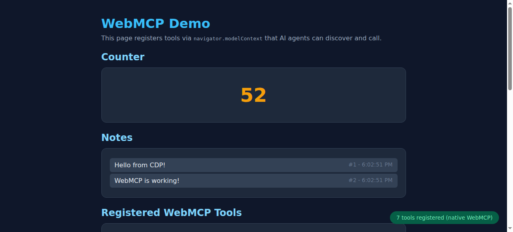
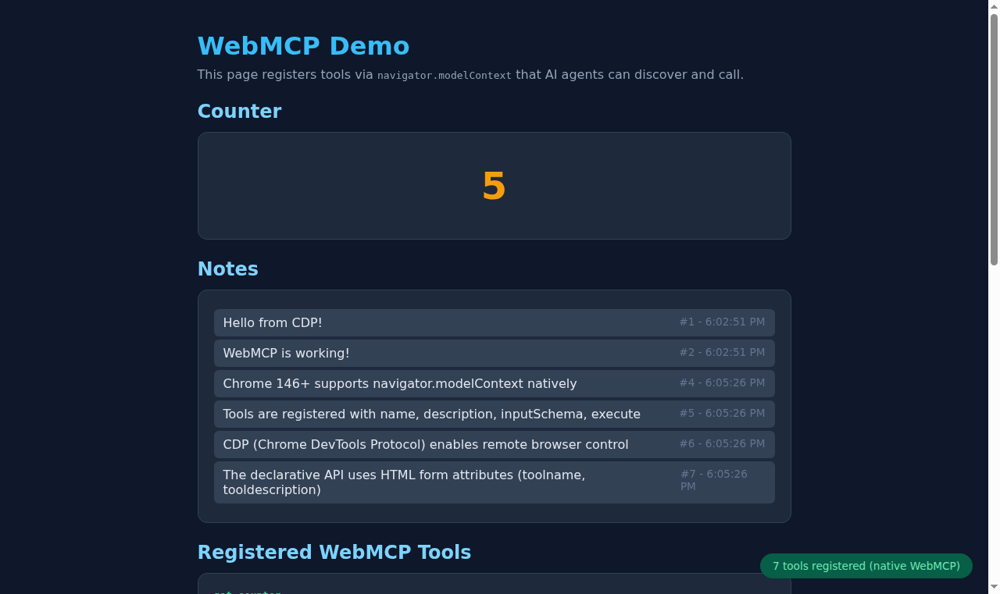

# WebMCP + Chrome DevTools Protocol Demo

<!-- AI-GENERATED-NOTE -->
> [!NOTE]
> This is an AI-generated research report. All text and code in this report was created by an LLM (Large Language Model). For more information on how these reports are created, see the [main research repository](https://github.com/simonw/research).
<!-- /AI-GENERATED-NOTE -->

An investigation into WebMCP — the W3C draft standard that lets websites expose structured tools to AI agents via `navigator.modelContext` — and how to interact with it programmatically over the Chrome DevTools Protocol (CDP).

## What is WebMCP?

WebMCP (Web Model Context Protocol) is a browser API proposed by Google and Microsoft through the W3C Web Machine Learning Community Group. It allows web pages to register callable "tools" with natural language descriptions and JSON Schema inputs. Instead of AI agents scraping screenshots and guessing where to click, they can call well-defined functions exposed by the page.

**Key facts:**
- Spec: https://webmachinelearning.github.io/webmcp/
- First available in Chrome 146 Canary (Feb 2026), behind feature flag
- Two APIs: **Imperative** (`navigator.modelContext.registerTool()`) and **Declarative** (`<form toolname="..." tooldescription="...">`)
- Complementary to Anthropic's MCP (backend protocol) — WebMCP is client-side only

## What's in this repo

| File | Description |
|------|-------------|
| `server.py` | Starlette web app that serves HTML pages with 7 WebMCP tools registered |
| `cdp_client.py` | Python script that launches Chrome, connects via CDP, discovers tools, and calls them |
| `explore_cdp.py` | Deeper exploration of the native `ModelContext` API surface and edge cases |
| `screenshot.png` | Screenshot from `cdp_client.py` showing the demo after tool calls |
| `screenshot_explore.png` | Screenshot from `explore_cdp.py` showing the demo after a multi-step agent workflow |
| `notes.md` | Detailed investigation notes |

All Python scripts use **uv inline script dependencies** — no `requirements.txt` needed.

## How to run

### 1. Install Chrome Dev channel (146+)

```bash
wget https://dl.google.com/linux/direct/google-chrome-unstable_current_amd64.deb
sudo apt install ./google-chrome-unstable_current_amd64.deb
```

### 2. Start the demo server

```bash
uv run server.py
```

This starts a Starlette app on `http://localhost:8000` that:
- Displays a counter and notes UI
- Registers 7 WebMCP tools with `navigator.modelContext.registerTool()`
- Also stores tools in `window.__webmcp_tools` for CDP discovery

### 3. Run the CDP client

```bash
uv run cdp_client.py
```

This script:
1. Launches headless Chrome with `--enable-features=WebMCPTesting --remote-debugging-port=9222`
2. Navigates to the demo app
3. Verifies `navigator.modelContext` is available natively
4. Discovers all 7 registered tools via `window.__webmcp_tools`
5. Calls tools through CDP `Runtime.evaluate`: sets the counter, adds notes, queries state
6. Takes a screenshot of the final page state

### 4. Run the exploration script

```bash
uv run explore_cdp.py
```

Goes deeper: probes the native `ModelContext` API surface, tests edge cases (duplicate names, unregister, provideContext, clearContext, annotations), injects declarative forms, and simulates a full AI agent workflow.

## Key findings

### Native API surface (Chrome 147)

```
ModelContext {
    registerTool(tool)     // Add a tool (throws on duplicate name)
    unregisterTool(name)   // Remove a tool (throws if not found)
    provideContext(options) // Replace all tools at once
    clearContext()          // Remove everything
}
```

The native API is **registration-only** — there is no `listTools()` or `callTool()` method. Tools are exposed to the browser's built-in AI agent (e.g., Gemini). External access requires a bridging layer.

### Architecture for CDP → WebMCP

```
Python CDP Client
    ↓ WebSocket (CDP)
Chrome (headless, --enable-features=WebMCPTesting)
    ↓ Runtime.evaluate
Page JavaScript
    ├─ navigator.modelContext.registerTool()  → Native browser AI
    └─ window.__webmcp_tools = {}             → CDP-accessible registry
```

The `@mcp-b/global` polyfill creates a similar bridge (`__mcpBridge`) for the `@mcp-b/chrome-devtools-mcp` MCP server to discover and call tools. Our approach uses a simpler window-level object.

### WebMCP tools registered in the demo

| Tool | Description | Read-only |
|------|-------------|-----------|
| `get_counter` | Get the current counter value | Yes |
| `set_counter` | Set the counter to a specific value | No |
| `increment_counter` | Increment the counter by an amount | No |
| `add_note` | Add a new note with text | No |
| `list_notes` | List all notes | Yes |
| `delete_note` | Delete a note by ID | No |
| `get_page_info` | Get full page state summary | Yes |

## Screenshots

### After CDP client tool calls


### After exploration agent workflow


## References

- [WebMCP W3C Spec Draft](https://webmachinelearning.github.io/webmcp/)
- [Chrome WebMCP Early Preview Blog](https://developer.chrome.com/blog/webmcp-epp)
- [GoogleChromeLabs/webmcp-tools](https://github.com/GoogleChromeLabs/webmcp-tools) — official demos and extensions
- [Chrome DevTools Protocol Docs](https://chromedevtools.github.io/devtools-protocol/)
- [@mcp-b/global npm package](https://www.npmjs.com/package/@mcp-b/global) — polyfill for navigator.modelContext
- [@mcp-b/chrome-devtools-mcp](https://www.npmjs.com/package/@mcp-b/chrome-devtools-mcp) — MCP server with WebMCP support
- [WebMCP-org/chrome-devtools-quickstart](https://github.com/WebMCP-org/chrome-devtools-quickstart) — quickstart demo
